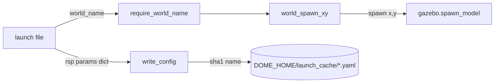

# utils.py — Shared Launch Utilities for dome_nav

`utils.py` is the small pile of helpers the launch files lean on. It has no ROS
dependencies and no side effects at import time, which is exactly what lets the
pure-Python test suite exercise it directly. As of the 2026-07-08 config
refactor it does much less than it used to: every YAML *patching* helper
(`build_slam_config`, `patch_dock_db`, `yaml_override`, `yaml_patch_dict`,
`deep_merge`) was deleted when the project moved from runtime patch-merges to
standalone, committed config files. What remains are three concerns:

1. locating the DOME home directory,
2. validating and mapping simulation world names, and
3. writing a content-addressed config file (the one place a file is still
   generated at launch time).

## Where does state live? `dome_home()`

Everything the robot persists — saved maps, telemetry, the launch cache — lives
under a single root. That root is `~/.dome` by default but can be relocated with
the `DOME_HOME` environment variable, which is invaluable in tests (point it at a
`tmp_path` and nothing touches the real home directory).

```python
def dome_home() -> str:
    """Return DOME_HOME path, expanding ~ if needed."""
    return os.path.expanduser(os.environ.get("DOME_HOME", "~/.dome"))
```

The function is deliberately trivial and called everywhere rather than caching a
module-level constant — so a test that sets `DOME_HOME` via `monkeypatch.setenv`
takes effect immediately, with no import-order surprises.

## Choosing a simulation world safely

The sim launch files take a `--world_name` argument. The naive approach — pass
the name straight to Gazebo — fails late and opaquely ("file not found") if the
name is wrong. Instead we validate up front against the worlds *actually
installed*, so the error message can list the real choices.

```python
def available_worlds(worlds_dir: str) -> list[str]:
    """List installed Gazebo world names (without the .world extension)."""
    return sorted(
        f[: -len(".world")] for f in os.listdir(worlds_dir) if f.endswith(".world")
    )
```

`available_worlds()` reads the installed `share/dome_nav/worlds/` directory at
launch time — it is never a hardcoded list, so it cannot drift out of sync with
what is actually shipped.

```python
def require_world_name(world_name: str, worlds_dir: str, usage: str) -> str:
    choices = available_worlds(worlds_dir)
    if world_name not in choices:
        raise ValueError(
            f"world_name is required and must be one of {choices}"
            f" (got {world_name!r}): {usage}"
        )
    return world_name
```

The `usage` string is passed in by each caller so the error carries the exact
`bl dome_nav <file>.launch.py --world_name <name>` hint for *that* launch file.
This is a boundary-validation helper: it rejects bad input at the edge and then
trusts the value downstream.

### Spawn points travel with the world

Each world was authored around a specific robot starting pose — `simple_room`
uses a centered origin and spawns at `(-1, -1)`, while `multi_room` uses a
bottom-left corner origin and spawns at `(1, 1)`. Coupling "which world" to
"where the robot starts" by hand would be an easy source of mistakes, so the
mapping lives in one table:

```python
WORLD_SPAWN_XY: dict[str, tuple[float, float]] = {
    "simple_room": (-1.0, -1.0),
    "multi_room": (1.0, 1.0),
}

def world_spawn_xy(world_name: str) -> tuple[float, float]:
    """Return the designed robot spawn (x, y) for a known world name."""
    return WORLD_SPAWN_XY.get(world_name, (0.0, 0.0))
```

Selecting a world therefore also selects its spawn point automatically; the
caller never repeats coordinates. Unknown names fall back to the origin — in
practice `require_world_name()` has already rejected those, so the fallback is
just defensive.

## The one file still generated at launch: `write_config()`

After the patching helpers were removed, only one launch input is still built at
runtime rather than committed as a file: the `robot_state_publisher` params file,
which embeds the (large, multi-line) URDF. `write_config()` serializes a dict to
YAML under the launch cache.

Its one non-obvious design choice is **content addressing**:

```python
def write_config(data: dict) -> str:
    cache_dir = os.path.join(dome_home(), "launch_cache")
    os.makedirs(cache_dir, exist_ok=True)
    blob = yaml.dump(data, default_flow_style=False, sort_keys=False)
    digest = hashlib.sha1(blob.encode()).hexdigest()[:16]
    path = os.path.join(cache_dir, f"{digest}.yaml")
    with open(path, "w") as f:
        f.write(blob)
    return path
```

The filename is a hash of the rendered YAML. Identical configs therefore map to
the same file and repeated launches reuse it, rather than accumulating a fresh
temp file every run — the failure mode of the old `NamedTemporaryFile` approach,
which leaked one file per launch into `/tmp`. `sort_keys=False` preserves the
authored key order so the rendered file reads naturally.



## Observations / possible improvements

- **`write_config` is now the module's only reason to depend on `yaml` and
  `hashlib`.** If the URDF-params-file need ever goes away (e.g. `bl.node`
  gains a first-class way to pass large parameters), this function and both
  imports could be removed, leaving `utils.py` as pure path/validation helpers.
- **The launch cache is never pruned.** Because names are content hashes it
  won't grow unboundedly for a fixed set of configs, but distinct URDFs over
  time will leave orphaned files. A tiny "delete entries older than N days"
  sweep on launch would keep it tidy; not worth it yet.
- **`world_spawn_xy` silently returns the origin for unknown worlds.** That's
  safe only because `require_world_name` runs first. If a future caller uses
  `world_spawn_xy` without that guard, an unknown world would spawn at `(0,0)`
  with no warning — worth a raise-or-log if the two ever get decoupled.
- **`available_worlds` does a directory listing on every call.** Negligible at
  launch time, but if it were ever called in a hot path it should be cached.
