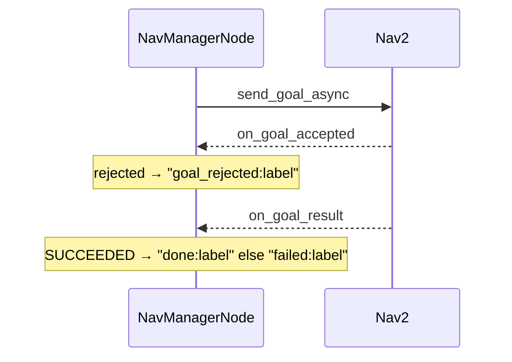

# nav_manager_node.py — Intents In, Nav2 Goals Out

`NavManagerNode` is the ROS adapter for point-to-point navigation (Mode B: "go to
the chair"). It is deliberately thin: all the *decisions* live in the pure
`NavManager` (see `05-nav_manager.md`), and this node is the plumbing that wires
ROS topics, the Nav2 action, and TF to that logic. The split is what keeps the
brain unit-testable and the node boring.

## What it wires up

The constructor is essentially a wiring diagram:

```python
self.manager = NavManager()
self.nav_client = ActionClient(self, NavigateToPose, "navigate_to_pose")
self.status_pub = self.create_publisher(String, "/dome_nav/nav_status", 10)
self.loc_status_pub = self.create_publisher(String, "/dome_nav/localization_status", 10)
self.loc_score_pub  = self.create_publisher(Float32, "/dome_nav/localization_score", 10)
self.intent_sub  = self.create_subscription(String, "/intent", self.on_intent, 10)
self.targets_sub = self.create_subscription(String, "/targets/confirmed", self.on_targets, 10)
```

Inputs: intents (commands), confirmed targets (from vision), and AMCL pose.
Outputs: a nav status string and a localization status/score. In between sits a
`NavigateToPose` action client and a TF listener for the robot's pose.

### One subtle subscription: AMCL QoS

`/amcl_pose` is latched, so a plain subscription can miss it. The node matches
AMCL's QoS explicitly — reliable, transient-local, depth 1 — or it would silently
never receive a pose:

```python
amcl_qos = QoSProfile(depth=1,
                      reliability=ReliabilityPolicy.RELIABLE,
                      durability=DurabilityPolicy.TRANSIENT_LOCAL)
self.amcl_sub = self.create_subscription(
    PoseWithCovarianceStamped, "/amcl_pose", self.on_amcl_pose, amcl_qos)
```

This is the kind of ROS-boundary detail that has to live in the node, not the
pure logic.

## The command path

Intents arrive as JSON. The node hands the raw string to `NavManager.parse_intent`
(which validates and extracts the action), then dispatches:

```python
def on_intent(self, msg):
    result = self.manager.parse_intent(msg.data)
    if result is None:
        self.get_logger().warning(f"Malformed or unknown intent: {msg.data!r}")
        return
    action, intent = result
    if action == "navigation_go":
        label = intent.get("slots", {}).get("label", "")
        self.navigate_to_object(label)
    elif action == "navigation_cancel":
        self.navigation_cancel()
```

The label comes from `slots.label` — the dome_control contract. `navigate_to_object`
asks the manager for the nearest matching target, converts it to a `PoseStamped`
in the `map` frame (including a yaw from `yaw_world` if present), waits for the
action server, and sends the goal:

```python
yaw = float(target.get("yaw_world", 0.0))
goal_pose.pose.orientation.z = math.sin(yaw / 2.0)
goal_pose.pose.orientation.w = math.cos(yaw / 2.0)
```

Note this node sends a *real* orientation (from the target), unlike the explorer
which sends identity — here the final heading is meaningful. Both guard rails
that can fail — no target, missing `xyz_world`, no action server — publish a
descriptive status and return rather than crash.

## The async result chain

Nav2 actions are asynchronous, so the outcome threads through callbacks, each
publishing a status string the rest of the system can watch:



`navigation_cancel` cancels the stored handle and reports `"cancelled"`.

## Localization reporting

AMCL pose messages carry a covariance; the node passes it to
`NavManager.check_localization` and caches the (status, score), then publishes
both on a 1 Hz timer *and* immediately on each pose update:

```python
def on_amcl_pose(self, msg):
    status, score = self.manager.check_localization(list(msg.pose.covariance))
    self.last_loc_status, self.last_loc_score = status, score
    self.publish_localization()
```

The timer guarantees consumers see a value even before AMCL has published, and
the immediate publish keeps it fresh.

## Robot pose from TF

Target selection needs the robot's position, looked up from TF with a graceful
`None` on the expected transient failures — and the node logs a warning but still
proceeds (the manager falls back to the first match rather than blocking):

```python
def find_nearest_confirmed(self, label):
    robot_xy = self.robot_xy_in_map()
    if robot_xy is None:
        self.get_logger().warning("map→base_footprint TF unavailable — returning first match.")
    return self.manager.find_nearest_confirmed(label, robot_xy)
```

## Observations / possible improvements

- **`on_nav_feedback` is an empty stub.** It's wired as the action feedback
  callback but does nothing; either use it (publish progress/distance-remaining)
  or drop the wiring.
- **Status is an ad-hoc string protocol** (`done:label`, `failed:label`,
  `nav_unavailable`, …). It works, but a structured JSON status (like
  `/explore/status`) would be easier for consumers to parse and extend.
- **`navigate_to_object` blocks up to 5 s** on `wait_for_server`. In the callback
  thread that's usually fine, but a persistent-readiness check would avoid the
  stall if Nav2 is briefly down.
- **The manual quaternion from yaw** is correct but repeated wherever goals are
  built; a tiny `yaw_to_quat` helper would DRY it across this node and any future
  goal senders.
