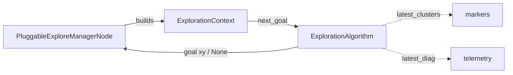

# explore_context.py — The Contract Between the Node and Its Algorithm

This tiny module is the *seam* that makes exploration pluggable. It defines no
behavior; it defines the three types that let `PluggableExploreManagerNode` and a
frontier-selection algorithm talk to each other without either one importing the
other's internals. Getting this boundary right is what lets all the real
frontier math be pure, ROS-free, and unit-testable.

There are exactly three things here: a bag of tuning knobs (`ExploreParams`), a
per-decision snapshot of the world (`ExplorationContext`), and the interface an
algorithm must satisfy (`ExplorationAlgorithm`).

## Tuning knobs: `ExploreParams`

Everything that changes exploration *behavior* without changing its *logic* lives
in one dataclass. Because it is a dataclass with defaults, the same fields can be
constructed from ROS parameters at runtime, and the defaults double as the
canonical real-robot values.

```python
@dataclass
class ExploreParams:
    min_frontier_size: int = 10
    blacklist_radius: float = 0.5
    min_frontier_dist: float = 1.3
    max_frontier_dist: float = 0.0
    goal_inset_m: float = 0.3
    max_explore_radius: float = 0.0
    prefer_farthest: bool = False
    frontier_buffer_cells: int = 2
```

The one field worth dwelling on is `min_frontier_dist`. It filters the **raw
frontier cell**, but the goal ultimately sent to Nav2 is first pulled back toward
the robot by `goal_inset_m`. So the effective floor on the *sent* goal distance
is `min_frontier_dist − goal_inset_m` — with the defaults, `1.3 − 0.3 = 1.0 m`.
That indirection is exactly why the number is 1.3 and not 1.0, and it's the kind
of non-obvious coupling that belongs in a comment right on the field (and is).

`frontier_buffer_cells` (default 2) is plumbed straight through to
`find_frontier_clusters` — it sets how many confirmed-known cells separate a
frontier goal from the unknown boundary, guarding against goals landing in the
seam between the SLAM map and the (smaller) global costmap.

`0.0` is used as an "unset / unlimited" sentinel for `max_frontier_dist` and
`max_explore_radius` — the pure functions treat `> 0.0` as "a real limit."

## A decision snapshot: `ExplorationContext`

Rather than hand the algorithm a live node (and thereby couple it to ROS), each
call gets an immutable-ish snapshot of everything needed to choose a goal:

```python
@dataclass
class ExplorationContext:
    map_data: list[int]
    map_info: MapInfo
    robot_xy: tuple[float, float]
    blacklist: set[tuple[float, float]]
    start_xy: tuple[float, float] | None
    params: ExploreParams
```

`map_data` is a plain list of occupancy values (the node converts the ROS
`OccupancyGrid` into this), `map_info` carries the grid geometry (from
`frontier_explorer`), and `blacklist`/`start_xy` carry session memory. The
algorithm reads this and returns a goal — it never touches TF, actions, or
publishers. That is what makes `FrontierAlgorithm` testable with hand-built
grids and no ROS at all.

## The interface: `ExplorationAlgorithm`

The contract itself is a structural `Protocol` — an algorithm satisfies it by
shape, not by inheritance:

```python
class ExplorationAlgorithm(Protocol):
    latest_clusters: list[list[int]]
    latest_diag: dict | None

    def next_goal(self, ctx: ExplorationContext) -> tuple[float, float] | None: ...
```

`next_goal()` is the whole job: take a context, return a goal point in world
coordinates, or `None` when nothing qualifies. The two attributes are a
deliberate side channel: after a call, the node reads `latest_clusters` (to draw
RViz markers) and `latest_diag` (to write "why did we find nothing?" telemetry).
Returning these as attributes rather than as part of the return value keeps
`next_goal`'s signature clean while still exposing the introspection the node
needs.



## Observations / possible improvements

- **`ExploreParams` is the single source of truth for defaults, but the node
  re-declares the same defaults as ROS parameters.** They can drift (they did:
  `max_frontier_dist` defaults to `0.0` here but `15.0` on the node). A small
  helper that builds ROS parameter declarations from the dataclass fields would
  remove that duplication.
- **The Protocol's side-channel attributes are easy to forget to set.** An
  algorithm that never assigns `latest_diag` would still type-check but starve
  the telemetry. A tiny base class initializing both to sane defaults would make
  the contract harder to get subtly wrong.
- **`map_data` is a full `list[int]` copy per decision.** Fine at current map
  sizes and 2 Hz, but if maps or rates grow, passing the array or a view would
  avoid the copy.
