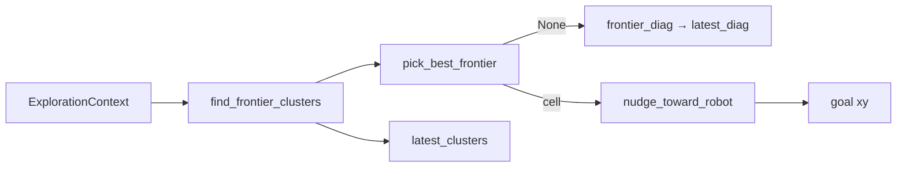

# frontier_algorithm.py — The Default Exploration Strategy

`FrontierAlgorithm` is the concrete strategy that satisfies the
`ExplorationAlgorithm` protocol. It contains almost no logic of its own: its job
is to compose the pure functions in `frontier_explorer.py` into a single
`next_goal(ctx)` call and to remember two things the node wants back afterward.
It is the adapter that lets the ROS node stay ignorant of *how* frontiers are
chosen.

## Why this class exists at all

The pure functions (`find_frontier_clusters`, `pick_best_frontier`,
`nudge_toward_robot`, `frontier_diag`) are stateless. But the node needs a stable
object it can hold, call every tick, and interrogate for markers and telemetry.
`FrontierAlgorithm` provides that object and holds the small amount of state that
spans a single decision:

```python
class FrontierAlgorithm:
    def __init__(self):
        self.latest_clusters: list[list[int]] = []
        self.latest_diag: dict | None = None
```

`latest_clusters` feeds the RViz frontier markers; `latest_diag` feeds the
"no frontier, and here's why" telemetry. Both are the protocol's side channel.

## The one method: `next_goal`

The method is a clean pipeline — cluster, pick, and either explain-the-failure or
nudge-the-success:

```python
def next_goal(self, ctx):
    clusters = find_frontier_clusters(
        ctx.map_data, ctx.map_info, ctx.params.frontier_buffer_cells
    )
    self.latest_clusters = clusters
    target = pick_best_frontier(
        clusters, ctx.map_info, ctx.robot_xy,
        min_size=ctx.params.min_frontier_size,
        blacklist=ctx.blacklist,
        blacklist_radius=ctx.params.blacklist_radius,
        max_radius=ctx.params.max_explore_radius,
        start_xy=ctx.start_xy,
        min_dist=ctx.params.min_frontier_dist,
        max_dist=ctx.params.max_frontier_dist,
        prefer_farthest=ctx.params.prefer_farthest,
    )
    if target is None:
        self.latest_diag = frontier_diag(
            clusters, ctx.map_info, ctx.robot_xy,
            ctx.params.min_frontier_size,
            ctx.params.min_frontier_dist,
            ctx.params.max_frontier_dist,
        )
        return None
    self.latest_diag = None
    return nudge_toward_robot(target, ctx.robot_xy, ctx.params.goal_inset_m)
```

Three things worth noticing:

1. **Every knob comes from `ctx.params`.** The algorithm has no hardcoded tuning
   — it is fully driven by the `ExploreParams` the node built from ROS
   parameters. That's what lets sim and real behave differently through the same
   code. Even the frontier-detection depth (`frontier_buffer_cells`) is passed
   straight through to `find_frontier_clusters`.
2. **The diagnostic pass only runs on failure.** `frontier_diag` is computed only
   when `target is None`, so the normal (goal-found) path pays nothing for the
   introspection. On success `latest_diag` is reset to `None` so stale
   diagnostics never leak into telemetry.
3. **The returned point is nudged.** `pick_best_frontier` returns the raw
   frontier cell; `nudge_toward_robot` pulls it `goal_inset_m` back toward the
   robot before it becomes the goal — keeping it inside navigable space.



## Observations / possible improvements

- **This is the seam where alternative strategies plug in.** A
  `CostmapFrontierAlgorithm` (reading `/global_costmap/costmap` instead of the raw
  `/map`) or a directional/heading-biased strategy would live as a sibling class
  implementing the same protocol, injected at node construction — no change here.
- **`pick_best_frontier`'s long call is repeated almost verbatim in the diag
  call.** Both unpack the same handful of `ctx.params` fields; if the parameter
  set grows, passing `ctx.params` straight through (and letting the pure
  functions read it) would cut the repetition.
- **`latest_diag`/`latest_clusters` are the only mutable state.** They make the
  object non-reentrant (one decision at a time), which is fine for a single 2 Hz
  node but worth remembering if it were ever shared.
