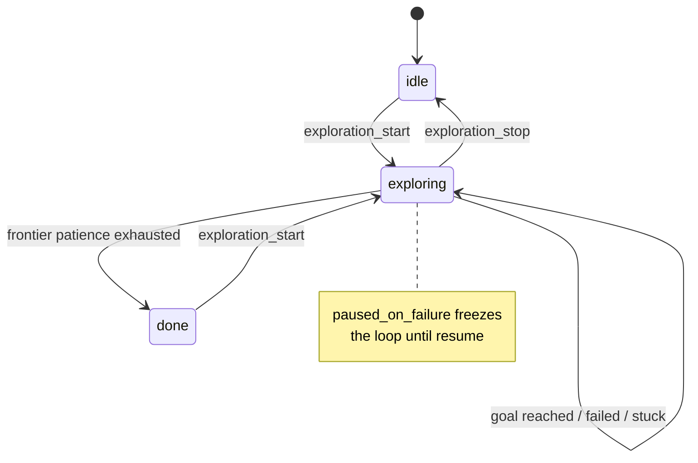
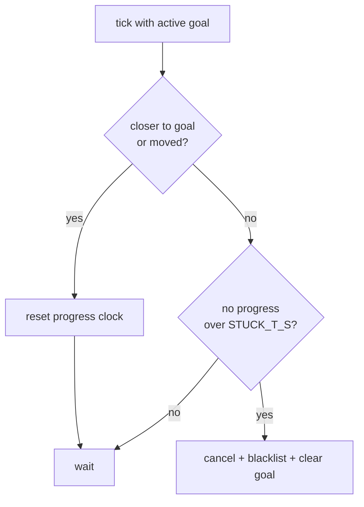
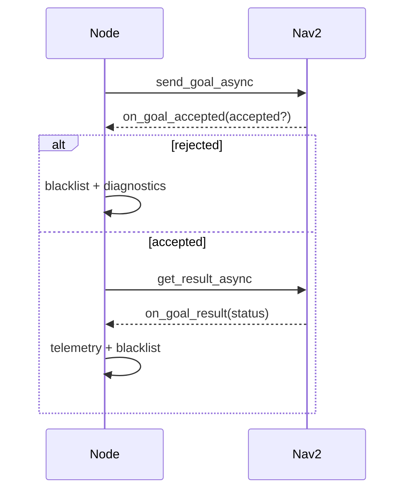

# The Explorer Manager

`explorer_manager_node.py` is the ROS node that turns "go explore the
building" into a stream of concrete navigation goals. It watches a growing
SLAM map, repeatedly asks a pluggable *algorithm* "where should I go next?",
hands each answer to Nav2 as a `NavigateToPose` goal, and watches how that goal
plays out — reached, aborted, timed out, or wedged with no progress. When there
is nothing left worth visiting, it declares exploration done.

The design's organizing idea is a clean seam: **the node owns everything about
ROS, Nav2, and the exploration *session*; the algorithm owns only the decision
of where to go.** The node is deliberately reusable across different exploration
strategies (frontier detection today; random-walk or scan-based tomorrow) by
injecting a different algorithm object. This document explains how the node is
built around that seam, and where the seam still leaks.

## The exploration loop as a state machine

At heart the node is a 1 Hz timer (`EXPLORE_HZ = 1.0`) driving a small state
machine. The states are strings: `idle`, `exploring`, `done`. Transitions are
triggered by JSON *intents* arriving on `/intent` (`exploration_start`,
`exploration_stop`, `exploration_resume`) and by the outcome of navigation.



The whole loop lives in `explore_tick`. It is written defensively: every tick
first publishes status and markers (so RViz and the UI stay live even when
idle), then returns early unless the node is actively exploring and not paused.

```python
def explore_tick(self):
    self.publish_status(self.state)
    self.publish_markers()
    if self.state != "exploring":
        return
    if self.paused_on_failure:
        return
    if self.start_xy is None:
        self.start_xy = self.robot_xy_in_map()
    if self.has_active_goal:
        self.check_stuck()
        if self.has_active_goal:
            self.check_goal_timeout()
        return
    self.latest_map = self.fetch_grid("/map")
    self.latest_global_costmap = self.fetch_grid("/global_costmap/costmap")
    self.find_and_send_frontier()
```

The critical branch is `if self.has_active_goal`. The node only reconsiders
*where to go* when it has no goal in flight. While a goal is active it does
nothing but police that goal — checking for a wedged robot (`check_stuck`) and
for a hard timeout (`check_goal_timeout`). Only once the goal finishes does the
tick fall through to fetch fresh grids and pick a new frontier. This keeps the
algorithm from thrashing: one goal is pursued to a definite conclusion before
the next is chosen.

## The pluggable seam

The node never imports frontier logic directly into its decision path. Instead
it constructs an `ExplorationContext` — a plain data bundle — and calls
`self.algorithm.next_goal(ctx)`. The algorithm is injected at construction and
defaults to `FrontierAlgorithm`:

```python
def __init__(self, algorithm: ExplorationAlgorithm | None = None):
    ...
    self.algorithm = algorithm or FrontierAlgorithm()
```

```mermaid
flowchart LR
    subgraph Node["ExplorerManagerNode (ROS + session)"]
        tick[explore_tick] --> ctx[build ExplorationContext]
        ctx --> call["algorithm.next_goal(ctx)"]
        call --> send[send_nav_goal to Nav2]
    end
    subgraph Algo["ExplorationAlgorithm (decision only)"]
        call -.-> decide[pick a goal or None]
    end
    decide -.-> call
```

The context carries exactly what a decision needs and nothing about ROS: the
occupancy grid as a flat `list[int]`, its `MapInfo` geometry, the robot's
`(x, y)` in the map frame, the current blacklist, the exploration start point,
and the tuning `ExploreParams`. Because the input is pure Python data, an
algorithm is testable with no robot, no `rclpy`, no Nav2 — the payoff of the
seam.

## Choosing a goal, and rejecting infeasible ones

`find_and_send_frontier` is where the node consults the algorithm. It does not
blindly trust the first answer. A frontier goal is chosen against the *SLAM map*,
which can extend past the *global costmap* Nav2 plans in; a goal outside the
costmap would be rejected by the planner with a `worldToMap` failure. So the node
loops, asking for the next-best goal and locally excluding any candidate that
falls outside the costmap, up to `MAX_GOAL_ATTEMPTS`:

```python
rejected: set[XY] = set()
goal_xy = None
for _ in range(self.MAX_GOAL_ATTEMPTS):
    ctx = ExplorationContext(
        map_data=map_data, map_info=info, robot_xy=robot_xy,
        blacklist=self.blacklist | rejected,
        start_xy=self.start_xy, params=self.params,
    )
    candidate = self.algorithm.next_goal(ctx)
    if candidate is None:
        break
    if self.goal_in_global_costmap(candidate):
        goal_xy = candidate
        break
    rejected.add(candidate)
```

Note the trick: rejected candidates are folded into the blacklist passed *back*
into the next `ExplorationContext` (`self.blacklist | rejected`), so the
algorithm naturally returns a *different* frontier each iteration. The `rejected`
set is local to this tick — next tick starts fresh, in case the costmap has
grown to include a previously-out-of-bounds frontier.

## Blacklist: the session's memory of failure

The blacklist is a `set[XY]` of world points the node has learned to avoid. It is
owned and mutated exclusively by the node — the algorithm only ever *reads* it
through the context. The node adds a point whenever a goal ends badly: rejected
at acceptance (`on_goal_accepted`), aborted or failed (`on_goal_result`), timed
out (`check_goal_timeout`), or abandoned for lack of progress (`check_stuck`).
Because `ExploreParams.blacklist_radius` suppresses a whole *neighborhood* around
each blacklisted point downstream in the algorithm, one failure poisons a region,
not just an exact coordinate.

This split — failure memory in the node, pure decision in the algorithm — is one
of the cleaner boundaries in the design.

## Two ways to give up on a goal

A wedged robot is the recurring hazard (see the start-in-inflation deadlock in
`experiments.md`). The node guards against it with two independent timers while a
goal is active.

The blunt one is `check_goal_timeout`: cancel any goal older than
`GOAL_TIMEOUT_S = 25s`, to break Nav2's internal behavior-tree recovery loops.

The sharper one is `check_stuck`, which abandons a goal after only
`STUCK_T_S = 7s` of *no progress* — roughly 4x faster. "Progress" is defined
generously so that legitimate slow motion and final in-place rotation are not
mistaken for wedging:

```python
if (self.best_dist_to_goal is None
        or d < self.best_dist_to_goal - self.STUCK_PROGRESS_EPS
        or moved > self.STUCK_MOVE_EPS):
    self.best_dist_to_goal = d if self.best_dist_to_goal is None \
        else min(self.best_dist_to_goal, d)
    self.last_progress_xy = robot_xy
    self.last_progress_time = time.monotonic()
    return
```

A tick counts as progress if the robot got meaningfully closer to the goal
(`d` dropped by `STUCK_PROGRESS_EPS = 0.10 m`) *or* simply moved at all
(`moved > STUCK_MOVE_EPS = 0.05 m`). Either resets the no-progress clock. Only
when neither has happened for `STUCK_T_S` does the node cancel, blacklist, and
clear the goal so a fresh frontier is chosen next tick.



The two-timer arrangement is layered on purpose: `check_stuck` catches the common
wedge fast, while `GOAL_TIMEOUT_S` remains a hard cap for the slow-but-not-stuck
edge case.

## The asynchronous goal lifecycle

Nav2's action interface is asynchronous, so a single goal fans out across three
callbacks chained by futures:



`send_nav_goal` builds the `PoseStamped`, seeds the no-progress trackers, writes
a `goal_sent` telemetry record, and attaches `on_goal_accepted`. Acceptance
either blacklists a rejected goal or wires up `on_goal_result`, which records the
final status, dumps failure diagnostics on an `ABORTED` (capturing Nav2's
`error_code` / `error_msg`), and — win or lose — blacklists the point so the same
target is not re-chosen.

## Knowing when exploration is finished

When `find_and_send_frontier` gets no usable goal, it calls `handle_no_frontier`,
which increments a patience counter and, once it reaches
`NO_FRONTIER_PATIENCE = 14`, must decide between two very different situations:
genuinely finished, versus temporarily blocked with all frontiers filtered out.

```python
raw = len(self.algorithm.latest_clusters)
if raw > 0 and not self.blacklist_cleared_once:
    self.blacklist.clear()
    self.blacklist_cleared_once = True
    self.no_frontier_count = 0
    return
self.get_logger().info("Frontier patience exhausted — exploration done.")
```

If raw frontier clusters still exist but were all filtered or blacklisted, the
node clears the blacklist *once* (stale entries may have become reachable as the
map grew) and tries again; only when nothing remains does it declare done. This
is a sensible policy — but notice how it works: the node reaches into
`self.algorithm.latest_clusters`, a frontier-specific attribute, to make the
call. We return to this below.

## The CPU discipline: nothing runs while idle

A quiet but important theme is that the node refuses to burn CPU when it is not
exploring — a hard-won lesson on the Raspberry Pi (see the CPU campaign in
`experiments.md`). Two expensive data sources are held *lazily*:

- **Grids** (`/map`, both costmaps) are never standing subscriptions. rclpy
  deserializes every message before the callback runs, so subscribing to large
  latched grids burned 10–20% CPU even when idle. Instead `fetch_grid` uses
  `wait_for_message` with a QoS matched to the latched publishers, pulling the
  last grid on demand only when a frontier is about to be chosen.
- **TF** is subscribed only between `start_tf` and `stop_tf`. The `/tf` stream
  runs ~40 Hz and the Python `TransformListener` deserializes all of it (~8% CPU)
  for a pose the node needs at 1 Hz. `stop_tf` explicitly destroys the
  subscriptions the listener registered, so an idle node deserializes no TF at
  all.

The guiding rule discovered here: an *active* ROS subscription always pays full
deserialization cost — there is no "throttle by time" QoS — so the only way to
not pay is to not subscribe.

## Where the design still leaks

The pluggable seam is good but not airtight. The clearest tell is the return
type of the algorithm: `next_goal` returns `(x, y) | None`, and `None` is
overloaded to mean *both* "nothing worth sending this tick" *and* "exploration is
finished." Because those are genuinely different outcomes, the node cannot act on
the return alone — it recovers the missing intent by peeking at
`len(self.algorithm.latest_clusters)`.

That peek forces a second leak: `latest_clusters` and `latest_diag` are
frontier-specific fields declared on the *general* `ExplorationAlgorithm`
protocol, consumed by the node in six places (diagnostics, the done-decision,
telemetry, and marker publishing). A non-frontier algorithm — say a minimal
"hello world" plugin — has no clusters and must fake `latest_clusters = []` just
to satisfy the interface. The abstraction is leaking frontier concepts into a
seam that claims to be strategy-agnostic.

The recommended fix (tracked as feature **F23** (from issue I12)) is to give `next_goal` an
intent-carrying result — e.g. an enum `NEW_GOAL(xy) / NO_TARGETS_BLOCKED /
EXPLORED_DONE` — so the node stops inferring done-ness from cluster counts, and
to move visualization/diagnostics data off the protocol into an opaque optional
channel the node renders blindly. An open sub-question is who should own frontier
*marker* rendering, since drawing cluster-colored markers inherently requires
knowing they are clusters.

### Other, smaller observations

- **Naming is not parallel.** The seam mixes `Explore*` (`ExploreParams`,
  `ExplorerManagerNode`, `explore_tick`, `explore_algorithm`) with `Exploration*`
  (`ExplorationContext`, `ExplorationAlgorithm`). Settling on one prefix would
  improve readability (tracked as a chore). The redundant `Pluggable` prefix has
  already been dropped from the node name.
- **The rejected-goal loop reuses the blacklist channel.** Folding this tick's
  `rejected` set into `ctx.blacklist` conflates "permanently failed" with
  "infeasible right now." It works, but a dedicated exclusion field would express
  intent more honestly.
- **`goal_in_global_costmap` returns `True` when no costmap is known yet.** A
  reasonable startup convenience, but it means the very first goals bypass the
  feasibility check entirely.
- **The status/telemetry surface is broad.** `publish_status` and the many
  `telemetry.write` calls are valuable for field debugging, but they are also a
  large share of the node's line count; extracting a small status-builder helper
  would thin the node toward its actual control logic.
