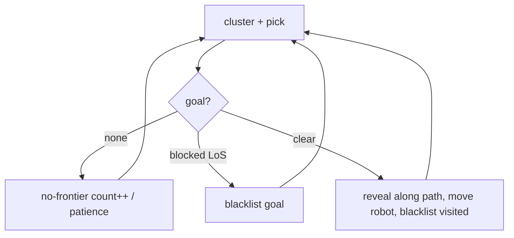

# algo_demo.py — Seeing the Frontier Algorithm Think

`algo_demo.py` is a developer tool, not part of the robot. It runs the *real*
`FrontierAlgorithm` against small hand-drawn ASCII maps and animates the result
in a color terminal, so you can watch how frontier detection, clustering, goal
selection, blacklisting, and the lidar reveal behave — without Gazebo, ROS, or a
robot. Because it calls the same pure functions the node uses
(`find_frontier_clusters`, `pick_best_frontier`, `nudge_toward_robot`,
`frontier_diag`), what you see here is exactly what the robot's brain would
decide given the same map.

```
python3 tools/algo_demo.py --map compound --min-size 3 --auto
```

## Maps as strings

The whole point is that a map is just text you can edit: `?`=unknown, `0`=free,
`#`=wall, `R`=robot start. Several built-ins (`room`, `corridor`, `ring`, `maze`,
`large`, `compound`) exercise different topologies — the `ring` map, for
instance, exists specifically to demonstrate why goal selection uses the nearest
*cell* and not the cluster centroid (a ring's centroid is the robot's own
position).

```python
def parse_map(rows):
    ...
    for ch in row.ljust(width):
        if ch in ("0", "R"):  data.append(CELL_FREE)
        elif ch == "#":       data.append(CELL_OCC)
        else:                 data.append(CELL_UNK)
    info = MapInfo(width=width, height=height, resolution=1.0,
                   origin_x=0.0, origin_y=0.0)
```

Resolution is 1.0 m/cell, so a cell and a meter are the same thing here — which
makes the printed distances easy to reason about.

## Simulating a lidar: line-of-sight reveal

A real robot doesn't see through walls, and the demo mustn't either — otherwise
frontier detection would be meaningless. `uncover_around_robot` turns unknown
cells free only if they're within the sensor radius **and** have clear
line-of-sight, traced with Bresenham:

```python
def uncover_around_robot(data, info, robot_xy, radius):
    for idx in ...:
        if data[idx] != CELL_UNK: continue
        wx, wy = cell_to_world(idx, info)
        if dist(...) <= radius and has_line_of_sight(data, info, robot_xy, (wx, wy)):
            data[idx] = CELL_FREE
```

Crucially, the reveal is swept **along the travel path**, not just at the
destination — `uncover_along_path` steps in `radius/2` increments from old to new
position, mirroring how a real robot scans continuously as it drives:

```python
steps = max(1, int(dist / (radius / 2)))
for i in range(steps + 1):
    pos = interpolate(from_xy, to_xy, i / steps)
    data = uncover_around_robot(data, info, pos, radius)
```

## The main loop mirrors the node

Each step reproduces the node's decision cycle: build a context, cluster, pick,
and either explain the failure (`frontier_diag`) or nudge the goal. The render
distinguishes **T** (the raw `pick_best_frontier` cell) from **G** (the nudged
goal), so you can literally see the inset:

```python
target_xy = pick_best_frontier(algo.latest_clusters, info, robot_xy, ...)
if target_xy is None:
    algo.latest_diag = frontier_diag(...)
    goal_xy = None
else:
    goal_xy = (nudge_away_from_unknown(...) if args.nudge_mode == "unknown"
               else nudge_toward_robot(target_xy, robot_xy, args.inset))
```

Then it advances the world: if the straight-line path is blocked it blacklists
the goal (a stand-in for a Nav2 failure); otherwise it reveals along the path,
teleports the robot to the goal, and continues — declaring "complete" after
`PATIENCE` empty steps, exactly like the node's `NO_FRONTIER_PATIENCE`.



## Two experiments baked in

- **`--nudge-mode {robot,unknown}`** compares the shipped `nudge_toward_robot`
  against the prototype `nudge_away_from_unknown` (the shelved T04n idea). The
  latter steps the goal along the summed direction *away* from nearby unknown
  cells, on the theory that a frontier cell sits on the known/unknown boundary
  and "toward the robot" doesn't reliably move off it. This function lives only
  here — it was never ported into the robot code.
- **The color rendering** assigns each large cluster a distinct 256-color
  letter (A–Z), with the legend showing cell counts — making it obvious which
  clusters the size filter kept and which it dropped.

## Observations / possible improvements

- **`nudge_away_from_unknown` is dead-ended here.** It's a useful visualization
  but decisions about it should be made in `frontier_explorer`, not kept as a
  tool-only fork. Either port it (with tests) or delete it once the buffer-cell
  approach is considered final.
- **The loop duplicates the node's orchestration** (patience, blacklist, nudge
  dispatch) rather than reusing it. That's inherent to being a standalone tool,
  but it means changes to the node's cycle must be mirrored here by hand.
- **`resolution: 1.0`** makes distances readable but hides sub-cell effects; a
  configurable resolution would let the demo reproduce the 0.05 m grids the robot
  actually uses.
- **Terminal-only.** Fine for a dev aid, but a tiny matplotlib/HTML render would
  make it usable in notebooks and docs.
