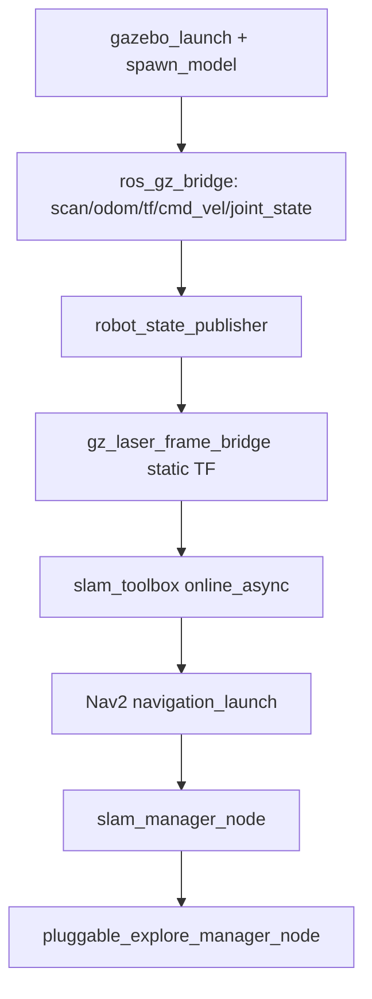

# sim_explore.launch.py — The All-in-One Simulation Stack

`sim_explore.launch.py` brings up the entire exploration stack in Gazebo
Harmonic from a single file: the simulator, the ROS↔gz bridge, the robot's TF,
slam_toolbox, Nav2, the map persister, and the explorer. It is the monolithic
counterpart to `sim_nav_full.launch.py` (which composes the same stack from the
smaller `sim_*` debug files). This file spells everything out inline, which makes
it the best single place to read "what does the full sim actually consist of."

It is a `better_launch` file — `@launch_this` plus `bl.node`/`bl.include` — run as
`bl dome_nav sim_explore.launch.py --map_name <name> --world_name <name>`.

## Arguments are the sim tuning surface

The launch signature *is* the sim configuration. These defaults are the
sim-specific overrides of the explorer's real-robot defaults:

```python
def sim_explore_launch(
    map_name="", world_name="",
    max_explore_radius=0.0, max_frontier_dist=15.0,
    min_frontier_dist=0.9, prefer_farthest=True, min_frontier_size=5,
):
```

There's a non-obvious constraint documented in the file: these defaults must be
**literal constants written directly in the signature**. `better_launch`'s CLI
parses the function signature via AST *without importing the module*, so a
default like `= SOME_IMPORTED_CONSTANT` fails ("not a valid float"). That's why
the same numbers are repeated across the three sim launch files rather than
shared via an import.

Both `map_name` and `world_name` are validated up front (`world_name` against the
installed worlds via `require_world_name`), failing fast with a usage hint rather
than letting Gazebo error obscurely later.

## Bring-up order and why it matters

The file assembles the stack in a specific order, each piece feeding the next:



1. **Gazebo + spawn** — the world runs (`-r`) and the robot spawns at the world's
   designed origin (`world_spawn_xy`).
2. **Bridge** — `clock`, `/scan`, `/odom`, `/tf`, `/cmd_vel`, and joint states
   cross between gz transport and ROS. `/clock` is what makes `use_sim_time` work.
3. **robot_state_publisher + laser TF** — two subtle, hard-won details live here
   (see below).
4. **slam → Nav2 → slam_manager → explorer** — slam must publish `map→odom`
   before Nav2 activates (Nav2 aborts bringup if the `map` frame is missing), and
   the explorer needs both `/map` and an active Nav2 to send goals to.

## Two details the comments guard

Both are the kind of thing that cost a debugging session and would silently
regress if edited away:

- **`robot_state_publisher` needs an explicit `name=`** and its URDF must go
  through a **params file**, not an inline `params=` dict. Without a name,
  `bl.node` treats it as anonymous and scans every process on the VM to pick a
  unique name — which hangs on a busy machine (F13 T04t).
- **The joint-state remap is on `robot_state_publisher`, not the bridge.**
  `spawn_topic_bridge` starts the bridge with `raw=True`, which drops remaps, so
  the bridge publishes under its literal topic name and RSP's subscription is
  remapped to match instead.

```python
bl.node("robot_state_publisher", "robot_state_publisher",
        name="robot_state_publisher",
        param_files=[rsp_params_path],
        remaps={"/joint_states": "/model/dome2/joint_state"})
```

The `gz_laser_frame_bridge` static transform anchors gz's renamed
`dome2/base_footprint/lidar` frame to the URDF `laser` frame, so slam_toolbox can
resolve the scan's `frame_id` in TF.

## Configs are standalone, loaded verbatim

Since the 2026-07-08 refactor there is no runtime patching. slam and Nav2 each
get a complete committed file:

```python
slam_config = os.path.join(pkg, "config", "mapper_params_online_async_sim.yaml")
nav2_config = os.path.join(pkg, "config", "nav2_params_explore_sim.yaml")
bl.include("slam_toolbox", "online_async_launch.py",
    slam_params_file=slam_config, use_sim_time="true")
bl.include("nav2_bringup", "navigation_launch.py",
    params_file=nav2_config, use_sim_time="true")
```

The only dynamic value is `map_persist_path` (from `--map_name`), passed to
`slam_manager_node` as a plain parameter.

## Observations / possible improvements

- **This file and `sim_nav_full.launch.py` overlap heavily** — the latter
  composes the split `sim_*` files to reach the same end state, while this one
  inlines everything. Two ways to launch "the whole thing" is one too many;
  eventually one should be the canonical entry point.
- **The sim tuning defaults are triplicated** across the three sim launch files
  because of the AST-parsing constraint. A generated-signature or a `--params-file`
  convention could remove the drift risk, at some cost in launch-file magic.
- **Gazebo is started here** (`gazebo_launch`) whereas `sim_robot.launch.py` was
  moved to expect an already-running `gz sim`. The two-step model (start Gazebo
  by hand, then the stack) has proven easier to debug; this all-in-one predates
  that decision.
