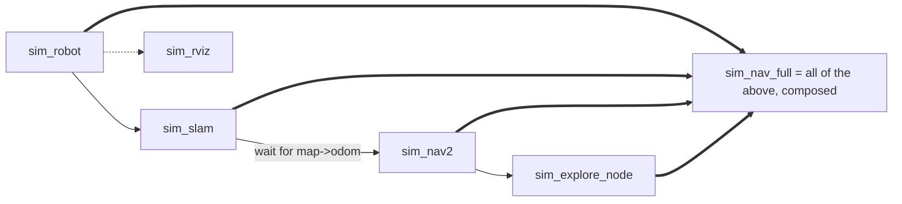

# Sim Debug Launch Files — Bringing the Stack Up Piece by Piece

Where `sim_explore.launch.py` starts the whole simulation from one file, the
`sim_*` debug launch files split that same stack into single-purpose pieces, each
runnable in its own terminal. The motivation is diagnosis: when something in the
sim misbehaves, being able to start *just* the robot, or *just* slam, and watch
it in isolation is far more informative than an all-in-one that either works or
doesn't. Several real bugs (the slam-before-Nav2 ordering, the joint-state remap,
the anonymous-name hang) were only found because the stack could be brought up
incrementally.

## The pieces



- **`sim_robot.launch.py`** — the visible, TF-correct robot with no autonomy:
  robot spawn into an already-running Gazebo, the `ros_gz_bridge`,
  `robot_state_publisher`, and the static laser-frame TF. This is the foundation
  every other piece assumes. (It expects `gz sim -r <world>.world` to already be
  running — Gazebo is started by hand so the sim layer can be confirmed with
  native `gz topic` tools independent of ROS.)
- **`sim_slam.launch.py`** — slam_toolbox `online_async` alone, loading the
  standalone `mapper_params_online_async_sim.yaml`. Split out so you can confirm `/map` and the
  `map→odom` transform appear *before* starting Nav2.
- **`sim_nav2.launch.py`** — the Nav2 stack alone (`navigation_launch.py` +
  `nav2_params_explore_sim.yaml`). Requires slam already publishing `map→odom`, or its
  `global_costmap` blocks on activation and `lifecycle_manager` aborts the whole
  bringup.
- **`sim_explore_node.launch.py`** — just `pluggable_explore_manager_node` with
  the sim exploration parameters. Requires the three above.
- **`sim_rviz.launch.py`** — RViz2 with `use_sim_time` on, for visualizing map,
  costmaps, TF, and the `/explore/markers`.

## Why the ordering is load-bearing, not cosmetic

The dependency chain is not arbitrary — each edge encodes a lesson:

- **slam before Nav2:** Nav2's `global_costmap` waits only a short, hardcoded time
  for the `map` frame during activation; if slam isn't publishing yet, activation
  fails and `lifecycle_manager` aborts *every* server. So slam must be up and
  publishing first.
- **Readiness, not just order:** starting slam "before" Nav2 in one script isn't
  enough — `bl.include` returns when it *registers* the nested launch, not when
  the stack is *ready*. That's exactly why these are separate manual steps, and
  why the composed `sim_nav_full.launch.py` blocks on the real `map→odom`
  transform between its slam and Nav2 includes.

## sim_nav_full: the composition

`sim_nav_full.launch.py` gives back one-command convenience without duplicating
logic: it `bl.include`s `sim_robot`, `sim_slam`, `sim_nav2`, and
`sim_explore_node` in dependency order, waits for `map→odom` between slam and
Nav2, and adds `slam_manager_node` itself (none of the split files own map
persistence). `better_launch` auto-forwards the calling launch's args to each
included file by matching signatures, so `--map_name`/`--world_name` reach the
right pieces without being re-specified.

```python
bl.include("dome_nav", "sim_robot.launch.py")
bl.include("dome_nav", "sim_slam.launch.py")
wait_for_map_odom_tf(bl)            # block on the real transform, not just order
bl.include("dome_nav", "sim_nav2.launch.py")
bl.include("dome_nav", "sim_explore_node.launch.py")
```

`wait_for_map_odom_tf` must use `bl.shared_node` (not `rclpy.create_node()`),
because `better_launch` runs `rclpy.init()` against its own private context — a
plain `create_node()` would raise `NotInitializedException`.

## Typical workflows

```bash
# One command (Gazebo already running):
bl dome_nav sim_nav_full.launch.py --map_name m1 --world_name multi_room

# Or piece by piece, one terminal each (for debugging):
gz sim -r .../worlds/multi_room.world
bl dome_nav sim_robot.launch.py --world_name multi_room
bl dome_nav sim_slam.launch.py            # confirm /map before next step
bl dome_nav sim_nav2.launch.py
bl dome_nav sim_explore_node.launch.py --map_name m1
bl dome_nav sim_rviz.launch.py            # optional
```

## Observations / possible improvements

- **`sim_nav_full` and `sim_explore` are two routes to the same stack.** The
  split-and-compose approach (`sim_nav_full`) is the more maintainable one since
  it has no duplicated node setup; `sim_explore` inlines everything. Long term,
  one should be retired.
- **The `wait_for_map_odom_tf` pattern is exactly what the raw `bl.include`
  ordering lacks.** If `better_launch` ever grows a "wait until ready" include
  option, the manual two-step debugging dance becomes unnecessary.
- **Sim parameter defaults are repeated** in `sim_explore_node`, `sim_explore`,
  and `sim_nav_full` (the AST-parsing constraint again). Worth consolidating if a
  clean mechanism appears.
- **`sim_robot` now assumes an externally-started Gazebo.** Convenient for
  debugging the sim layer natively, but it means "run the robot" is really a
  two-command operation; documenting that at the top of the file (done) is the
  mitigation.
