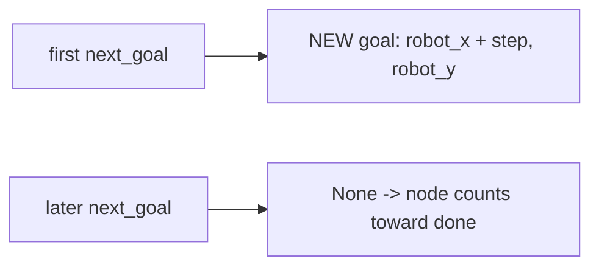

# Appendix: The Hello-World Algorithm

`hello_world_algorithm.py` is the smallest thing that satisfies the
`ExplorationAlgorithm` protocol and still drives the robot. It exists as a
reference template for authoring new exploration plugins, and as a live proof that
the F12 pluggable seam swaps behavior on a real robot — not only in tests. It is
deliberately trivial, hence an appendix.

## What the protocol asks for

An algorithm must expose two attributes the manager node reads and implement one
method:

```python
def next_goal(self, ctx: ExplorationContext) -> tuple[float, float] | None:
    ...
```

Return a world-frame `(x, y)` goal, or `None` to mean "nothing to send." The node
calls `next_goal` whenever it has no active goal, pursues each returned goal to
completion, and — after enough consecutive `None`s (`NO_FRONTIER_PATIENCE`) —
declares exploration finished.

## The whole algorithm

Hello-world ignores the map entirely. It emits exactly one goal a fixed step ahead
of the robot in the map **+x** direction, then returns `None` forever after:

```python
def next_goal(self, ctx):
    if self.emitted:
        return None
    self.emitted = True
    rx, ry = ctx.robot_xy
    step = ctx.params.preferred_goal_distance
    return (rx + step, ry)
```

The `emitted` flag is the entire state. `preferred_goal_distance` is the one tuning
param it borrows from the shared `ExploreParams`; every other param is frontier
tuning it never touches. Heading is ignored — the node stamps orientation `w = 1.0`.

## The one wart, on purpose

The class also sets `latest_clusters = []` and `latest_diag = None`. These are
frontier-specific fields the general protocol still requires (the node reads them
for markers, telemetry, and its done-decision). Hello-world has no clusters, so it
*fakes* them. That fakery is not incidental — it is the concrete evidence behind
feature **F23**, which decouples the manager from frontier concepts so a minimal
plugin no longer has to pretend. Until F23 lands, the fake stays.


