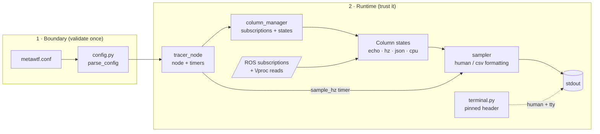
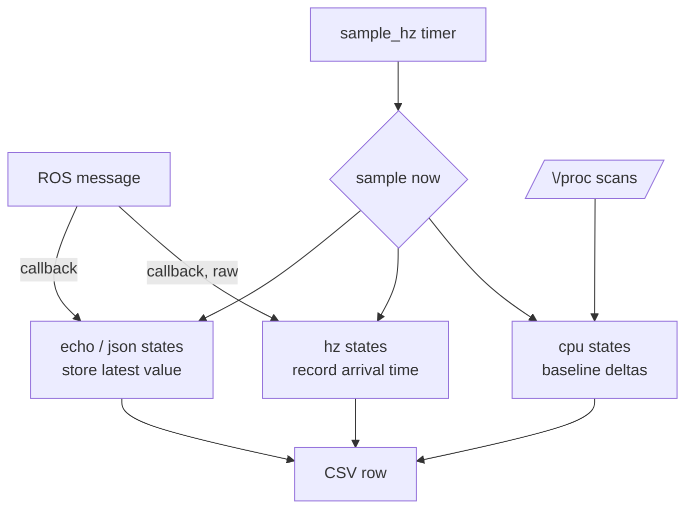

# Overview: the theory of operation of metawtf

metawtf answers a deceptively simple question: *"several things are happening
inside my ROS2 system at once — what are they all doing, right now, on one
screen?"* A robotics developer typically juggles `ros2 topic echo` in one
terminal, `ros2 topic hz` in another, and `top` in a third, and cannot see a
velocity command, a TF rate, and a navigator's CPU% line up in time. metawtf
merges them: a single process samples a configurable set of *columns* on a
common timer and prints one row per tick — timestamp plus one value per
column — to stdout. Output comes in two formats chosen by where stdout
points: on a terminal the `human` format aligns and pads columns, truncates
over-wide values with `…`, and pins the header to the top of the screen via
an ANSI scroll region; piped or redirected, the `csv` format emits plain
RFC-4180 rows for spreadsheets and graphing. A `format` directive overrides
the auto-detection.

This document is the map. It explains the architecture as a whole — the
abstractions, the data and control flow, and the design rules that recur in
every chapter — and then points at the numbered chapters for the details.

## The pipeline at a glance

The lifecycle of a run:

1. **Parse.** `load_config` reads `./metawtf.conf` and `parse_config` turns it
   into a `Config` — a closed union of typed column dataclasses. Every rule
   (required keys, regex compilation, window ≥ sample period) is enforced
   here, with line numbers. A bad config is one clean error line, never a
   traceback (chapter 01).
2. **Build.** `TracerNode` hands the `Config` to a `ColumnManager`, which
   creates one *column state* per column and a lazy `Subscription` per topic
   (chapter 19). Columns without a topic (`proc_cpu`, `sys_cpu`) skip
   subscriptions entirely — they read `/proc` (chapters 14–17).
3. **Listen.** Once per second the manager re-scans the topic graph — one
   snapshot shared by all pending subscriptions — subscribing as topics
   appear. `match` hz columns and key-expanded JSON columns can *grow* the
   column set at runtime.
4. **Tick.** A `sample_hz` timer asks the `Sampler` for a row (chapter 18).
   Each column state's `sample(now)` returns a string or `None`; the sampler
   joins the cells in one of two modes — padded and truncated for humans,
   bare RFC-4180 for csv. In human mode on a tty the header is pinned by a
   scroll region (appendix X02) instead of reprinted.

## The two clocks and the O(1) rule

The central architectural decision is the separation of **collecting** from
**reporting**, which is what keeps a single-threaded rclpy executor
sufficient:

- **Message callbacks do O(1) work.** An echo callback stores the extracted
  scalar and `time.monotonic()`; an hz callback appends one timestamp to a
  pruned deque. No formatting, no printing, no allocation-heavy work — so a
  500 Hz camera topic cannot starve the 2 Hz row cadence. (`ros2 topic hz`
  needs a separate printing thread; metawtf does not.)
- **The timer does all the expensive work once per tick.** Formatting,
  `/proc` reads, and CPU math happen in `sample()`, driven by the row timer,
  never per message.

Two clocks coexist deliberately: `time.monotonic()` for *intervals* (rates,
staleness, CPU deltas — immune to NTP jumps) and `datetime.now()` for the
*displayed* timestamp (what a human correlates with other logs).

## The key abstractions

| Abstraction | Module | Role |
|---|---|---|
| `Config` dataclasses | `config.py` | Typed, validated description of every column; the only thing crossing the parse boundary |
| `SampledColumn` protocol | `sampler.py` | Anything with `name`, `width`, and `sample(now) -> str \| None` can be a column |
| `ValueColumnState` | `value_column.py` | Template-method base for value columns: last-known value, staleness, `INVALID` sentinel |
| `Subscription` | `column_manager.py` | Lazy state machine (pending → subscribed \| failed) decoupling config from graph timing |
| Trackers | `cpu_tracker.py`, `sys_cpu_tracker.py` | Baseline/delta measurement over `/proc`, injectable for tests |

The protocol is the quiet hero: the sampler knows nothing about ROS, JSON, or
`/proc`. New metrics (F02's hz, F03's proc_cpu, the sys_cpu addition) each
landed as *one new state class plus one config branch* — the sampler and the
row pipeline never changed.

## Data flow: three shapes of column

- **Value columns** (echo, json) are *zero-order hold*: they show the most
  recent value at tick time, with `stale_after` blanking data that stopped
  arriving. Message rate and row rate are fully decoupled.
- **Rate columns** (hz) measure *receive* rate over a rolling window with the
  span estimator `(n−1)/(t_newest − t_oldest)` (chapter 06) — never header
  stamps, which measure the publisher's clock, not arrival.
- **CPU columns** are pull-based: no callback exists, so their `sample()` does
  the measurement itself — per-process jiffies deltas against wall time
  (Irix mode, one core = 100%), or system-wide busy/idle as a pure ratio of
  deltas (Solaris mode, 0–100).

## The failure philosophy

Three rules recur everywhere and are worth knowing before reading any
chapter:

1. **Missing data is a cell state, not an error.** Not-yet-published,
  stale, or first-sample-without-baseline all render as an *empty cell*;
  a message that arrived but couldn't be read renders as `?`. Zero would be
  a lie, a crash would kill the other columns.
2. **Transient vs permanent is decided at classification time.** A topic
  missing from the graph is retried every scan; an unresolvable message type
  is marked `failed` once. A vanished pid is dropped from the baseline; a
  malformed stat line raises. Guess-and-repair is forbidden by project rule.
3. **One subscription, many columns.** A JSON `subfields` line or a
  discovered key set fans one subscription out to several states, so DDS
  traffic doesn't multiply with column count.

## Testability as an architectural feature

Every measurement seam is injectable: the `/proc` root, the clock, the
jiffies reader, the graph snapshot, the terminal size, the output stream. The
consequence is structural — the 217 tests run without ROS, without root,
without real processes, and mostly without mocks, because the code was shaped
around replaceable boundaries rather than patched around them in the tests.

## Reading guide

The chapters follow dependency order — each can be read with only the ones
before it:

- **01** `config` — the conf grammar, validation, typed dataclasses
- **02–06** small foundations: field paths, message types, QoS, topic
  matching, rate counting
- **07–09** the `/proc` parsers: per-pid stat, pid resolution, system stat
- **10–13** value columns: shared base, echo, hz, JSON subfields
- **14–17** CPU measurement: trackers and their column states
- **18–20** the output and orchestration: sampler, column manager, node
- **X01, X02** appendices: `json_select`, the dotted-key walker; `terminal`,
  the ANSI pinned header

## Observations and possible improvements

- The shared mutable `states` list between `ColumnManager` and `Sampler` is
  the one covert channel in the design; a columns-provider interface would
  make the ownership explicit (already logged as a chore).
- Header reprinting on column-set growth is honest CSV but means downstream
  parsers must tolerate mid-stream headers; an alternative is buffering new
  columns into a side file.
- `/proc` Linux-ism is total — the tracker seam would admit a psutil backend
  for portability, at the cost of the dependency the project deliberately
  avoided.
