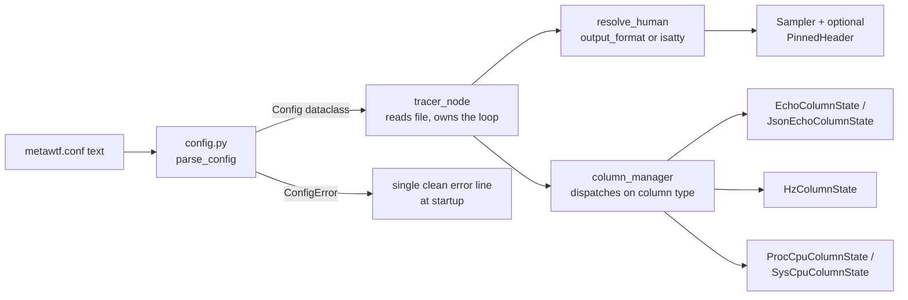

# Config: the line-oriented `metawtf.conf` parser

Every `metawtf` run starts by reading a small configuration file,
`metawtf.conf`, written in a deliberately minimal line-oriented syntax — one
directive per line, whitespace-separated tokens, `#` comments. It is *not*
YAML: the format is a tiny domain-specific language parsed by hand in
`metawtf/config.py`, which is the boundary between "whatever a human typed
into a text file" and "a typed structure the rest of the program can trust."

That boundary matters more than it looks. The project's rule is *validate at
the boundary, then trust it*: once `parse_config` returns, no other module
re-checks that a topic is present, a window is positive, or a regex compiles.
A tracer meant to run unattended against a live robot should fail loudly and
early on a malformed config, not limp along with a `None` where a topic name
should be and crash three layers deeper inside a subscription callback.

## How the config fits into the whole

`config.py` is the foundation every other module stands on. The control flow
across the package looks like this:



The key architectural property is the *typed seam*: `column_manager` never
sees strings or raw tokens. It pattern-matches on `isinstance(column,
EchoColumn)` and friends, so every consumer of configuration downstream is
exhaustive over a closed union of dataclasses rather than defensive against
arbitrary dict shapes. Adding a new metric means adding one dataclass, one
branch in the parser's dispatch, and one branch in the manager — the shape of
the code makes the extension point obvious.

The same seam carries the presentation policy introduced with the output
format feature: the parser records *what the user asked for* (`human`, `csv`,
or nothing), and the decision of what that means for a live process —
including the tty auto-detection fallback — is deferred to `tracer_node`'s
`resolve_human`. The config module knows the vocabulary of formats; it
deliberately does not know what a terminal is.

## A tiny grammar, parsed by hand

The grammar is intentionally small enough to describe in one sentence: a line
is `DIRECTIVE [positional] [key=value ...]`, where at most one bare positional
token is allowed and every other token must be `key=value`. `parse_line` is
the tokenizer and first-line validator:

```python
def parse_line(line: str) -> tuple[str, str | None, dict]:
    tokens = line.split()
    directive, args = tokens[0], tokens[1:]
    if directive not in DIRECTIVES:
        raise ConfigError(...)
    positional = None
    options = {}
    for token in args:
        if "=" not in token:
            if positional is not None:
                raise ConfigError(...)
            positional = token
            continue
        key, _, value = token.partition("=")
        ...
        options[key] = value
    return directive, positional, options
```

Three design choices are worth pausing on. First, the tokenizer is strict in
both directions: a second positional, an empty key or value, or a repeated key
all raise immediately — there is no "last write wins" ambiguity to debug
later. Second, `token.partition("=")` splits on the *first* `=` only, so a
value like a regex containing `=` survives intact. Third, the function returns
a uniform `(directive, positional, options)` triple, so the per-directive
parsers downstream share one calling convention instead of each re-tokenizing.

This is the classic interpreter pipeline — tokenize, then dispatch on the
head symbol — applied at the smallest scale that still buys real separation.
Writing it by hand (rather than pulling in a config library) keeps the
dependency footprint at zero and, more importantly, keeps every error message
under the project's control.

## Data classes, one per column shape

The parsed result is a small family of dataclasses, closed under the four
column metrics plus the timestamp and output-format configuration:

```python
@dataclass
class EchoColumn:
    name: str
    topic: str
    field: str
    type: str | None = None
    stale_after: float | None = None
    width: int | None = None
    is_json: bool = False
    subfields: list[str] | None = None
    subfield_names: list[str] | None = None
    subfield_widths: list[int] | None = None
    fields: list[str] | None = None
    field_names: list[str] | None = None
    field_widths: list[int] | None = None

@dataclass
class HzColumn:
    window: float
    topic: str | None = None
    match: re.Pattern | None = None
    name: str | None = None
    width: int | None = None

@dataclass
class Config:
    sample_hz: float
    columns: list[EchoColumn | HzColumn | ProcCpuColumn | SysCpuColumn]
    time: TimeColumn = field(default_factory=TimeColumn)
    # None means auto-detect from stdout (tty -> human, pipe -> csv).
    output_format: str | None = None
```

`ProcCpuColumn` and `SysCpuColumn` follow the same pattern (name plus a
compiled `process` regex, or a `busy`/`idle` mode). Three things to notice.
`HzColumn.match` and `ProcCpuColumn.process` hold *compiled* `re.Pattern`
objects: regexes are compiled at load time so a malformed pattern is reported
at startup, not on the first matching attempt, and the per-message hot path
pays no compile cost. `Config.time` defaults via
`field(default_factory=TimeColumn)` so a config with no `time` directive still
parses, and tests constructing a `Config` directly need not mention it. And
`output_format` is a plain optional string rather than a new dataclass: unlike
`TimeColumn`, which carries two tunables (`format`, `width`) and so earns its
own type, the output format is a single enum-like value — `None`, `"human"`,
or `"csv"` — where `None` is not "unset and forgotten" but a meaningful third
state, *auto-detect*.

## The driver: line loop, then deferred cross-checks

`parse_config` is a straightforward accumulation loop — one pass over the
lines, routing each directive to its parser, with line numbers attached to any
error so the user is pointed at the exact offending line:

```python
for line_no, raw_line in enumerate(text.splitlines(), start=1):
    line = raw_line.strip()
    if not line or line.startswith("#"):
        continue
    try:
        directive, positional, options = parse_line(line)
        if directive in COLUMN_METRICS:
            columns.append(parse_column(directive, positional, options))
        elif directive == "sample":
            sample_hz = parse_sample(positional, options, seen_singletons)
        elif directive == "format":
            output_format = parse_format(positional, options, seen_singletons)
        else:
            time_column = parse_time(positional, options, seen_singletons)
    except ConfigError as error:
        raise ConfigError(f"line {line_no}: {error}") from error
```

The dispatch has a tidy shape: column metrics *accumulate* into a list, while
`sample`, `format`, and `time` are *singletons* — file-global settings that
may appear at most once, guarded by the shared `seen_singletons` set. The
three singleton parsers differ in what they return (a float, a string, a
`TimeColumn`) but are identical in skeleton, which is what makes adding a new
singleton directive a five-line change rather than a refactor.

The interesting subtlety is what *cannot* be checked line-by-line. The rule
"an `hz` column's `window` must be at least one sample period" couples a
column to `sample_hz`, but `sample` may appear *after* the `hz` lines in the
file. A naive one-pass validator would either have to require an ordering or
reject valid files. Instead the module defers the check: `validate_windows`
runs once after the whole file is parsed:

```python
def validate_windows(columns: list, sample_hz: float) -> None:
    sample_period = 1.0 / sample_hz
    for column in columns:
        if isinstance(column, HzColumn) and column.window < sample_period:
            raise ConfigError(...)
```

This is a general parsing technique worth recognizing: when validation rules
span multiple declarations and the format allows free ordering, parse
everything into an intermediate form first, then run the cross-cutting rules
over the completed structure. The reason the rule exists at all is
algorithmic: a window shorter than the sampling period cannot reliably contain
two message arrivals at the row cadence, so the measured rate would be noise.

One other whole-file rule lives in the loop's epilogue: an empty column list
is rejected at the end — a config with no columns would trace nothing.

## The `format` directive: policy up front, mechanism downstream

The newest directive picks the output presentation, and it is worth reading
as a study in how this codebase separates *policy* from *mechanism*:

```python
OUTPUT_FORMATS = {"human", "csv"}

def parse_format(positional, options: dict, seen: set) -> str:
    reject_singleton_repeat("format", seen)
    if options:
        raise ConfigError(f"'format' takes no key=value options: {sorted(options)}")
    if positional not in OUTPUT_FORMATS:
        raise ConfigError(
            f"'format' must be one of {sorted(OUTPUT_FORMATS)},"
            f" got {positional!r}"
        )
    return positional
```

Several small decisions add up here. The value is *positional only* — `format
csv`, never `format mode=csv` — because with exactly one meaningful argument
the `key=value` machinery would be ceremony, and the singleton-parsers already
share the convention that a bare value is the directive's payload (`sample 5`
works the same way). Validating against the `OUTPUT_FORMATS` set, rather than
a pair of string comparisons, keeps the error message self-maintaining: add a
third format to the set and the rejection text lists it for free. And a
repeated `format` is an error, not an override, via the same
`reject_singleton_repeat` helper that guards `sample` and `time` — for
file-global settings, duplication is almost certainly a paste mistake, and
silently honoring the second one would hide it.

The deeper choice is what the parser does *not* decide. `Config.output_format`
defaults to `None`, and `None` means auto-detect: `tracer_node.resolve_human`
checks `sys.stdout.isatty()` and picks `human` on a terminal, `csv` on a pipe
or redirect. This three-state design — explicit human / explicit csv / defer
to the environment — is the classic *tri-state option* pattern, and it is the
right home for the default because the honest answer to "what format should I
emit?" depends on information (is stdout a terminal?) that only exists at
runtime, not at parse time. A user watching a live trace gets aligned columns
with a pinned header; the same config piped into a file or another tool gets
clean machine-parseable csv; and either behavior can be pinned down with one
line in `metawtf.conf` when the auto-detection guesses wrong — for example
forcing `format csv` while watching output scroll past in a terminal, or
`format human` when piping to `less`. Keeping the isatty probe out of
`config.py` also keeps this module trivially testable: `parse_config` is a
pure function of text, with no dependency on the process's file descriptors.

## The positional shorthand and the topic-twice trap

`echo` and `hz` accept a bare positional token as sugar for `topic=`:

```python
if positional is not None:
    if directive not in ("echo", "hz"):
        raise ConfigError(...)
    if "topic" in options:
        raise ConfigError("topic given twice: ...")
    options = {**options, "topic": positional}
```

Note the dict *copy* (`{**options, ...}`) rather than mutation — the positional
is folded into the options map so the four column parsers can treat
`options["topic"]` uniformly, while the caller's structure stays untouched.
The sugar is scoped to the two directives where the topic is the natural
primary argument; `proc_cpu` and `sys_cpu` reject positionals outright. The
singletons are their mirror image: `sample` and `format` take a positional and
*forbid* options, `time` takes options and forbids a positional — each
directive claims exactly the token shape its semantics need, and `parse_line`'s
strict tokenizer guarantees nothing else can slip through.

## Per-column validation: same checklist shape, different rules

Each column parser follows an identical skeleton — reject unknown keys, check
required keys, coerce and range-check values, build the dataclass — which
makes the differences between metrics easy to scan. `parse_hz_column` shows
the shape and its one real rule, mutual exclusivity:

```python
has_topic = "topic" in options
has_match = "match" in options
if has_topic == has_match:
    raise ConfigError("hz column requires exactly one of 'topic' or 'match'")
```

`has_topic == has_match` is a compact way of saying "not exactly one": both
present or both absent fail the same test. A `match` column also forbids a
hand-set `name`, because its names come from the topics the regex discovers at
runtime — a fixed name would be wrong for every column it spawns.

The echo parser carries the richest rule set, and its central design choice is
that **`field=` is always a comma list**. One path is the plain single-column
echo; several paths fan out into one column per path, all from one
subscription. There is no separate plural keyword — `parse_key_list` splits
`field=` the same way it splits `subfields=`, so the same list machinery drives
both. A third shape, a JSON string field split by `subfields=`, reuses the same
fan-out with `JsonEchoColumnState` recipients instead. `validate_echo_column`
holds the coupling rules — `subfields` needs `json=true`, and neither the JSON
parse nor `subfields` makes sense over more than one message field — plus the
one naming rule: an optional `name=` list must have exactly one header per
column:

```python
def validate_echo_column(paths, names, is_json, subfields) -> None:
    if subfields is not None and not is_json:
        raise ConfigError("'subfields' requires 'json=true'")
    if len(paths) > 1 and (is_json or subfields is not None):
        raise ConfigError("'json'/'subfields' require a single 'field'")
    keys = subfields if subfields is not None else paths
    if names is not None and len(names) != len(keys):
        raise ConfigError(
            f"'name' must have {len(keys)} comma-separated value(s),"
            f" one per column, got {len(names)}"
        )
```

The per-column headers (`explore_status_reached`, `cmd_vel_linear_x`) are
computed at parse time by `resolve_multi_names` — shared by the multi-field and
subfields forms. A `name=` comma list overrides them with one custom header per
column; otherwise it falls back to `subfield_name(prefix, key)`, which turns
dotted keys into underscores. Keeping this beside `sanitize_topic` means every
header rule lives on one page rather than being split between config and the
column manager. (A single-field echo keeps its legacy behavior: `name=` is one
string defaulting to the sanitized topic. And `json=true` with no `subfields`
leaves the headers unknown until the first message reveals the keys, so the
manager derives them at runtime.)

Because each fanned-out column renders as its own cell, `width=` on a
multi-field or `subfields` echo is likewise a comma list — one width per column
— resolved by `echo_widths`:

```python
def echo_widths(options, keys):
    if keys is None:
        return None
    return parse_width_list(options.get("width"), len(keys))
```

`parse_width_list` rejects a count mismatch (`width=4,10` against three columns
is an error, not a silently padded default) and falls back to
`DEFAULT_ECHO_WIDTH` per column when `width` is omitted. The single-column
forms — plain echo, hz, cpu — keep the lone-integer `width`; the fanned-out
cases carry `EchoColumn.subfield_widths` or `field_widths`, which the column
manager zips one-to-one with the states it creates.

## Naming and small coercions

When a config omits `name`, the column is named after its topic:

```python
def sanitize_topic(topic: str) -> str:
    return topic.lstrip("/").replace("/", "_")
```

`/robot/odom` becomes `robot_odom` — short enough to read as a spreadsheet
header, still traceable to its source. Echo, single-topic hz, and
match-discovered hz columns all share this rule, so a header is unambiguous no
matter which metric produced it.

The leaf coercers (`parse_float`, `parse_width`, `parse_bool`, `parse_key_list`,
`compile_regex`) each validate exactly one value and raise a `ConfigError`
with the offending token embedded. None of them guess-and-repair: a string
`"fast"` for `sample_hz` is not silently defaulted; it is rejected. Booleans
are the strict case — only the literal tokens `true`/`false` are accepted, not
Python's usual truthy values, because in a text format `yes`, `1`, and `True`
are all plausible typos rather than intentions. Default widths are sized to
each metric's printed format (echo and hz use `%.2f`, the CPU columns
`%.1f%%`), which is why `DEFAULT_ECHO_WIDTH` is 8 but the others are 6.

## Loading from disk is a thin seam

```python
def load_config(path) -> Config:
    try:
        text = Path(path).read_text()
    except OSError as error:
        raise ConfigError(f"cannot read config {path}: {error}") from error
    return parse_config(text)
```

`parse_config` takes a plain string, not a path — so every rule above is
unit-tested by handing it literal text, with no filesystem mocking.
`load_config` is the only piece that touches disk, and its one job besides
reading is translation: I/O failures become the same `ConfigError` the
validator raises, so a missing file and a schema violation surface
identically — one clean error line at startup instead of a traceback (the
catching half lives in the tracer node chapter).

## Observations for future improvement

- **Error aggregation.** The first invalid line aborts parsing, so a config
  with several mistakes costs one fix-rerun cycle per mistake. Collecting all
  line errors before raising would shorten that loop, at the cost of a more
  complex `ConfigError` payload.
- **Quoting.** Values are whitespace-delimited tokens, so a `match` regex or
  a `name` cannot contain a space. If patterns ever need that, a minimal
  quoted-string rule in `parse_line` would do it — but adding it speculatively
  now would complicate the grammar for a case nobody has hit.
- **The singleton shape policy is stated three times.** `sample` and `format`
  forbid options and require a positional; `time` forbids a positional. The
  two `format`-style parsers are now nearly line-for-line identical apart from
  the value coercion, so a small table of "directive → allowed shape" (or a
  shared `parse_singleton_value` helper taking a validator) would state the
  policy once instead of three times in code.
- **A command-line `--format` override.** Today the only escape from
  auto-detection is editing `metawtf.conf`. A CLI flag layered on top of
  `Config.output_format` would make one-off overrides (`metawtf --format csv`)
  cheaper, at the cost of a second place where the precedence rule lives.
- **The `HzColumn` union-by-None.** `topic` and `match` are both optional
  fields with an exclusivity invariant enforced only at parse time. Two
  separate dataclasses (or a discriminated variant) would make the invariant
  unrepresentable-hence-unbreakable, at the cost of an extra branch in the
  column manager.
