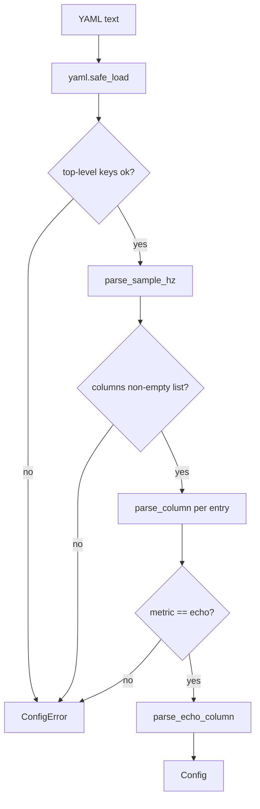

# Config: turning `metawtf.yaml` into a typed `Config`

Every `metawtf` run starts by reading a small YAML file describing which
columns to sample and how fast. `metawtf/config.py` is the boundary between
"whatever a human typed into a text file" and "a typed structure the rest of
the program can trust." Once `parse_config` returns, no other module in the
codebase re-checks that a topic string is really a string, or that
`sample_hz` is positive — that work happens exactly once, here.

This matters more than it looks. The style guide this project follows is
explicit about it: validate at the boundary, then trust it. A tracer that is
meant to run unattended against a live robot should fail loudly and early on
a malformed config, not limp along with a `None` where a topic name should
be and crash three layers deeper inside a subscription callback.

## Two small data classes, not a dict

The parsed result is two dataclasses:

```python
@dataclass
class EchoColumn:
    name: str
    topic: str
    field: str
    type: str | None = None
    stale_after: float | None = None


@dataclass
class Config:
    sample_hz: float
    columns: list[EchoColumn]
```

`EchoColumn` intentionally has only one shape today, because v1 supports
exactly one column metric: `echo`. F02 and F03 will add `hz` and `proc_cpu`
metrics later, at which point `columns` will likely become a list of a union
type rather than a list of `EchoColumn`. Keeping `EchoColumn` narrowly named
now (instead of a vague `Column`) means that future change is additive
rather than a rename.

## Validation as a chain of small, single-purpose checks

`parse_config` reads like a checklist because it *is* one — each rule in the
feature spec becomes one guard clause:

```python
def parse_config(data: dict) -> Config:
    if not isinstance(data, dict):
        raise ConfigError("top-level config must be a mapping")
    unknown_keys = set(data) - TOP_LEVEL_KEYS
    if unknown_keys:
        raise ConfigError(f"unknown top-level key(s): {sorted(unknown_keys)}")
    sample_hz = parse_sample_hz(data.get("sample_hz", DEFAULT_SAMPLE_HZ))
    raw_columns = data.get("columns")
    if not isinstance(raw_columns, list) or not raw_columns:
        raise ConfigError("'columns' must be a non-empty list")
    columns = [parse_column(entry) for entry in raw_columns]
    return Config(sample_hz=sample_hz, columns=columns)
```

Each helper (`parse_sample_hz`, `parse_column`, `require_str`,
`parse_stale_after`, ...) validates exactly one field and raises a
`ConfigError` with the offending value embedded in the message. None of them
try to coerce a bad value into a good one — a string `"fast"` for
`sample_hz` is not silently treated as the default; it is rejected. This is
the "report, don't guess-and-repair" rule in practice: a config typo is a
bug in the user's input, and the right response is to say so precisely, not
to paper over it.



## Deriving column names from topic and field

When a config omits `name`, one is derived from the topic and field:

```python
def sanitize_topic(topic: str) -> str:
    return topic.lstrip("/").replace("/", "_")


def default_column_name(topic: str, field: str) -> str:
    last_segment = field.split(".")[-1]
    return f"{sanitize_topic(topic)}_{last_segment}"
```

`/odom` + `pose.pose.position.x` becomes `odom_x` — short enough to read as
a spreadsheet header, but still traceable back to its source. `sanitize_topic`
is written as a general topic-name sanitizer (strip the leading slash,
collapse remaining slashes to underscores) even though v1's example never
exercises the "remaining slashes" branch, because F02's `hz` columns need the
identical rule for topics matched by regex. Sharing the function now avoids
two slightly-different sanitizers drifting apart later.

## Loading from disk is a thin, separately-testable seam

```python
def load_config(path) -> Config:
    import yaml

    with open(path) as config_file:
        data = yaml.safe_load(config_file)
    return parse_config(data or {})
```

`parse_config` takes a plain `dict`, not a file path — so every validation
rule above is unit-tested by handing it `yaml.safe_load(some_string)`
directly, with no filesystem or PyYAML mocking required. `load_config` is
the only piece that touches disk, and it stays a two-line wrapper.

## Observations for future improvement

- **Union types for columns.** Once F02/F03 land, `Config.columns` should
  probably become `list[EchoColumn | HzColumn | ProcCpuColumn]` with
  `parse_column` dispatching on `metric`. The current `VALID_METRICS = {"echo"}`
  guard is already shaped to make that dispatch a one-line extension.
- **Error aggregation.** Right now the first invalid field aborts parsing.
  For a config with several mistakes, a user fixes them one at a time across
  several runs. Collecting all errors before raising would shorten that
  loop, at the cost of a more complex `ConfigError`.
- **`bool` vs `int` gotcha.** `parse_sample_hz` and `parse_stale_after` both
  special-case `isinstance(value, bool)` before the numeric check, because
  in Python `True` is an instance of `int`. Worth a one-line comment at the
  first occurrence so a future reader doesn't "simplify" it away.
