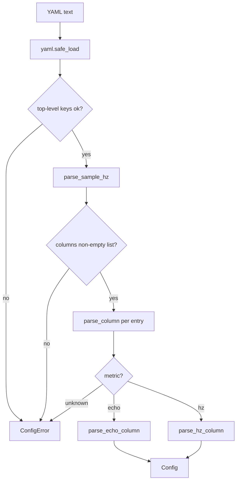

# Config: turning `metawtf.yaml` into a typed `Config`

Every `metawtf` run starts by reading a small YAML file describing which
columns to sample and how fast. `metawtf/config.py` is the boundary between
"whatever a human typed into a text file" and "a typed structure the rest of
the program can trust." Once `parse_config` returns, no other module in the
codebase re-checks that a topic string is really a string, or that
`sample_hz` is positive — that work happens exactly once, here.

This matters more than it looks. The style guide this project follows is
explicit about it: validate at the boundary, then trust it. A tracer that is
meant to run unattended against a live robot should fail loudly and early on
a malformed config, not limp along with a `None` where a topic name should
be and crash three layers deeper inside a subscription callback.

## Data classes, one per column shape

The parsed result is a small family of dataclasses. F02 added the `hz` metric,
so `columns` is now a union list rather than a list of one type — the additive
change the original design anticipated:

```python
@dataclass
class EchoColumn:
    name: str
    topic: str
    field: str
    type: str | None = None
    stale_after: float | None = None
    width: int | None = None
    is_json: bool = False
    subfields: list[str] | None = None
    subfield_names: list[str] | None = None


@dataclass
class HzColumn:
    window: float
    topic: str | None = None
    match: re.Pattern | None = None
    name: str | None = None
    width: int | None = None


@dataclass
class TimeColumn:
    format: str | None = None
    width: int | None = None


@dataclass
class Config:
    sample_hz: float
    columns: list[EchoColumn | HzColumn]
    time: TimeColumn = field(default_factory=TimeColumn)
```

An `HzColumn` carries either a single `topic` or a compiled `match` regex, never
both (the parser enforces the exclusivity). `width` is shared across every
column shape: an optional minimum column width the sampler uses for alignment.
`TimeColumn` configures the always-present leading timestamp column, and
`Config.time` defaults via `field(default_factory=TimeColumn)` so an older
config with no `time:` block still parses — and so code constructing a `Config`
directly (the tests do) need not mention it.

## Validation as a chain of small, single-purpose checks

`parse_config` reads like a checklist because it *is* one — each rule in the
feature spec becomes one guard clause:

```python
def parse_config(data: dict) -> Config:
    if not isinstance(data, dict):
        raise ConfigError("top-level config must be a mapping")
    unknown_keys = set(data) - TOP_LEVEL_KEYS
    if unknown_keys:
        raise ConfigError(f"unknown top-level key(s): {sorted(unknown_keys)}")
    sample_hz = parse_sample_hz(data.get("sample_hz", DEFAULT_SAMPLE_HZ))
    raw_columns = data.get("columns")
    if not isinstance(raw_columns, list) or not raw_columns:
        raise ConfigError("'columns' must be a non-empty list")
    sample_period = 1.0 / sample_hz
    columns = [parse_column(entry, sample_period) for entry in raw_columns]
    time = parse_time(data.get("time"))
    return Config(sample_hz=sample_hz, columns=columns, time=time)
```

Note that `sample_period` is threaded into `parse_column`: an `hz` column's
`window` must be at least one sample period (a shorter window could not contain
two arrivals at the row cadence), and that cross-field rule can only be checked
once `sample_hz` is known. It is the one place a column validation depends on a
top-level value.

Each helper (`parse_sample_hz`, `parse_column`, `require_str`,
`parse_stale_after`, `parse_width`, ...) validates exactly one field and raises a
`ConfigError` with the offending value embedded in the message. None of them
try to coerce a bad value into a good one — a string `"fast"` for
`sample_hz` is not silently treated as the default; it is rejected. This is
the "report, don't guess-and-repair" rule in practice: a config typo is a
bug in the user's input, and the right response is to say so precisely, not
to paper over it.



`parse_column` now dispatches on `metric` through `VALID_METRICS = {"echo",
"hz"}`; an `hz` entry routes to `parse_hz_column`, which enforces the
"exactly one of `topic`/`match`" rule, compiles the regex at load time (so a bad
pattern is reported here, not at first use), and forbids a hand-set `name` on a
`match` column since those names come from the matched topics.

## JSON subfields: naming decided here, not in the manager

F04 lets an echo column parse a JSON-string field and select keys out of it
(`json: true` plus an optional `subfields:` list). The parser enforces the
feature's coupling rules — `subfields` requires `json: true`, and an explicit
`name` is only allowed when it can unambiguously name *one* column:

```python
def resolve_echo_name(entry, topic, is_json, subfields) -> str:
    if subfields is not None and not is_json:
        raise ConfigError("'subfields' requires 'json: true'")
    if subfields is not None and len(subfields) > 1 and "name" in entry:
        raise ConfigError("'name' is not allowed with more than one subfield")
    ...


def resolve_subfield_names(entry, name, subfields) -> list[str] | None:
    if subfields is None:
        return None
    if len(subfields) == 1 and "name" in entry:
        return [name]
    return [subfield_name(name, key) for key in subfields]


def subfield_name(prefix: str, key: str) -> str:
    return f"{prefix}_{key.replace('.', '_')}"
```

The per-key column headers (`explore_status_reached`) are computed *here*, at
parse time, and travel in `EchoColumn.subfield_names`. The alternative — the
column manager deriving names when it fans out states — would split naming
policy across two modules; keeping it beside `sanitize_topic` means every
header rule lives on one page. (`json: true` with no `subfields` leaves
`subfield_names` as `None`: those columns can't be named until the first
message reveals the keys, so the manager derives them at runtime with the same
`subfield_name` helper.)

## Deriving column names from the topic

When a config omits `name`, the column is named after its topic:

```python
def sanitize_topic(topic: str) -> str:
    return topic.lstrip("/").replace("/", "_")
```

`/robot/odom` becomes `robot_odom` — short enough to read as a spreadsheet
header, but still traceable back to its source. Echo and single-topic hz columns
share this exact rule, and a `match` hz column names each discovered topic the
same way, so a header is unambiguous no matter which metric produced it. (An
earlier version appended the field's last segment for echo columns — `odom_x` —
but that was dropped in favour of the plain topic name; give two echo columns on
the same topic explicit `name`s to tell them apart.)

## Loading from disk is a thin, separately-testable seam

```python
def load_config(path) -> Config:
    import yaml

    with open(path) as config_file:
        data = yaml.safe_load(config_file)
    return parse_config(data or {})
```

`parse_config` takes a plain `dict`, not a file path — so every validation
rule above is unit-tested by handing it `yaml.safe_load(some_string)`
directly, with no filesystem or PyYAML mocking required. `load_config` is
the only piece that touches disk, and it stays a two-line wrapper.

## Observations for future improvement

- **F03 slots in the same way F02 did.** Adding `proc_cpu` means one more
  dataclass, `"proc_cpu"` in `VALID_METRICS`, and a `parse_proc_cpu_column`
  branch in `parse_column` — the dispatch is already shaped for it.
- **Error aggregation.** Right now the first invalid field aborts parsing.
  For a config with several mistakes, a user fixes them one at a time across
  several runs. Collecting all errors before raising would shorten that
  loop, at the cost of a more complex `ConfigError`.
- **`bool` vs `int` gotcha.** `parse_sample_hz` and `parse_stale_after` both
  special-case `isinstance(value, bool)` before the numeric check, because
  in Python `True` is an instance of `int`. Worth a one-line comment at the
  first occurrence so a future reader doesn't "simplify" it away.
