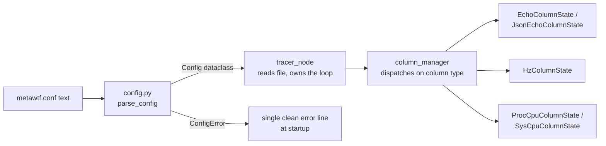

# Config: the line-oriented `metawtf.conf` parser

Every `metawtf` run starts by reading a small configuration file,
`metawtf.conf`, written in a deliberately minimal line-oriented syntax — one
directive per line, whitespace-separated tokens, `#` comments. It is *not*
YAML: the format is a tiny domain-specific language parsed by hand in
`metawtf/config.py`, which is the boundary between "whatever a human typed
into a text file" and "a typed structure the rest of the program can trust."

That boundary matters more than it looks. The project's rule is *validate at
the boundary, then trust it*: once `parse_config` returns, no other module
re-checks that a topic is present, a window is positive, or a regex compiles.
A tracer meant to run unattended against a live robot should fail loudly and
early on a malformed config, not limp along with a `None` where a topic name
should be and crash three layers deeper inside a subscription callback.

## How the config fits into the whole

`config.py` is the foundation every other module stands on. The control flow
across the package looks like this:



The key architectural property is the *typed seam*: `column_manager` never
sees strings or raw tokens. It pattern-matches on `isinstance(column,
EchoColumn)` and friends, so every consumer of configuration downstream is
exhaustive over a closed union of dataclasses rather than defensive against
arbitrary dict shapes. Adding a new metric means adding one dataclass, one
branch in the parser's dispatch, and one branch in the manager — the shape of
the code makes the extension point obvious.

## A tiny grammar, parsed by hand

The grammar is intentionally small enough to describe in one sentence: a line
is `DIRECTIVE [positional] [key=value ...]`, where at most one bare positional
token is allowed and every other token must be `key=value`. `parse_line` is
the tokenizer and first-line validator:

```python
def parse_line(line: str) -> tuple[str, str | None, dict]:
    tokens = line.split()
    directive, args = tokens[0], tokens[1:]
    if directive not in DIRECTIVES:
        raise ConfigError(...)
    positional = None
    options = {}
    for token in args:
        if "=" not in token:
            if positional is not None:
                raise ConfigError(...)
            positional = token
            continue
        key, _, value = token.partition("=")
        ...
        options[key] = value
    return directive, positional, options
```

Three design choices are worth pausing on. First, the tokenizer is strict in
both directions: a second positional, an empty key or value, or a repeated key
all raise immediately — there is no "last write wins" ambiguity to debug
later. Second, `token.partition("=")` splits on the *first* `=` only, so a
value like a regex containing `=` survives intact. Third, the function returns
a uniform `(directive, positional, options)` triple, so the per-directive
parsers downstream share one calling convention instead of each re-tokenizing.

This is the classic interpreter pipeline — tokenize, then dispatch on the
head symbol — applied at the smallest scale that still buys real separation.
Writing it by hand (rather than pulling in a config library) keeps the
dependency footprint at zero and, more importantly, keeps every error message
under the project's control.

## Data classes, one per column shape

The parsed result is a small family of dataclasses, closed under the four
column metrics plus the timestamp configuration:

```python
@dataclass
class EchoColumn:
    name: str
    topic: str
    field: str
    type: str | None = None
    stale_after: float | None = None
    width: int | None = None
    is_json: bool = False
    subfields: list[str] | None = None
    subfield_names: list[str] | None = None

@dataclass
class HzColumn:
    window: float
    topic: str | None = None
    match: re.Pattern | None = None
    name: str | None = None
    width: int | None = None

@dataclass
class Config:
    sample_hz: float
    columns: list[EchoColumn | HzColumn | ProcCpuColumn | SysCpuColumn]
    time: TimeColumn = field(default_factory=TimeColumn)
```

`ProcCpuColumn` and `SysCpuColumn` follow the same pattern (name plus a
compiled `process` regex, or a `busy`/`idle` mode). Two things to notice.
`HzColumn.match` and `ProcCpuColumn.process` hold *compiled* `re.Pattern`
objects: regexes are compiled at load time so a malformed pattern is reported
at startup, not on the first matching attempt, and the per-message hot path
pays no compile cost. And `Config.time` defaults via
`field(default_factory=TimeColumn)` so a config with no `time` directive still
parses, and tests constructing a `Config` directly need not mention it.

## The driver: line loop, then deferred cross-checks

`parse_config` is a straightforward accumulation loop — one pass over the
lines, routing each directive to its parser, with line numbers attached to any
error so the user is pointed at the exact offending line:

```python
for line_no, raw_line in enumerate(text.splitlines(), start=1):
    line = raw_line.strip()
    if not line or line.startswith("#"):
        continue
    try:
        directive, positional, options = parse_line(line)
        if directive in COLUMN_METRICS:
            columns.append(parse_column(directive, positional, options))
        elif directive == "sample":
            sample_hz = parse_sample(positional, options, seen_singletons)
        else:
            time_column = parse_time(positional, options, seen_singletons)
    except ConfigError as error:
        raise ConfigError(f"line {line_no}: {error}") from error
```

The interesting subtlety is what *cannot* be checked line-by-line. The rule
"an `hz` column's `window` must be at least one sample period" couples a
column to `sample_hz`, but `sample` may appear *after* the `hz` lines in the
file. A naive one-pass validator would either have to require an ordering or
reject valid files. Instead the module defers the check: `validate_windows`
runs once after the whole file is parsed:

```python
def validate_windows(columns: list, sample_hz: float) -> None:
    sample_period = 1.0 / sample_hz
    for column in columns:
        if isinstance(column, HzColumn) and column.window < sample_period:
            raise ConfigError(...)
```

This is a general parsing technique worth recognizing: when validation rules
span multiple declarations and the format allows free ordering, parse
everything into an intermediate form first, then run the cross-cutting rules
over the completed structure. The reason the rule exists at all is
algorithmic: a window shorter than the sampling period cannot reliably contain
two message arrivals at the row cadence, so the measured rate would be noise.

Two other whole-file rules live in the loop itself: `seen_singletons` rejects
a repeated `sample` or `time` directive (both are file-global settings, so
duplicates are almost certainly a mistake), and an empty column list is
rejected at the end — a config with no columns would trace nothing.

## The positional shorthand and the topic-twice trap

`echo` and `hz` accept a bare positional token as sugar for `topic=`:

```python
if positional is not None:
    if directive not in ("echo", "hz"):
        raise ConfigError(...)
    if "topic" in options:
        raise ConfigError("topic given twice: ...")
    options = {**options, "topic": positional}
```

Note the dict *copy* (`{**options, ...}`) rather than mutation — the positional
is folded into the options map so the four column parsers can treat
`options["topic"]` uniformly, while the caller's structure stays untouched.
The sugar is scoped to the two directives where the topic is the natural
primary argument; `proc_cpu` and `sys_cpu` reject positionals outright.

## Per-column validation: same checklist shape, different rules

Each column parser follows an identical skeleton — reject unknown keys, check
required keys, coerce and range-check values, build the dataclass — which
makes the differences between metrics easy to scan. `parse_hz_column` shows
the shape and its one real rule, mutual exclusivity:

```python
has_topic = "topic" in options
has_match = "match" in options
if has_topic == has_match:
    raise ConfigError("hz column requires exactly one of 'topic' or 'match'")
```

`has_topic == has_match` is a compact way of saying "not exactly one": both
present or both absent fail the same test. A `match` column also forbids a
hand-set `name`, because its names come from the topics the regex discovers at
runtime — a fixed name would be wrong for every column it spawns.

The echo parser carries the richest rule set. Beyond requiring `topic` and
`field`, it enforces the JSON feature's coupling: `subfields` requires
`json=true`, and an explicit `name` is only allowed when it can unambiguously
name *one* column:

```python
def resolve_echo_name(options, topic, is_json, subfields) -> str:
    if subfields is not None and not is_json:
        raise ConfigError("'subfields' requires 'json=true'")
    if subfields is not None and len(subfields) > 1 and "name" in options:
        raise ConfigError("'name' is not allowed with more than one subfield")
    return options.get("name") or sanitize_topic(topic)
```

The per-key headers (`explore_status_reached`) are computed here, at parse
time, and travel in `EchoColumn.subfield_names` via
`subfield_name(prefix, key)`, which turns dotted keys into underscores. The
alternative — the column manager deriving names when it fans out states —
would split naming policy across two modules; keeping it beside
`sanitize_topic` means every header rule lives on one page. (`json=true` with
no `subfields` leaves `subfield_names` as `None`: those columns can't be named
until the first message reveals the keys, so the manager derives them at
runtime.)

## Naming and small coercions

When a config omits `name`, the column is named after its topic:

```python
def sanitize_topic(topic: str) -> str:
    return topic.lstrip("/").replace("/", "_")
```

`/robot/odom` becomes `robot_odom` — short enough to read as a spreadsheet
header, still traceable to its source. Echo, single-topic hz, and
match-discovered hz columns all share this rule, so a header is unambiguous no
matter which metric produced it.

The leaf coercers (`parse_float`, `parse_width`, `parse_bool`, `parse_subfields`,
`compile_regex`) each validate exactly one value and raise a `ConfigError`
with the offending token embedded. None of them guess-and-repair: a string
`"fast"` for `sample_hz` is not silently defaulted; it is rejected. Booleans
are the strict case — only the literal tokens `true`/`false` are accepted, not
Python's usual truthy values, because in a text format `yes`, `1`, and `True`
are all plausible typos rather than intentions. Default widths are sized to
each metric's printed format (echo and hz use `%.2f`, the CPU columns
`%.1f%%`), which is why `DEFAULT_ECHO_WIDTH` is 8 but the others are 6.

## Loading from disk is a thin seam

```python
def load_config(path) -> Config:
    try:
        text = Path(path).read_text()
    except OSError as error:
        raise ConfigError(f"cannot read config {path}: {error}") from error
    return parse_config(text)
```

`parse_config` takes a plain string, not a path — so every rule above is
unit-tested by handing it literal text, with no filesystem mocking.
`load_config` is the only piece that touches disk, and its one job besides
reading is translation: I/O failures become the same `ConfigError` the
validator raises, so a missing file and a schema violation surface
identically — one clean error line at startup instead of a traceback (the
catching half lives in the tracer node chapter).

## Observations for future improvement

- **Error aggregation.** The first invalid line aborts parsing, so a config
  with several mistakes costs one fix-rerun cycle per mistake. Collecting all
  line errors before raising would shorten that loop, at the cost of a more
  complex `ConfigError` payload.
- **Quoting.** Values are whitespace-delimited tokens, so a `match` regex or
  a `name` cannot contain a space. If patterns ever need that, a minimal
  quoted-string rule in `parse_line` would do it — but adding it speculatively
  now would complicate the grammar for a case nobody has hit.
- **`sample` and `time` duplicate rules asymmetrically.** `sample` forbids all
  options; `time` forbids positionals. Both guards are correct, but a small
  table of "directive → allowed shape" would state the policy once instead of
  twice in code.
- **The `HzColumn` union-by-None.** `topic` and `match` are both optional
  fields with an exclusivity invariant enforced only at parse time. Two
  separate dataclasses (or a discriminated variant) would make the invariant
  unrepresentable-hence-unbreakable, at the cost of an extra branch in the
  column manager.
