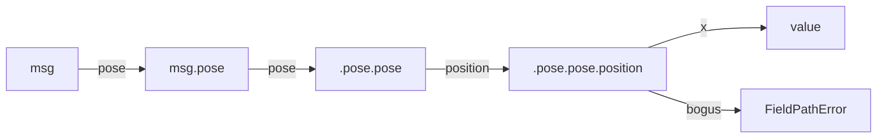

# Field Extract: walking a dotted path off a live message

`metawtf/field_extract.py` answers one question: given a ROS message object
and a config string like `"pose.pose.position.x"`, what value does that
point to *right now*? It is the smallest module in the codebase, but it sits
directly on the path from "user typed a field name into YAML" to "number
appears in a spreadsheet," so it earns its own chapter.

## Why attribute-walking instead of `eval` or `operator.attrgetter`

The obvious one-liner is `functools.reduce(getattr, path.split("."), msg)`,
or even `operator.attrgetter(path)(msg)`. Both work for the happy path, but
neither gives a usable error message when a config typo points at a field
that doesn't exist — you get a bare `AttributeError` pointing at whichever
Python internals did the lookup, with no indication of *which* segment of
the dotted path was wrong or what the user should fix.

```python
def extract_field(msg, path: str):
    value = msg
    parts = path.split(".")
    for index, part in enumerate(parts):
        if not hasattr(value, part):
            walked = ".".join(parts[:index]) or "<root>"
            raise FieldPathError(f"{part!r} not found on {walked} (path {path!r})")
        value = getattr(value, part)
    return value
```

The explicit loop trades three lines of brevity for a `FieldPathError` that
names the exact failing segment and how far the walk got before it failed.
For `pose.pose.position.bogus` against a real `nav_msgs/msg/Odometry`, the
error reads `'bogus' not found on pose.pose.position (path
'pose.pose.position.bogus')` — enough to fix the config without opening the
message definition.



## A deliberately narrow scope

The docstring in F01 calls out that this is "attribute paths only; no
sequence indexing" — there is no support for `waypoints[2].x`. That is a
stated non-goal, not an oversight: indexing into arrays raises questions
(what if the array is empty this tick? out of bounds?) that don't have a
one-line answer, so v1 defers them entirely rather than guessing.

## Observations for future improvement

- **Array indexing.** If a future feature needs `waypoints[0].pose.x`, the
  natural extension is to let each "part" optionally carry a `[N]` suffix,
  parsed once at config-load time (so a malformed index is a `ConfigError`,
  not a runtime surprise) and applied as `value[n]` before continuing the
  walk.
- **Caching the split.** `path.split(".")` runs on every call. Since a
  column's `field` string is fixed for the life of the program, `EchoColumnState`
  could pre-split it once at construction and hand `extract_field` a tuple
  instead of a string, avoiding repeated string splitting on every tick.
