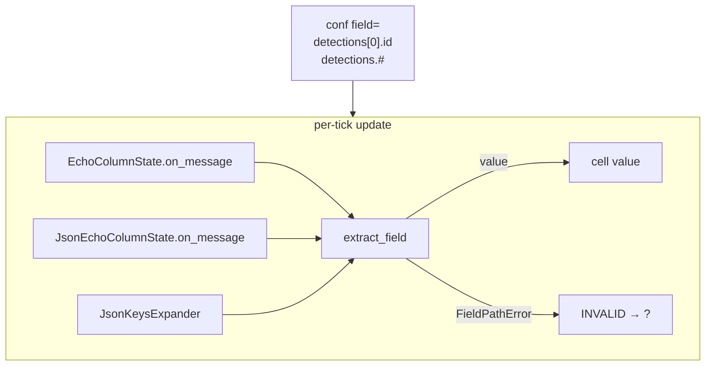
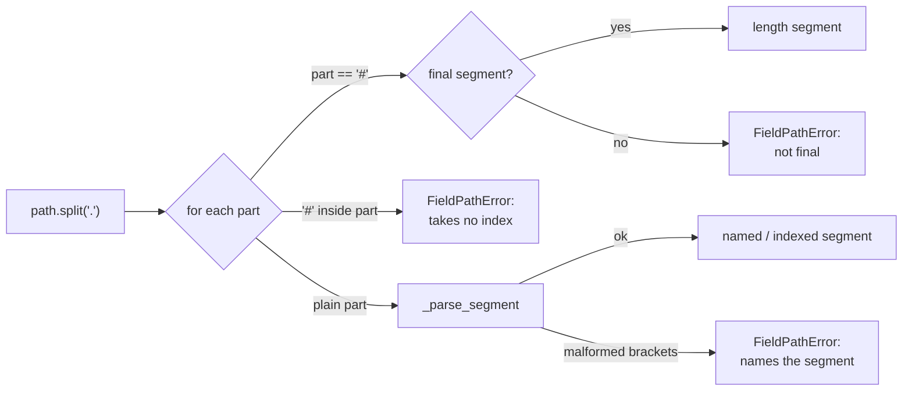

# Field Extract: walking an indexed path off a live message

`metawtf/field_extract.py` answers one question: given a ROS message object
and a config string like `"detections[0].results[0].hypothesis.score"` or
`"detections.#"`, what value does that point to *right now*? It started at 21
lines as a pure dotted-attribute walker (F01); F11 grew it to ~100 lines by
adding two new path features — an integer **index** on any segment, and a
terminal **length** segment (`#`) — without touching a single one of its
callers.

The module exports the same two names it always has:

- `extract_field(msg, path)` — the walker
- `FieldPathError` — the exception raised when parsing or walking fails

and one new one, useful mostly to tests and to anyone who wants to validate a
path without a live message:

- `parse_path(path)` — splits a path string into a list of segments, each
  either a plain/indexed name or a length marker

Every consumer of raw message values in the package — `echo_column.py`,
`json_column.py`, and `column_manager.py` — still funnels its field lookups
through `extract_field` alone, which means the error contract defined here
remains the *single* place that decides how a config typo (or a bad index, or
an empty array) behaves at runtime.

## Where it sits in the pipeline

A column configured with a `field:` string never touches the message object
directly. Each tick, the column hands the incoming message and its fixed
field string to `extract_field` and either stores the result or catches
`FieldPathError` and renders the cell as invalid (`?`). F11 changes nothing
about this fan-in — it only changes what can happen *inside* the box:



Because the exception is specific and predictable, callers can still catch it
narrowly. `EchoColumnState.on_message` catches only `FieldPathError` — a
genuine bug elsewhere (say, a `TypeError` inside an unrelated property) still
propagates rather than being silently masked as an invalid cell. F11 keeps
this contract by construction: every new failure mode (bad brackets, a
non-integer index, an out-of-range index, a non-indexable value, `#` on
something with no length) is folded into the same `FieldPathError`, never a
new exception type.

## Two phases: parse, then walk

F01's walker did both jobs in one loop — split on `.` and immediately
`getattr` each piece. F11 splits that into two phases, because a bracket or a
`#` can be malformed in ways that have nothing to do with any particular
message:

1. **`parse_path`** turns the string into a list of `_Segment` objects,
   rejecting anything structurally wrong (`detections[`, `detections[]`,
   `detections[a]`, a `#` in the middle of a path) *before* any message is
   involved.
2. **`extract_field`** walks the segments against a real object, doing the
   attribute lookups, index lookups, and the one length lookup, each with its
   own narrow failure mode.

```python
@dataclass
class _Segment:
    name: str | None
    index: int | None = None
    is_length: bool = False
```

A plain segment (`"id"`) is `_Segment(name="id")`. An indexed segment
(`"detections[0]"`) is `_Segment(name="detections", index=0)`. The length
marker (`"#"`) is `_Segment(name=None, is_length=True)` — it carries no name
because it never does a `getattr`; it operates on whatever value the walk has
already reached.

Splitting these phases apart means a config validator could someday call
`parse_path` alone, at startup, against every configured `field=` string, and
report every malformed path before the graph even connects — a *config*
mistake (`detections[a].id`) is caught structurally, independent of whether
`/oak/detections` ever publishes a message.

## Parsing a segment: where the brackets live

```python
def _parse_segment(part: str, path: str) -> _Segment:
    if "[" not in part:
        if "]" in part:
            raise FieldPathError(f"stray ']' in segment {part!r} (path {path!r})")
        return _Segment(name=part)
    name, _, rest = part.partition("[")
    if not rest.endswith("]") or "[" in rest[:-1]:
        raise FieldPathError(f"unclosed '[' in segment {part!r} (path {path!r})")
    index_text = rest[:-1]
    if not name:
        raise FieldPathError(
            f"index on an empty name in segment {part!r} (path {path!r})"
        )
    if not index_text:
        raise FieldPathError(f"empty index in segment {part!r} (path {path!r})")
    try:
        index = int(index_text)
    except ValueError as error:
        raise FieldPathError(
            f"non-integer index {index_text!r} in segment {part!r} (path {path!r})"
        ) from error
    return _Segment(name=name, index=index)
```

`str.partition("[")` is doing the real work here: it splits `"detections[0]"`
into `("detections", "[", "0]")` in one call, with no regex and no manual
index-hunting. Each malformed shape gets its own named check rather than one
catch-all "bad segment" error, because the *symptom* differs enough to be
worth distinguishing for someone reading the message:

| Input | Failure | Message names |
|---|---|---|
| `detections[0` | unclosed bracket | the whole malformed segment |
| `detections[]` | empty index | the whole malformed segment |
| `detections[a]` | non-integer index | the offending index text |
| `detections]` | stray `]`, no `[` | the whole malformed segment |
| `[0].id` | index on an empty name | the whole malformed segment |

`int(index_text)` is doing double duty: it accepts a leading `-` for free
(Python's `int()` parses `"-1"` without extra code), which is exactly what
negative indexing needs downstream.

## Parsing the whole path: where `#` is legal

```python
def parse_path(path: str) -> list[_Segment]:
    parts = path.split(".")
    last = len(parts) - 1
    segments = []
    for position, part in enumerate(parts):
        if part == "#":
            if position != last:
                raise FieldPathError(f"'#' must be the final segment (path {path!r})")
            segments.append(_Segment(name=None, is_length=True))
            continue
        if "#" in part:
            raise FieldPathError(f"'#' takes no index, got {part!r} (path {path!r})")
        segments.append(_parse_segment(part, path))
    return segments
```

Two rules are enforced here, deliberately at parse time rather than as a
runtime surprise:

- **`#` may only be the final segment.** `detections.#.id` doesn't mean
  anything — you can't keep walking *into* a count — so it is rejected before
  any message is touched, with an error that names the actual mistake
  ("must be the final segment") rather than failing three steps later with a
  confusing `AttributeError`-flavored message.
- **`#` takes no index.** A segment like `#[0]` (or any other stray `#` mixed
  into a segment) is rejected the same way, for the same reason: indexing a
  count doesn't parse as a sensible operation.



## Walking the segments

```python
def extract_field(msg, path: str):
    value = msg
    walked_parts: list[str] = []
    for segment in parse_path(path):
        if segment.is_length:
            return _resolve_length(value, walked_parts, path)
        value = _resolve_attr(value, segment.name, walked_parts, path)
        walked_parts.append(segment.name)
        if segment.index is not None:
            value = _resolve_index(value, segment.index, walked_parts, path)
    return value
```

This is the same *pointer chase* the original module implemented — each
iteration dereferences the current handle and re-points it at the child named
by the next segment — extended with two more dereference kinds:

- **attribute** (`_resolve_attr`, unchanged from F01): `hasattr`-then-`getattr`,
  chosen over a bare `try: getattr` so the failure branch can *know* it was
  the attribute lookup that failed, not some unrelated `AttributeError`
  raised from inside a property getter.
- **index** (`_resolve_index`, new): `value[index]`, wrapping the two ways
  Python's own indexing can fail (`TypeError` for a non-sequence, `IndexError`
  for out-of-range) into the same `FieldPathError` contract everything else
  uses.
- **length** (`_resolve_length`, new): `len(value)`, wrapping the one way
  that can fail (`TypeError` on something with no `__len__`) the same way,
  and — because it is only ever reached as the *last* segment — returning
  immediately instead of falling through to another iteration.

`walked_parts` replaces F01's `parts[:index]` slicing: instead of
re-deriving "how far did we get" from the original path string, the walk now
accumulates the *names* it has successfully resolved, one per attribute
segment, so an index or length failure can report exactly which named value
it was operating on (`"index 3 out of range on 'detections'"`).

```mermaid
flowchart LR
    M[msg] -->|detections| P1[msg.detections]
    P1 -->|[0]| P2["detections[0]"]
    P2 -->|results| P3[.results]
    P3 -->|[0]| P4["results[0]"]
    P4 -->|hypothesis| P5[.hypothesis]
    P5 -->|score| V[value]
    P1 -.->|#| L["len(detections)"]
```

## The empty-array asymmetry — the entire point of F11

The motivating case for F11 was a dashboard question: *how many objects is
the tracker seeing right now?* An indexed path and a length path answer two
different questions on the same empty array, and the difference is
deliberate rather than an oversight:

```python
def test_length_of_empty_array_is_zero():
    msg = make_detections()
    assert extract_field(msg, "detections.#") == 0
```

- `detections[0].id` on an empty array is `?` — there genuinely is no
  element 0 to read, so the cell shows invalid, exactly like any other bad
  path.
- `detections.#` on the same empty array is `0` — a real, valid value. The
  array's length is a well-defined number regardless of whether it has any
  elements.

If length behaved like indexing here — showing `?` on an empty frame — a
dashboard could never distinguish "the tracker sees nothing right now" from
"the topic stopped publishing" or "the config has a typo." Making `0` a value
rather than an error is what turns `#` into a track-count column instead of
just another way to spell indexing.

## Why not `eval`, `attrgetter`, or a full expression grammar

The reasoning from F01 still holds and now extends to indexing: `eval` is off
the table for a string from a config file (arbitrary code execution on a
live robot process), and `operator.attrgetter`/slicing helpers give no
control over the error message — a bad index would surface as a bare
`IndexError` with no indication of which segment of the path was at fault.

F11 also draws an explicit line against growing into a general expression
language. Only two operations were added — index and length — and everything
adjacent to them is a stated non-goal:

- **No slices** (`[1:3]`), no wildcards (`[*]`), no open-ended ranges.
- **No aggregate functions** (`min`/`max`/`sum`/`mean` over an array).
- **No arithmetic, comparisons, or filters.**
- **`#` only as the final segment** — there is no way to keep walking past a
  count, because a count is not a message; it's a plain integer.

The bias is "less code, add only what a real config needs": length has no
alternative spelling and every load-monitoring dashboard wants one, which is
why it earned the one exception to "no aggregates." Everything else waits
for a config that actually needs it.

## Observations for future improvement

- **Caching the parsed path.** `parse_path` runs on every call, i.e. every
  tick of every column, even though a column's `field` string is fixed for
  the life of the program. The caller could parse once at construction and
  hand `extract_field` the segment list directly — the saving is small but
  free, same as the `path.split(".")` observation from F01, now compounded by
  the extra bracket-parsing work.
- **Eager path validation at config-load time.** Because `parse_path` needs
  no live message, the config loader could call it on every `field=` string
  at startup and report every malformed path (bad brackets, misplaced `#`)
  before the graph even connects, instead of discovering it as a per-cell `?`
  during a live trace.
- **Slices, if a real config ever needs a range.** The non-goals list is
  deliberately conservative; if `[1:3]`-style ranges become genuinely
  necessary, the natural extension point is `_parse_segment`, which already
  isolates all bracket-content parsing in one function.
- **`walked_parts` currently only names attribute segments.** An index
  failure's error message could additionally embed the index that was being
  applied (it already does, via the caller-provided `index` argument), but a
  chained `detections[0][1]`-style double index (not currently reachable,
  since a segment carries at most one index) would need `walked_parts` to
  track index history too if that shape were ever added.
