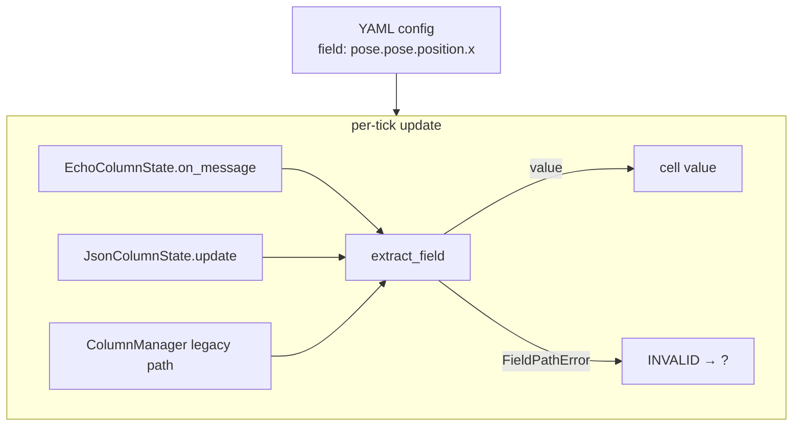
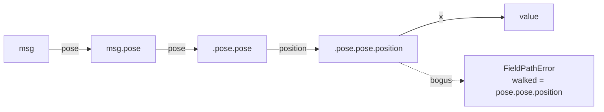

# Field Extract: walking a dotted path off a live message

`metawtf/field_extract.py` answers one question: given a ROS message object
and a config string like `"pose.pose.position.x"`, what value does that
point to *right now*? At 21 lines it is the smallest module in the
codebase, but it sits directly on the path from "user typed a field name
into YAML" to "number appears in a spreadsheet cell," so it earns its own
chapter.

The module exports exactly two things:

- `extract_field(msg, path)` — the walker
- `FieldPathError` — the exception raised when the walk fails

Every consumer of raw message values in the package — `echo_column.py`,
`json_column.py`, and `column_manager.py` — funnels its field lookups
through this one function, which means the error contract defined here is
the *single* place that decides how a config typo behaves at runtime.

## Where it sits in the pipeline

A column configured with a `field:` string never touches the message
object directly. Each tick, the column hands the incoming message and its
fixed field string to `extract_field` and either stores the result or
catches `FieldPathError` and renders the cell as invalid (`?`). The
diagram shows that fan-in:



The important design consequence: because the exception is specific and
predictable, callers can catch it narrowly. `EchoColumnState.on_message`
catches only `FieldPathError` — a genuine bug elsewhere (say, a `TypeError`
inside a property) still propagates rather than being silently masked as
an invalid cell.

## Why attribute-walking instead of `eval` or `operator.attrgetter`

The obvious one-liner is `functools.reduce(getattr, path.split("."), msg)`,
or even `operator.attrgetter(path)(msg)`. Both work for the happy path, but
neither gives a usable error message when a config typo points at a field
that doesn't exist — you get a bare `AttributeError` raised from whichever
Python internals did the lookup, with no indication of *which* segment of
the dotted path was wrong or what the user should fix. And `eval` is off
the table for a string that comes out of a config file; it would execute
arbitrary code on a live robot process.

The explicit loop trades three lines of brevity for a diagnostic that
names the exact failing segment and how far the walk got before it failed:

```python
def extract_field(msg, path: str):
    value = msg
    parts = path.split(".")
    for index, part in enumerate(parts):
        if not hasattr(value, part):
            walked = ".".join(parts[:index]) or "<root>"
            raise FieldPathError(f"{part!r} not found on {walked} (path {path!r})")
        value = getattr(value, part)
    return value
```

For `pose.pose.position.bogus` against a real `nav_msgs/msg/Odometry`, the
error reads `'bogus' not found on pose.pose.position (path
'pose.pose.position.bogus')` — enough to fix the config without opening
the message definition. Two small details carry the weight here:

- `index` from `enumerate` is used only to reconstruct `walked`, the
  prefix that *did* resolve. Without it the error could say "not found on
  pose" for a failure three levels deeper, which is exactly the misleading
  output the loop was written to avoid.
- `or "<root>"` handles the zero-length prefix — when the very first
  segment fails, `parts[:0]` is empty and `"".join(...)` would produce an
  empty string, so the message substitutes a readable placeholder.

## The algorithm, such as it is

This is a textbook *pointer chase*: each iteration dereferences the
current handle and re-points it at the child named by the next path
segment. It is the same traversal a filesystem does for
`/a/b/c` with inode lookups, or a trie does per character — a path string
is decomposed into edges, and each edge is validated before it is
followed. The complexity is O(d) attribute lookups for a path of depth d,
with `getattr` itself doing the usual Python attribute resolution (instance
dict, then type dict, then descriptors). The `hasattr` check before each
`getattr` technically walks that chain twice per segment, a classic
look-before-you-leap pattern chosen here because the failure branch needs
to *know* it was the attribute lookup that failed — with EAFP
(`try: getattr`) you could not distinguish "attribute missing" from
"property getter raised `AttributeError` internally" without inspecting
the exception.



Note the separation of concerns in the error type: `FieldPathError`
carries a human-readable string, but the *decision* of what to do about it
is left to callers. This module raises; it never logs, prints, or
substitutes a default. That keeps a 21-line utility free of policy and
lets `echo_column` choose "show `?`" while a future batch validator could
choose "abort at startup."

## A deliberately narrow scope

There is no support for `waypoints[2].x` — the path language is attribute
names separated by dots, nothing more. That is a stated non-goal, not an
oversight: indexing into sequences raises questions that don't have a
one-line answer (what if the array is empty this tick? out of bounds?
negative indices?), so v1 defers them rather than guessing. The sibling
module `json_select.py` shows where richer path syntax lives when it is
actually needed: JSON columns extract `data` via `extract_field` first,
then walk the parsed JSON dict with a separate selector that understands
array subscripts — two small walkers instead of one overloaded one.

Edge cases the current semantics settle by construction, for better or
worse:

- A path like `"data.bogus.deeper"` fails at `bogus`, and `deeper` is
  never examined — the walk stops at the first missing segment (covered
  by `test_field_extract.py`).
- An empty string path splits to `[""]`, which fails with `'' not found
  on <root>` — technically an error, but a confusing one for what is
  really a malformed path.

## Observations for future improvement

- **Array indexing.** If a future feature needs `waypoints[0].pose.x`, the
  natural extension is to let each segment optionally carry a `[N]`
  suffix, parsed once at config-load time (so a malformed index is a
  config error, not a runtime surprise) and applied as `value[n]` before
  continuing the walk.
- **Caching the split.** `path.split(".")` runs on every call, i.e. every
  tick of every column. Since a column's `field` string is fixed for the
  life of the program, the caller could pre-split it once at construction
  and hand `extract_field` a tuple of segments — or `extract_field` could
  accept either type. The saving is small but free, and it would make
  hot-path cost independent of path length.
- **Fail-fast on empty paths.** Rejecting `""` (and segments like
  `"a..b"`) up front with a clearer message would turn a confusing
  `'' not found on <root>` into an immediate, actionable config error.
- **Optional eager validation.** Because `FieldPathError` is cheap to
  raise, the config loader could validate each `field:` against one sample
  message (or against the message type's slots, where available) at
  startup and report all typos at once, instead of discovering them one
  `?` cell at a time during the trace.
