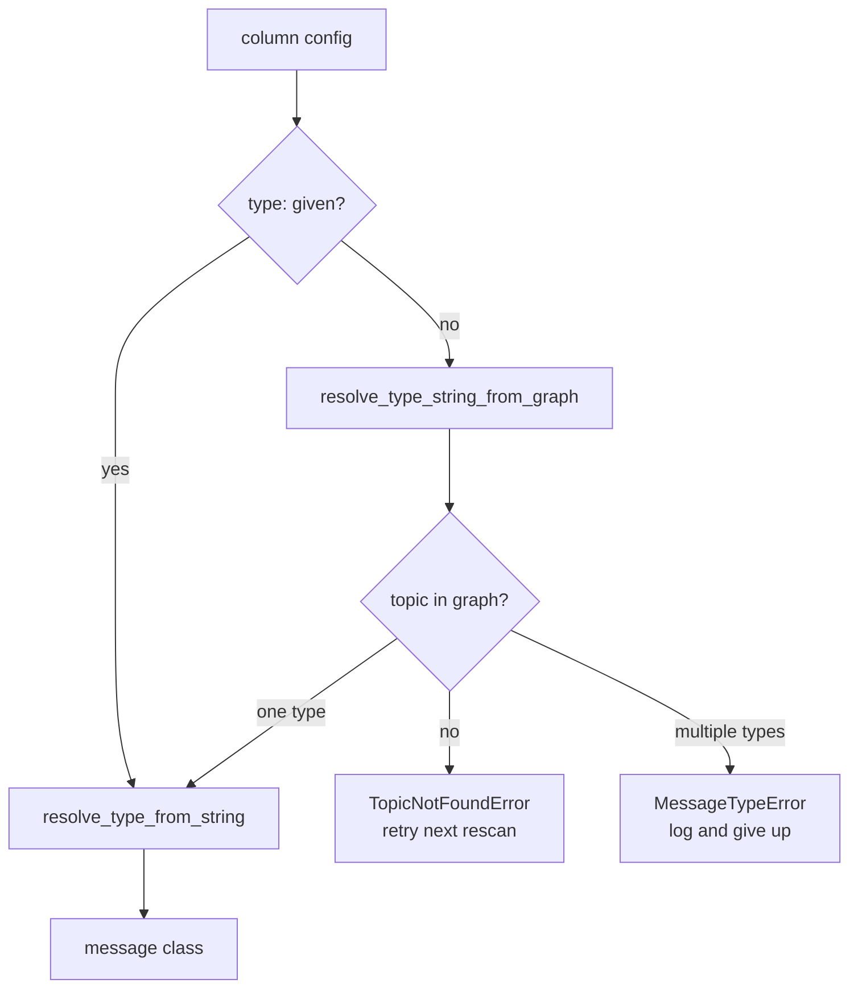

# Msg Type: finding out what a topic actually carries

Before `metawtf` can subscribe to a topic, it needs a Python message class —
`rclpy.create_subscription` takes a type, not a string. `metawtf/msg_type.py`
resolves that type two ways: from an explicit `type:` in the config, or by
asking the live ROS graph what a topic is currently publishing.

## Two failure modes, two exceptions

The module defines two distinct exceptions on purpose:

```python
class MessageTypeError(Exception):
    """Raised when a message type string or graph lookup cannot be resolved."""


class TopicNotFoundError(Exception):
    """Raised when a topic is not (yet) present in the graph."""
```

The distinction is not academic — it drives different behavior one layer up
in `tracer_node.py`. A `MessageTypeError` (bad type string, or a topic
publishing more than one message type) is a real problem worth logging.
A `TopicNotFoundError` is expected and routine: a topic that a robot hasn't
started publishing yet is not an error, it's a timing issue, and the node
should just retry later. Collapsing both into one exception type would force
the caller to inspect the exception's message string to tell them apart —
exactly the kind of stringly-typed branching the style guide's "avoid
if/else nesting" and "avoid guess-and-repair" rules exist to prevent.



## The graph lookup is pure; the string resolver is not

`resolve_type_string_from_graph` is ordinary Python — it takes a list of
`(topic, types)` pairs (exactly the shape `get_topic_names_and_types()`
returns) and a topic name, and picks a type string out of it:

```python
def resolve_type_string_from_graph(topic: str, names_and_types: list) -> str:
    matches = [types for name, types in names_and_types if name == topic]
    if not matches:
        raise TopicNotFoundError(f"topic {topic!r} not found in graph")
    types = matches[0]
    if len(types) != 1:
        raise MessageTypeError(f"topic {topic!r} has multiple types: {types}")
    return types[0]
```

Because it never touches `rclpy` or `rosidl_runtime_py`, it is fully
unit-testable with a hand-built list of tuples — no ROS installation
required. `resolve_type_from_string`, by contrast, has to import a real
message class:

```python
def resolve_type_from_string(type_str: str):
    from rosidl_runtime_py.utilities import get_message

    try:
        return get_message(type_str)
    except (AttributeError, ModuleNotFoundError, ValueError) as error:
        raise MessageTypeError(f"cannot resolve message type {type_str!r}: {error}")
```

The `import` lives inside the function rather than at module level. That is
a deliberate exception to the project's "imports at the top of the file"
default: it keeps `metawtf.msg_type` importable — and its pure graph-lookup
half testable — on a machine that has no ROS2 installation at all, deferring
the hard dependency to the one call site that actually needs it.

`resolve_message_type` glues the two together — config type wins if present,
otherwise fall back to the graph:

```python
def resolve_message_type(
    topic: str, configured_type: str | None, names_and_types: list
):
    type_str = configured_type or resolve_type_string_from_graph(
        topic, names_and_types
    )
    return resolve_type_from_string(type_str)
```

## Observations for future improvement

- **Caching resolved types.** Every rescan re-resolves already-subscribed
  columns' types unnecessarily — `tracer_node.py` currently guards this with
  an `is_subscribed` flag per column so `try_subscribe` short-circuits, but
  if that guard were ever removed, `resolve_message_type` itself has no
  memoization and would redo the graph lookup and `get_message` import every
  second.
- **`get_message`'s real exception types.** The `except` clause lists
  `AttributeError, ModuleNotFoundError, ValueError` based on reading
  `rosidl_runtime_py`'s implementation; this hasn't been exercised against a
  real ROS2 install yet (tracked in `04-tasks/notdone/TF01-*.md`, task T02).
  Worth confirming the exact exception types once verified on a real
  install, in case a bogus type string raises something not yet caught.
