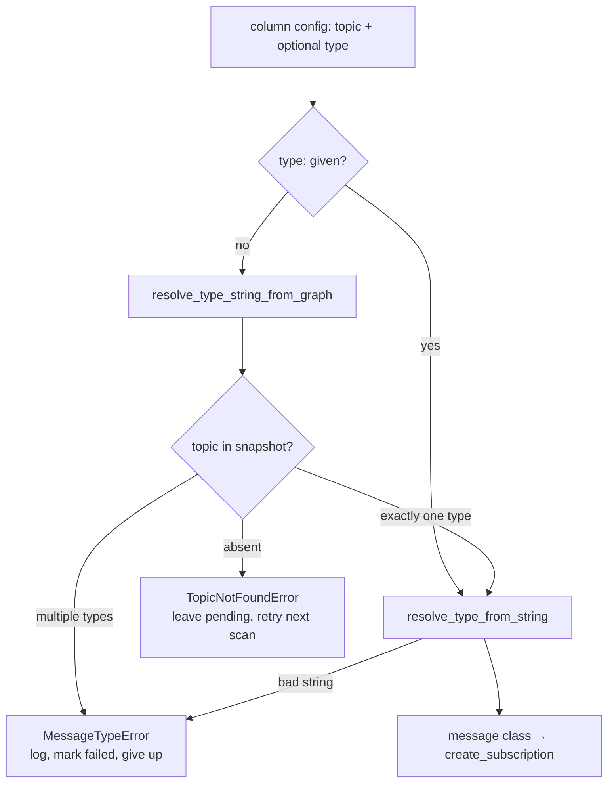

# Msg Type: finding out what a topic actually carries

Before `metawtf` can subscribe to a topic, it needs a Python message *class* —
`rclpy.create_subscription` takes a type, not a string. `metawtf/msg_type.py`
is the tiny module that produces that class, and it can get there two ways:
from an explicit `type:` entry in the user's config, or by asking the live ROS
graph what a topic is currently publishing and resolving that string.

The module is only 42 lines, but it makes two deliberate design choices that
are worth understanding, because the rest of the package leans on both: a
two-exception error taxonomy, and a strict split between a pure, testable half
and a ROS-dependent half.

## Where it sits in the pipeline

Resolution happens once per subscription attempt, inside
`ColumnManager.try_subscribe` (`metawtf/column_manager.py`). The column manager
queries the graph once per scan — `get_topic_names_and_types()` is a DDS
round-trip, so it is called once and the resulting snapshot is handed down to
every pending subscription — and passes that snapshot into
`resolve_message_type` along with the topic and whatever `type:` the config
specified:



## Two failure modes, two exceptions

The module defines two distinct exceptions on purpose:

```python
class MessageTypeError(Exception):
    """Raised when a message type string or graph lookup cannot be resolved."""


class TopicNotFoundError(Exception):
    """Raised when a topic is not (yet) present in the graph."""
```

The distinction is not academic — it drives different behavior in the caller.
`ColumnManager.try_subscribe` treats a `TopicNotFoundError` as *transient*:
the robot may simply not have started publishing yet, so the exception is
swallowed and the subscription stays pending, to be retried on the next
periodic scan. A `MessageTypeError` — a type string that cannot be imported,
or a topic publishing more than one message type — is a genuine
misconfiguration that will never fix itself, so it is logged and the
subscription is marked `failed` so no further attempts are made.

Collapsing both into a single exception type would force the caller to parse
the exception's message string to decide whether to retry — exactly the kind
of stringly-typed branching that typed exceptions exist to prevent. This is a
small application of a classic pattern: make the *category* of failure part of
the type system so control flow can pattern-match on it with `except` clauses
rather than inspect payloads.

## The graph lookup is pure; the string resolver is not

`resolve_type_string_from_graph` is ordinary Python over an ordinary data
structure — the list of `(topic_name, [type_strings])` pairs that
`rclpy.Node.get_topic_names_and_types()` returns:

```python
def resolve_type_string_from_graph(topic: str, names_and_types: list) -> str:
    matches = [types for name, types in names_and_types if name == topic]
    if not matches:
        raise TopicNotFoundError(f"topic {topic!r} not found in graph")
    types = matches[0]
    if len(types) != 1:
        raise MessageTypeError(f"topic {topic!r} has multiple types: {types}")
    return types[0]
```

Two things are worth noting here. First, the data structure: each topic maps
to a *list* of type strings, not a single one, because ROS2's graph genuinely
permits several publishers on the same topic name to advertise different
message types. That is almost always a deployment bug rather than a feature,
and a tracer cannot meaningfully subscribe in that situation — which is why
the multi-type case is promoted to a `MessageTypeError` instead of silently
picking the first. The check encodes an invariant (one topic, one type) that
ROS itself does not enforce.

Second, the algorithm is a linear scan over the snapshot. That looks naive,
but it is the right choice: the graph snapshot is already in memory, a typical
robot publishes tens to low hundreds of topics, and this runs at most once per
pending subscription per scan. Building a dict index would add code to save
nanoseconds. The real performance decision was made one level up — taking the
graph snapshot once per scan and passing it down, rather than letting each
subscription query the graph itself and pay a DDS round-trip per topic.

Because this function never touches `rclpy` or `rosidl_runtime_py`, it is
fully unit-testable with a hand-built list of tuples on a machine with no ROS
installation at all — and indeed `test/test_msg_type.py` exercises all three
branches (found, absent, multi-type) with plain tuples.

## The string resolver and the deferred import

Turning a type string like `"std_msgs/msg/String"` into a class is delegated
to `rosidl_runtime_py.utilities.get_message`:

```python
def resolve_type_from_string(type_str: str):
    from rosidl_runtime_py.utilities import get_message

    try:
        return get_message(type_str)
    except (AttributeError, ModuleNotFoundError, ValueError) as error:
        raise MessageTypeError(f"cannot resolve message type {type_str!r}: {error}")
```

Under the hood, `get_message` parses the canonical `pkg/msg/Type` form and
uses `importlib` to dynamically import the module `pkg.msg._type` — the Python
code that the `rosidl` generators emitted when the message package was built —
and then pulls the class attribute out of it. So "resolving a type" here is
really *dynamic module loading with a naming convention*: the string is a
stable external name, the generated `_*` module is the internal artifact, and
`importlib` is the bridge. The three caught exceptions correspond to the three
ways that bridge can fail: the package module does not exist
(`ModuleNotFoundError`), the class attribute is missing from it
(`AttributeError`), or the string does not even have the right shape
(`ValueError`). Whatever the cause, the caller sees one uniform
`MessageTypeError`.

The `import` lives inside the function body rather than at module level — a
deliberate exception to the project's usual "imports at the top" default. The
payoff is that `metawtf.msg_type` remains importable, and its pure graph-lookup
half remains testable, on a machine with no ROS2 installation; the hard
dependency is deferred to the one call site that actually needs it. The test
suite mirrors this: the graph-lookup tests import freely, while the
`resolve_type_from_string` tests guard themselves with
`pytest.importorskip("rosidl_runtime_py")`, so the suite degrades gracefully
instead of erroring on a ROS-less development machine.

## Gluing the two halves together

`resolve_message_type` is the whole policy in four lines — the configured type
wins if present, otherwise fall back to the graph:

```python
def resolve_message_type(
    topic: str, configured_type: str | None, names_and_types: list
):
    type_str = configured_type or resolve_type_string_from_graph(
        topic, names_and_types
    )
    return resolve_type_from_string(type_str)
```

Python's `or` short-circuit carries real meaning here: when a type is
configured, the graph is never consulted at all. That matters for two reasons.
It lets a user trace a topic that is not currently publishing (the graph
lookup would raise `TopicNotFoundError`, but the config override sidesteps
it), and it lets a user override what the graph claims — for example, forcing
a specific type on a topic whose publisher mis-advertises. Config beats
runtime discovery, which is the right precedence for a diagnostic tool: the
user's explicit intent should win over whatever the system happens to report.

## Observations for future improvement

- **No memoization of resolved types.** If the same type string is resolved
  repeatedly, `get_message` re-walks the import machinery each time (Python's
  module cache makes this cheap, but not free). Today this is a non-issue
  because `try_subscribe` short-circuits on `sub.subscribed or sub.failed`, so
  resolution runs at most once per subscription — but the guard lives in the
  caller, not here. A `functools.lru_cache` on `resolve_type_from_string`
  would make the function self-defending if call patterns ever change, at the
  cost of holding class references alive.
- **Exception coverage is only verified where ROS exists.** The
  `except (AttributeError, ModuleNotFoundError, ValueError)` list is exercised
  by `test_resolve_from_string_bogus_type_raises`, but that test skips
  entirely without a ROS install, so on ROS-less CI runs the mapping from
  `get_message` failures to `MessageTypeError` is untested. A test that
  monkeypatches `get_message` to raise each exception type would close that
  gap without needing ROS.
- **`matches[0]` assumes unique topic names.** The list comprehension collects
  all entries whose name equals the topic and then uses only the first. In
  practice `get_topic_names_and_types()` never returns duplicate names, so the
  assumption is safe, but it is unstated — the multi-*type* case is checked
  while the multi-*entry* case is silently collapsed. A comment, or folding
  both into one "ambiguous topic" check, would make the invariant explicit.
- **Vague type annotations.** `names_and_types: list` and the un-annotated
  return of `resolve_type_from_string` could be
  `list[tuple[str, list[str]]]` and `type` respectively, which would document
  the snapshot's shape at the signature where readers look first.
