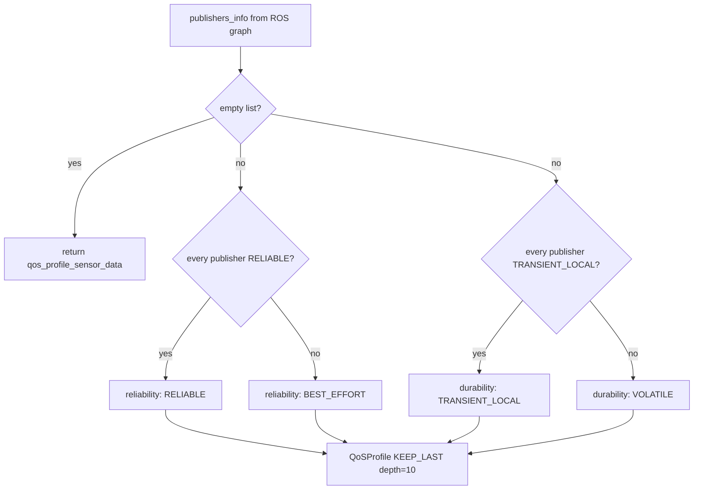

# QoS Select: subscribing to a topic you know nothing about

ROS2's Quality of Service settings are a compatibility contract: a
subscription and a publisher only exchange messages if their QoS profiles
are *compatible*. A tool like `metawtf`, which subscribes to arbitrary
topics named in a YAML file, cannot assume any particular QoS — it has to
*discover* what will actually work. Get this wrong and the symptom is not
an error, it is silence: the subscription exists, the callback never
fires, and nothing in the logs says why. `metawtf/qos_select.py` exists
specifically to avoid that trap. It is a single pure function: given the
publishers currently visible on a topic, decide which QoS profile the new
subscription should request.

## The compatibility matrix the code is exploiting

Under DDS (which ROS2 QoS mirrors), several QoS policies follow a
"requested vs. offered" rule: endpoints match when the subscription's
*requested* strength is less than or equal to the publisher's *offered*
strength. For reliability and durability the matrix looks like this:

| Subscriber requests \ Publisher offers | RELIABLE | BEST_EFFORT |
|---|---|---|
| **RELIABLE** | connect | **silent mismatch** |
| **BEST_EFFORT** | connect | connect |

| Subscriber requests \ Publisher offers | TRANSIENT_LOCAL | VOLATILE |
|---|---|---|
| **TRANSIENT_LOCAL** | connect | **silent mismatch** |
| **VOLATILE** | connect | connect |

The asymmetry is the whole story: a *lenient* subscriber is compatible
with everyone, a *strict* subscriber only with publishers who can keep
its promise. So the only failure mode in the system is asking for more
than some publisher offers. A subscriber can always be the "weakest
link" in the graph and still receive data from every publisher — it
just won't get delivery guarantees from any of them.

`TRANSIENT_LOCAL` durability deserves a word, because its name obscures
its purpose: it is the "latched topic" mechanism from ROS1. A publisher
that offers it retains its most recent sample and replays it to any
subscription created later. RViz-style tools and TF static transforms
depend on this; a `VOLATILE` subscriber joining late still *connects* to
a `TRANSIENT_LOCAL` publisher — it simply misses the stored sample.

## Borrowing a battle-tested rule instead of inventing one

Rather than design a new heuristic, this module ports the rule that
`ros2cli`'s `ros2 topic echo` and `ros2 topic hz` already use internally
(`choose_qos` in `ros2cli/qos.py`): look at every publisher currently on
the topic, and only request the strict QoS setting if *all* of them
offer it.

```python
def select_qos(publishers_info: list):
    ...
    if not publishers_info:
        return qos_profile_sensor_data

    is_all_reliable = all(
        info.qos_profile.reliability == ReliabilityPolicy.RELIABLE
        for info in publishers_info
    )
    is_all_transient_local = all(
        info.qos_profile.durability == DurabilityPolicy.TRANSIENT_LOCAL
        for info in publishers_info
    )
```

Each `publishers_info` entry is a `TopicEndpointInfo` returned by the
ROS graph (`node.get_publishers_info_by_topic(...)`), carrying the
publisher's advertised QoS profile. The two `all(...)` checks are
unanimous votes over that list — and the vote structure is exactly what
the compatibility matrix demands.

## Why unanimity is the right rule

Given the matrix, the correctness argument is short:

- If **every** publisher offers `RELIABLE`, requesting `RELIABLE`
  matches everyone, and requesting it is strictly better (you get
  delivery guarantees you would otherwise forfeit).
- If **any** publisher offers only `BEST_EFFORT`, requesting `RELIABLE`
  would silently disconnect you from that publisher. Requesting
  `BEST_EFFORT` matches everyone.

So `all()` is not a conservative guess — it is the unique decision rule
that both (a) always connects to the whole graph and (b) upgrades to the
stricter guarantee whenever doing so is provably safe. The same argument
applies to durability. The fallback costs something (a dropped sample
from a reliable publisher becomes possible) but for a trace tool,
"always connects" is the right trade-off — a dropped sample is a blank
cell in the output; a subscription that silently never connects is a
much harder bug to notice.

The two votes are computed independently and combined into the returned
profile, along with a plain history policy:

```python
    return QoSProfile(
        history=HistoryPolicy.KEEP_LAST,
        depth=10,
        reliability=(...RELIABLE if is_all_reliable else BEST_EFFORT...),
        durability=(...TRANSIENT_LOCAL if is_all_transient_local else VOLATILE...),
    )
```

`KEEP_LAST` with `depth=10` is deliberately ordinary: it says nothing
about compatibility (history policy never blocks a connection), it just
bounds how many undelivered samples DDS will queue for us.



Note that the two votes do not depend on each other — a topic whose
publishers are all reliable but durability-mixed gets
`RELIABLE`/`VOLATILE`, and that combination is exactly as valid as any
other.

## The empty-publisher-list edge case

If a column's message type was given explicitly in the config (`type:`
set), `metawtf` can create the subscription immediately rather than
waiting for a publisher to appear — but with zero publishers to inspect,
there is nothing to vote on. `select_qos` falls back to
`qos_profile_sensor_data`, ROS2's standard "reasonable default for
sensor-style data" profile (`BEST_EFFORT` reliability, `VOLATILE`
durability, shallow `KEEP_LAST` history), rather than guessing a
`RELIABLE`/`TRANSIENT_LOCAL` combination that might turn out wrong once
a real publisher shows up.

This fallback sits squarely on the "lenient subscriber" side of the
compatibility matrix, so it too connects to everyone. Its real risk is
not mismatch but *behavior*: if the eventual publisher is
`TRANSIENT_LOCAL`, we will have missed the latched sample sent before
our subscription existed. That is accepted, because at subscription time
there is no evidence either way. This case also stays outside the
"wait and retry" path described in `msg_type.py`'s chapter: type
resolution and QoS selection are independent concerns, and only the
former needs the graph to already know about the topic.

## Where it fits in the package

The single call site is `ColumnManager.try_subscribe`
(`column_manager.py`), which runs once per topic after the message type
has been resolved and just before `create_subscription`:

```python
qos = select_qos(self.node.get_publishers_info_by_topic(sub.topic))
callback = make_callback(sub.states)
self.node.create_subscription(msg_class, sub.topic, callback, qos, raw=sub.raw)
```

The graph query and the decision happen at the last possible moment,
which matters: the answer is a *point-in-time* snapshot of the graph.
Publishers that join later are fine — the lenient-side choice connects
to them — but the profile can never be renegotiated for this
subscription. Keeping `select_qos` a small, stateless, dependency-free
function (input: a list of endpoint infos; output: a `QoSProfile`)
makes it trivially testable: the test suite builds fake info objects and
asserts the four combinations without spinning up any ROS graph.

## Why the `rclpy.qos` import is deferred

Like `msg_type.py`, the `from rclpy.qos import ...` line lives inside
the function body rather than at the top of the file. `rclpy` is a
heavy, environment-specific dependency (it requires a full ROS2
install); deferring the import keeps `import metawtf.qos_select` cheap
and side-effect-free on any machine, even ones without ROS2, and
confines the hard dependency to the single call site that needs it. On
repeated calls Python's import machinery returns the already-loaded
module from `sys.modules`, so the in-function placement costs
essentially nothing at runtime.

## Observations for future improvement

- **`depth=10` is a guess.** The history depth isn't derived from
  anything — it is a reasonable-sounding constant. `ros2cli`'s
  `choose_qos` derives its depth from context (the `--qos-depth` CLI
  flag); `metawtf` has no equivalent knob yet. Worth revisiting if a
  high-rate topic ever needs a deeper queue.
- **No per-column QoS override.** Some topics genuinely need `RELIABLE`
  even when one flaky publisher on the graph is `BEST_EFFORT`. An
  optional `qos:` override in the column config would let a user force
  the issue instead of relying purely on auto-detection.
- **Snapshot staleness.** The vote reflects the graph at subscription
  time. If a `BEST_EFFORT`-only publisher later disappears and all
  remaining publishers are `RELIABLE`, the subscription stays on the
  lenient setting forever. A "re-evaluate QoS when the publisher set
  changes" mechanism would be possible via graph events, at real
  complexity cost (destroying and recreating the subscription).
- **Mixed-publisher `TRANSIENT_LOCAL` loses latching entirely.** With
  one latched and one unlatched publisher, unanimity votes `VOLATILE`,
  so even the latched publisher's stored sample is never replayed. A
  per-publisher subscription (one sub per endpoint) would recover it,
  but that fights the module's core design goal of one simple
  subscription per topic.
