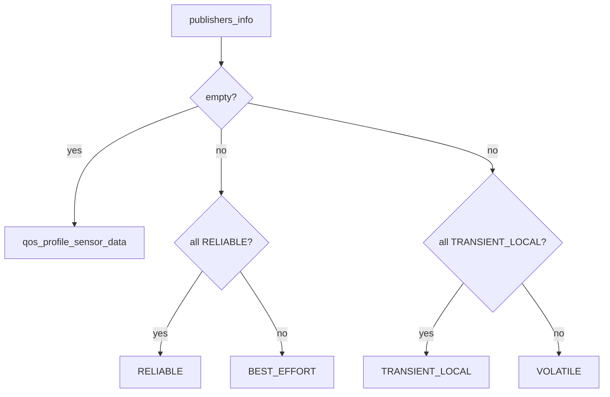

# QoS Select: subscribing to a topic you know nothing about

ROS2's Quality of Service settings are a compatibility contract: a
subscription and a publisher only exchange messages if their QoS profiles
are compatible. A tool like `metawtf`, which subscribes to arbitrary
topics named in a YAML file, cannot assume any particular QoS — it has to
*discover* what will actually work. Get this wrong and the symptom is not an
error, it is silence: the subscription exists, the callback never fires, and
nothing in the logs says why. `metawtf/qos_select.py` exists specifically to
avoid that trap.

## Borrowing a battle-tested rule instead of inventing one

Rather than design a new heuristic, this module ports the rule
`ros2cli`'s `ros2 topic echo` and `ros2 topic hz` already use internally
(`choose_qos` in `ros2cli/qos.py`): look at every publisher currently on the
topic, and only request the strict QoS setting if *all* of them offer it.

```python
def select_qos(publishers_info: list):
    from rclpy.qos import (
        DurabilityPolicy,
        HistoryPolicy,
        QoSProfile,
        ReliabilityPolicy,
        qos_profile_sensor_data,
    )

    if not publishers_info:
        return qos_profile_sensor_data

    is_all_reliable = all(
        info.qos_profile.reliability == ReliabilityPolicy.RELIABLE
        for info in publishers_info
    )
    is_all_transient_local = all(
        info.qos_profile.durability == DurabilityPolicy.TRANSIENT_LOCAL
        for info in publishers_info
    )
    return QoSProfile(
        history=HistoryPolicy.KEEP_LAST,
        depth=10,
        reliability=(
            ReliabilityPolicy.RELIABLE
            if is_all_reliable
            else ReliabilityPolicy.BEST_EFFORT
        ),
        durability=(
            DurabilityPolicy.TRANSIENT_LOCAL
            if is_all_transient_local
            else DurabilityPolicy.VOLATILE
        ),
    )
```

The logic is "all-or-nothing" in both directions: `RELIABLE` is only safe to
request if every publisher supports it (a `BEST_EFFORT` publisher will
refuse a `RELIABLE` subscriber), and the same for `TRANSIENT_LOCAL`. Falling
back to the looser setting (`BEST_EFFORT`, `VOLATILE`) whenever the graph is
mixed guarantees the subscription connects to everyone, at the cost of
possibly missing messages from a publisher that would have tolerated the
stricter setting. For a trace tool, "always connects" is the right
trade-off — a dropped sample is a blank spreadsheet cell; a subscription
that silently never connects is a much harder bug to notice.



## The empty-publisher-list edge case

If a column's message type was given explicitly in the config (`type:` set),
`metawtf` can create the subscription immediately rather than waiting for a
publisher to appear — but with zero publishers to inspect, there is nothing
to vote on. `select_qos` falls back to `qos_profile_sensor_data`, ROS2's
standard "reasonable default for sensor-style data" profile, rather than
guessing a `RELIABLE`/`VOLATILE` combination that might turn out wrong once
a real publisher shows up. This is a case F01's design deliberately leaves
outside the "wait and retry" path described in `msg_type.py`'s chapter: type
resolution and QoS selection are independent concerns, and only the former
needs the graph to already know about the topic.

## Why the `rclpy.qos` import is deferred

Like `msg_type.py`, the `from rclpy.qos import ...` line lives inside the
function body rather than at the top of the file. `rclpy` is a heavy,
environment-specific dependency (it requires a full ROS2 install); deferring
the import keeps `import metawtf.qos_select` cheap and side-effect-free on
any machine, even ones without ROS2, and confines the hard dependency to the
single call site that needs it.

## Observations for future improvement

- **`depth=10` is a guess.** The history depth isn't derived from anything —
  it is a reasonable-sounding constant. `ros2cli`'s `choose_qos` derives its
  depth from context (the `--qos-depth` CLI flag); `metawtf` has no
  equivalent knob yet. Worth revisiting if a high-rate topic ever needs a
  deeper queue.
- **No per-column QoS override.** Some topics genuinely need `RELIABLE`
  even when one flaky publisher on the graph is `BEST_EFFORT`. An optional
  `qos:` override in the column config would let a user force the issue
  instead of relying purely on auto-detection.
