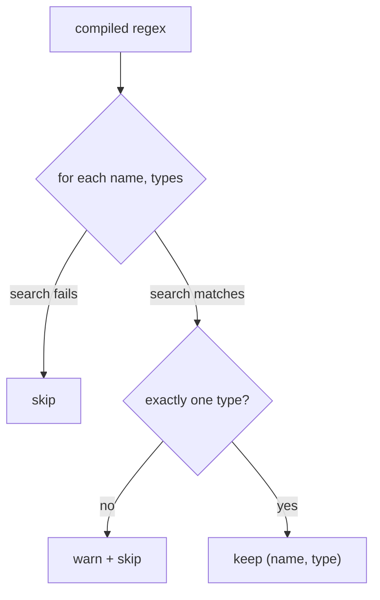

# Topic matching: turning a regex into concrete topics

F02 lets an `hz` column say "measure the rate of every topic matching `^/tf`"
instead of naming one topic. `metawtf/topic_match.py` is the small, pure step
that turns such a pattern into the concrete `(topic, type)` pairs the rest of
the system can subscribe to. It has no ROS dependency at all — it operates on
whatever list of names-and-types the caller hands it, which is exactly the
shape `Node.get_topic_names_and_types()` returns.

## One function, three rules

```python
def match_topics(pattern: re.Pattern, names_and_types: list) -> list:
    matches = []
    for name, types in names_and_types:
        if pattern.search(name) is None:
            continue
        if len(types) != 1:
            logger.warning("skipping multi-type topic %r: %s", name, types)
            continue
        matches.append((name, types[0]))
    return matches
```

Three deliberate decisions live in those few lines:

- **`pattern.search`, not `match`.** `search` finds the pattern anywhere in the
  name, so the user controls anchoring: `^/tf` anchors to the start, while a
  bare `odom` matches `/robot/odom` too. This is the least surprising choice for
  someone thinking in ordinary regexes.
- **Multi-type topics are skipped, not guessed.** A topic advertising two
  message types is ambiguous: picking one would risk subscribing with the wrong
  type, and in DDS a wrong type silently delivers zero messages — the single
  worst failure mode because it looks like "the topic is idle." Rather than
  guess, the function drops the topic and logs a warning, honouring the
  project's "report, don't repair" rule.
- **No match is not an error.** An empty result is normal — the matching topic
  may simply not have appeared in the graph yet. The caller rescans later.



## Why a `logging` warning and not a print

The library rule in this repo is that modules must not `print` to stdout —
stdout is reserved for the CSV stream, and a stray warning there would corrupt
the output a spreadsheet reads. A module-level `logging` logger routes the
notice to stderr (or wherever the app configures logging) without touching the
data channel.

## Observations for future improvement

- **The type of a matched topic is returned but the caller may re-derive it.**
  `column_manager` currently takes only the topic name from each pair and lets
  `resolve_message_type` look the type up again from the graph. Passing the
  already-known type through would save one lookup, at the cost of a slightly
  wider contract.
- **A compiled-once pattern is assumed.** `match_topics` takes a `re.Pattern`,
  not a string, so compilation (and its error handling) stays at config-load
  time where a bad regex can be reported clearly — a good separation, but worth
  stating explicitly since the function would happily accept any object with a
  `.search`.
