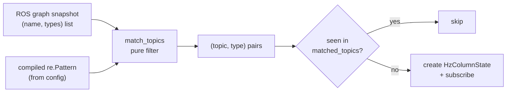
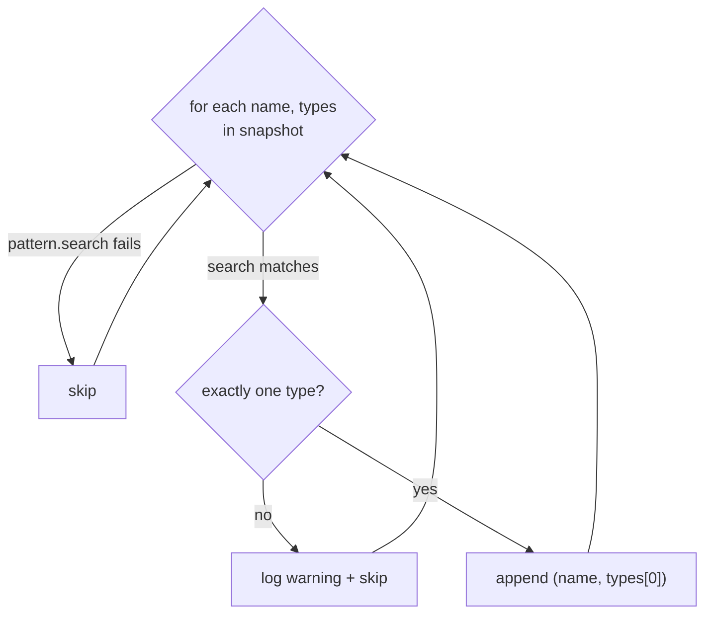

# Topic matching: turning a regex into concrete topics

A metawtf `hz` column can be declared with a regular expression instead of a
topic name: "measure the rate of every topic matching `^/tf`". But you cannot
subscribe to a regex — DDS subscriptions need a concrete topic name and a
concrete message type. `metawtf/topic_match.py` is the small, pure function
that bridges that gap: given a compiled pattern and a snapshot of the ROS
graph, it returns the concrete `(topic, type)` pairs the rest of the system
can subscribe to.

The module is deliberately dependency-free. It never touches ROS itself; it
operates on whatever list of `(name, types)` pairs the caller hands it — which
happens to be exactly the shape `Node.get_topic_names_and_types()` returns.
That purity is what makes it trivially testable (the tests feed it a
hand-written four-topic graph) and what keeps the DDS round-trip, an expensive
operation, firmly in the caller's hands.

## Where it sits in the pipeline

`column_manager.scan()` queries the graph once per scan and passes the same
snapshot to every pending match spec. For each spec, `match_topics` filters
the snapshot, and the caller then de-duplicates the survivors against a
`matched_topics` set so an already-subscribed topic is never subscribed twice:

```python
# column_manager.scan_match — the sole production caller
for topic, _type in match_topics(spec.pattern, names_and_types):
    if topic in self.matched_topics:
        continue
    self.matched_topics.add(topic)
    state = HzColumnState.from_topic(topic, spec.window, spec.width)
    self.register([state], topic, None, raw=True)
```

So `match_topics` answers "which of the topics currently in the graph fit this
pattern?" while the caller answers "which of those have I not seen before?"
The split matters: the graph is dynamic — topics come and go as nodes start
and stop — so matching must be re-runnable on every scan, and purity (no
memory of previous calls) is exactly the right property for that.



## One function, three rules

The entire module is one function:

```python
def match_topics(pattern: re.Pattern, names_and_types: list) -> list:
    matches = []
    for name, types in names_and_types:
        if pattern.search(name) is None:
            continue
        if len(types) != 1:
            logger.warning("skipping multi-type topic %r: %s", name, types)
            continue
        matches.append((name, types[0]))
    return matches
```

Three deliberate decisions live in those few lines:

- **`pattern.search`, not `match`.** Python's `re.match` anchors implicitly at
  the start of the string; `re.search` scans for the pattern anywhere. Using
  `search` puts anchoring under the user's control: `^/tf` matches only topics
  that *start* with `/tf`, while a bare `odom` also matches `/robot/odom`.
  This is the least surprising choice for someone writing an ordinary regex —
  the pattern means exactly what it would mean in `grep`.
- **Multi-type topics are skipped, not guessed.** A topic advertising more
  than one message type is ambiguous: picking one would risk subscribing with
  the wrong type, and in DDS a type mismatch does not raise an error — it
  silently delivers zero messages. That is the worst failure mode a tracer can
  have, because it is indistinguishable from "the topic is idle." Rather than
  guess, the function drops the topic and logs a warning, honouring the
  project's "report, don't repair" rule.
- **No match is not an error.** An empty result is normal and expected — the
  matching topic may simply not have appeared in the graph yet. Because the
  caller rescans periodically, the topic will be picked up on a later pass
  when it appears.



## The algorithm underneath

Conceptually this is a **linear filter over a snapshot**: for `n` topics in
the graph, the function does `n` regex searches, so the running time is
`O(n · s)` where `s` is the cost of one search. Two things keep that cheap in
practice:

1. **The pattern arrives pre-compiled.** `match_topics` takes a
   `re.Pattern`, not a string. Python's `re` compiles a pattern string into a
   bytecode program for a small virtual machine (a backtracking regex engine,
   descended from the classic NFA-simulation tradition — Thompson's
   construction, though CPython's `sre` chooses backtracking over a DFA to
   support features like backreferences). Compilation is the expensive step;
   execution against a short string like a topic name is fast. By accepting a
   compiled pattern, the function guarantees compilation happens once at
   config-load time — which is also where an invalid regex can be reported to
   the user with full context — instead of once per topic per scan.
2. **The snapshot is fetched once per scan by the caller.** A naive design
   would have each match spec call `get_topic_names_and_types()` itself,
   turning one DDS round-trip into one per spec per scan. The current shape —
   caller fetches, matcher filters — makes the graph query count independent
   of the number of patterns.

The data structures are equally plain by design: a list in, a list out. The
input `names_and_types` is a list of `(name, [type, ...])` pairs — note the
*list* of types per name, which is what makes the `len(types) != 1` ambiguity
check necessary at all. The output flattens each surviving pair to
`(name, single_type)`, so downstream code never has to think about the
multi-type case again.

## Why a `logging` warning and not a print

The library rule in this repo is that modules must not `print` to stdout —
stdout is reserved for the CSV stream, and a stray warning there would corrupt
the output a spreadsheet or downstream tool reads. A module-level
`logging.getLogger(__name__)` routes the notice to stderr (or wherever the
application configures logging) without touching the data channel. In a
28-line module this is the only I/O, and it is worth noticing precisely
because it would be so easy to get wrong.

## What the tests pin down

`test/test_topic_match.py` captures the contract with a four-topic graph —
two TF topics, one odometry, one deliberately multi-type `/mixed`:

- `^/tf` selects exactly the two TF topics, with their single types attached;
- `^/mixed` returns nothing (ambiguity is a skip, not a guess);
- `^/camera` returns an empty list (absence is not an error);
- a bare `odom` matches `/odom` (search semantics, unanchored).

Together these encode all three rules above as executable facts.

## Observations for future improvement

- **The matched type is returned but discarded by the only caller.**
  `column_manager.scan_match` binds it to `_type` and later lets
  `resolve_message_type` re-derive the type from the same graph snapshot when
  subscribing. Passing the already-known type through would save a lookup, at
  the cost of widening the `register`/`try_subscribe` contract. The current
  design favours a uniform subscription path over the micro-optimisation —
  defensible, but the redundancy is real.
- **The "compiled-once" contract is implicit.** The function would happily
  accept any object with a `.search` method. A type hint already says
  `re.Pattern`; a short note in the module docstring stating *why* (compile
  once at config load, where errors are reportable) would make the design
  intent explicit to future readers.
- **Skipped multi-type topics are re-warned every scan.** Because the function
  is stateless, a persistent ambiguous topic produces the same warning on
  every rescan. De-duplicating the warning (e.g. the caller tracking warned
  topics, as it already does for matched ones) would keep logs readable.
- **Zero-type topics are silently dropped.** `len(types) != 1` covers both
  "too many types" and "no types at all", but the warning message only
  mentions the multi-type case. A zero-type entry is odd enough (a topic with
  no discoverable type) that distinguishing it in the log would aid debugging.
- **No case-folding or namespace normalisation.** Matching is done on raw
  graph names, so `^/TF` misses `/tf`. That is arguably correct — ROS topic
  names are case-sensitive — but users coming from shell habits may be
  surprised; a mention in user-facing docs would head that off.
