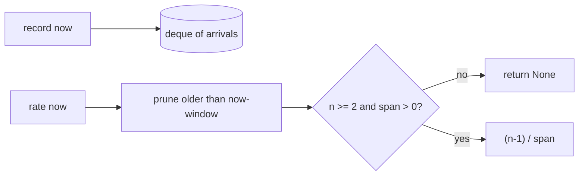

# Rate counter: measuring hz the way `ros2 topic hz` does

An `hz` column answers "how many messages per second is this topic delivering
right now?" `metawtf/rate_counter.py` is the estimator behind that number. It
is deliberately tiny and clock-injected so it can be tested to the millisecond
without a running graph, and it copies the estimator `ros2 topic hz` uses
rather than the naive one most people reach for first.

## The naive estimator is wrong at the edges

The obvious approach — count the messages that arrived in the last `window`
seconds and divide by `window` — under-reports badly exactly when you care
most. At startup, or on a sparse topic, only a fraction of the window has
elapsed, so `count / window` reads far below the true rate. Three messages in
the first 0.2 s of a 2 s window would read 1.5 hz instead of the real 10 hz.

The fix is to measure the *span the messages actually cover*, not the nominal
window:

```python
    def rate(self, now: float) -> float | None:
        self.prune(now)
        if len(self.arrivals) < 2:
            return None
        span = self.arrivals[-1] - self.arrivals[0]
        if span <= 0:
            return None
        return (len(self.arrivals) - 1) / span
```

With `n` arrivals there are `n − 1` inter-arrival gaps, spread over
`t_newest − t_oldest`, so `(n − 1) / span` is the mean rate over the messages
we have — independent of how much of the window is empty. This is algebraically
the same as `1 / mean(Δt)`, which is what `ros2 topic hz` reports.

Two guard clauses encode "not enough information yet" as `None` rather than a
misleading number: fewer than two arrivals (no gap to measure), or a zero span
(all arrivals share a timestamp, which would divide by zero).

## A pruned deque as the window

```python
    def __init__(self, window: float):
        self.window = window
        self.arrivals = deque()

    def record(self, now: float) -> None:
        self.arrivals.append(now)

    def prune(self, now: float) -> None:
        cutoff = now - self.window
        while self.arrivals and self.arrivals[0] < cutoff:
            self.arrivals.popleft()
```

Arrivals go on the right; anything older than `now − window` falls off the
left. A `deque` makes both ends O(1), so the counter stays cheap even for a
high-rate image or point-cloud topic. Pruning happens at read time inside
`rate`, so a topic that stops publishing correctly decays to `None` once its
last two arrivals age out of the window — an idle topic reads empty, not a
stale non-zero number.



## Why the clock is a parameter

Neither `record` nor `rate` calls `time.monotonic()` itself; the caller passes
`now`. In production that caller uses the monotonic clock (immune to NTP steps);
in tests it passes a scripted sequence of floats, which is how
`test_rate_counter.py` can assert that a steady 10 msg/s reads exactly 10.0 and
that three quick early messages already read 10.0 rather than 1.5.

## Observations for future improvement

- **The window is time-based; `ros2 topic hz` is count-based by default.** Ours
  fits a fixed row cadence better, but a very bursty topic could see the rate
  swing between rows; a small amount of smoothing could be offered as an option.
- **No maximum size on the deque.** For an extremely high-rate topic the deque
  holds one entry per message within the window. That is bounded by
  `rate × window` and fine in practice, but a hard cap would make worst-case
  memory explicit.
