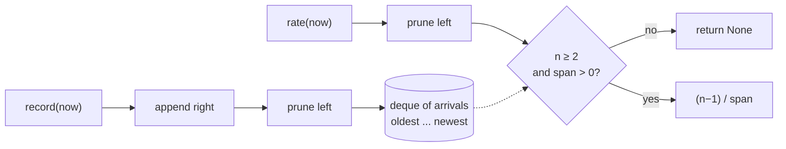

# Rate counter: measuring hz the way `ros2 topic hz` does

An `hz` column answers "how many messages per second is this topic delivering
right now?" `metawtf/rate_counter.py` is the estimator behind that number. It
is deliberately tiny — one class, three methods, forty lines — and deliberately
clock-injected so it can be tested to the millisecond without a running ROS
graph. Its one real design decision is which estimator to use, and it copies
the one `ros2 topic hz` uses rather than the naive one most people reach for
first.

## The naive estimator is wrong at the edges

The obvious approach — count the messages that arrived in the last `window`
seconds and divide by `window` — under-reports badly exactly when you care
most. At startup, or on a sparse topic, only a fraction of the window has
elapsed, so `count / window` reads far below the true rate. Three messages in
the first 0.2 s of a 2 s window would read 1.5 hz instead of the real 10 hz.

The fix is to measure the *span the messages actually cover*, not the nominal
window:

```python
    def rate(self, now: float) -> float | None:
        self.prune(now)
        if len(self.arrivals) < 2:
            return None
        span = self.arrivals[-1] - self.arrivals[0]
        if span <= 0:
            return None
        return (len(self.arrivals) - 1) / span
```

### Why `(n-1)/span` is the right number

With `n` arrivals there are `n − 1` inter-arrival gaps, and those gaps tile the
interval `t_newest − t_oldest` exactly: the sum of the gaps is a telescoping
series,

```
(t₂−t₁) + (t₃−t₂) + … + (tₙ−tₙ₋₁) = tₙ − t₁ = span
```

so `span / (n−1)` *is* the mean gap, and `(n−1)/span` is `1 / mean(Δt)` — the
rate estimator `ros2 topic hz` reports. Written this way it needs no gap
storage at all: the entire history of `n` timestamps collapses into three
values (`n`, oldest, newest). That is why the method reads the deque's two ends
and its length, and nothing in between.

In point-process terms this treats arrivals as (approximately) a Poisson
process and estimates its intensity from the observed mean inter-arrival time.
It is unbiased-ish at any window fill level — the estimate depends only on the
messages present, never on how much of the window is still empty — which is
exactly the property `count / window` lacks. The price is variance: with few
arrivals the estimate is noisy, so on a bursty topic the number can swing
between samples. The code accepts that trade; the alternative (a longer
window, or smoothing) would lag behind real rate changes.

Two guard clauses encode "not enough information yet" as `None` rather than a
misleading number: fewer than two arrivals (no gap to measure), or a
non-positive span (all arrivals share a timestamp, which would divide by zero).
Returning `None` pushes the decision upstream — `HzColumnState.sample` renders
it as an empty cell, so the UI shows "no data" instead of a fake 0.00 hz.

## A pruned deque as the window

```python
    def __init__(self, window: float):
        self.window = window
        self.arrivals = deque()
```

The data structure is a `collections.deque` used as a sliding window over a
sorted stream: arrivals go on the right, and anything older than
`now − window` falls off the left.

```python
    def prune(self, now: float) -> None:
        cutoff = now - self.window
        while self.arrivals and self.arrivals[0] < cutoff:
            self.arrivals.popleft()
```

Because timestamps arrive in non-decreasing order, eviction is always a prefix
drop: the moment `arrivals[0]` is young enough, every later entry is too, so
the loop can stop at the first survivor. A `deque` gives O(1) `append` and
`popleft`, and amortized O(1) per *arrival* for pruning — each timestamp enters
once and leaves once, so processing `k` messages costs O(k) total regardless of
window size. A `list` would make `popleft` O(n); a ring buffer would work but
would fix a capacity the code would then have to size against the fastest
possible topic. The deque sidesteps that: capacity is implicit, roughly
`rate × window` entries (about 101 floats for 100 hz over a 1 s window — the
bound `test_record_prunes_without_rate_calls` asserts).

Pruning happens on *both* the write and the read path, for different reasons:

```python
    def record(self, now: float) -> None:
        # Prune here too, not only in rate(): sampling can pause while messages
        # keep arriving, and the deque must stay bounded regardless.
        self.arrivals.append(now)
        self.prune(now)
```

- `rate` prunes so a topic that stops publishing correctly decays to `None`
  once its last two arrivals age out — an idle topic reads empty, not a stale
  non-zero number. The window makes silence self-erasing: no reset logic, no
  timeout state, just arithmetic.
- `record` prunes so the deque stays bounded even when nobody is reading. There
  is a real case where nobody reads for a long time: the tracer's pause key
  stops row output (no more `rate` calls) while subscriptions keep recording.
  Read-path-only pruning would let memory grow without bound for the duration
  of the pause.



## Why the clock is a parameter

Neither `record` nor `rate` calls `time.monotonic()` itself; the caller passes
`now`. This is a small application of dependency injection with two payoffs:

- **Testability.** Tests pass a scripted sequence of floats, so
  `test_rate_counter.py` can assert that a steady 10 msg/s reads exactly 10.0,
  that three quick early messages already read 10.0 rather than 1.5, and that
  simultaneous timestamps yield `None` — all deterministically, in microseconds,
  with no sleeps.
- **Honesty about the monotonicity assumption.** Pruning by dropping everything
  older than `now − window` only keeps a correct window if timestamps never go
  backwards. In production the injected clock is `time.monotonic()`, immune to
  NTP steps, so the assumption holds; making the clock an explicit parameter
  keeps that contract visible to any future caller.

The same choice is what lets `HzColumnState` share one clock across all columns
in a sample row — every `rate(now)` call in a row evaluates against the same
instant, so columns are mutually comparable.

## Observations for future improvement

- **The window is time-based; `ros2 topic hz` is count-based by default** (it
  estimates over the last N messages). Ours fits a fixed row cadence better —
  a count-based window on a 1 khz topic would cover 10 ms and jitter wildly —
  but a bursty topic can still swing between rows. An optional EWMA over the
  span-based estimates would smooth the display without the startup bias of
  `count / window`.
- **No confidence signal.** With two arrivals the estimate rests on a single
  gap, yet it is displayed with the same two decimals as a 200-arrival one.
  `None` for `n < 3`, or dimming the cell below some `n`, would distinguish
  "measured" from "guessed".
- **Pruning assumes a monotonic clock** (discussed above). Worth re-stating
  because it is the one silent precondition: a second caller passing wall time
  or ROS bag time (which can jump backwards on loop) would corrupt the window
  without any error. An assertion that `now` is non-decreasing would make the
  contract executable.
- **Memory is per-topic and unbounded in principle.** The bound is
  `rate × window`, and `rate` is whatever the publisher does. For plausible
  topics this is trivial, but a defensive `maxlen` on the deque would cap the
  worst case at the cost of silently dropping oldest entries — arguably fine
  for a rate estimate.
