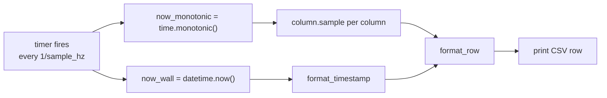

# Sampler: turning column state into a CSV stream

Everything upstream of `metawtf/sampler.py` — config parsing, subscriptions,
QoS, per-field extraction — exists to produce a handful of objects that each
know how to answer one question: "what's your value right now?" `Sampler`
is where those answers become the actual output of the program: a header
row, then one CSV row per tick, to stdout.

## Depending on a shape, not a class

`Sampler` doesn't import `EchoColumnState`. It depends on a `Protocol`:

```python
class SampledColumn(Protocol):
    name: str

    def sample(self, now: float) -> str | None: ...


class Sampler:
    def __init__(self, columns: list[SampledColumn], out: TextIO = sys.stdout):
        self.columns = columns
        self.out = out
        self.header_printed = False
```

This is what makes the module trivially testable without any ROS
machinery: `test_sampler.py` hands it a list of a tiny local `FakeColumn`
class that just returns a canned string from `sample()`. It's also what lets
F02's future `hz` columns and F03's future `proc_cpu` columns plug into the
exact same sampler with zero changes here — anything with a `.name` and a
`.sample(now)` is a column, regardless of what it measures.

`out` defaults to `sys.stdout` but is injectable, which is the same trick
`load_config` uses for the filesystem: production code takes the default,
tests pass an `io.StringIO()` and assert on `.getvalue()`.

## Two clocks, one tick

```python
    def tick(self, now_monotonic: float, now_wall: datetime) -> None:
        if not self.header_printed:
            print(self.format_header(), file=self.out)
            self.header_printed = True
        print(self.format_row(now_monotonic, now_wall), file=self.out)
```

`tick` takes two different notions of "now," because they answer two
different questions. `now_monotonic` — `time.monotonic()` — feeds every
column's `sample()` call, since staleness and (later, in F02) rate
calculations need a clock immune to NTP adjustments or the system clock
being stepped backward. `now_wall` — `datetime.now()` — is purely cosmetic:
it becomes the human-readable `HH:MM:SS.mmm` timestamp printed at the start
of each row, because that's what a person skimming the CSV, or a spreadsheet
plotting it, wants to see. Conflating the two would risk a subtly wrong
staleness check every time the wall clock jumps.



## Header-once, not header-per-row

```python
    def format_header(self) -> str:
        names = ",".join(column.name for column in self.columns)
        return f"time,{names}"

    def format_row(self, now_monotonic: float, now_wall: datetime) -> str:
        cells = [format_timestamp(now_wall)]
        for column in self.columns:
            value = column.sample(now_monotonic)
            cells.append("" if value is None else value)
        return ",".join(cells)
```

`header_printed` is a single boolean, because in F01 the column set is fixed
for the life of the process — a stated non-goal is "column set changing
mid-run." `format_header` and `format_row` are kept as separate public
methods (not inlined into `tick`) specifically because F02's `hz` columns
need to reprint the header when a graph rescan discovers a new topic; that
feature can call `format_header()` again without touching this module.

`None` from any column becomes an empty string, never the literal text
`"None"` and never `0` — consistent with the empty-cell rule enforced in
`echo_column.py`.

## Observations for future improvement

- **`format_timestamp` truncates rather than rounds.** `microsecond // 1000`
  discards sub-millisecond precision by truncation, not rounding. Harmless
  for a human-readable timestamp column, but worth knowing if timestamps are
  ever compared numerically across rows.
- **No CSV escaping.** Cells are joined with a bare `","` — fine for numeric
  and simple string fields, but a `str`-typed message field containing a
  literal comma (unlikely for `nav_msgs`-style numeric fields, more likely
  for arbitrary `std_msgs/String` topics) would silently corrupt the column
  count of that row. Worth switching to Python's `csv` module if string
  fields become common.
