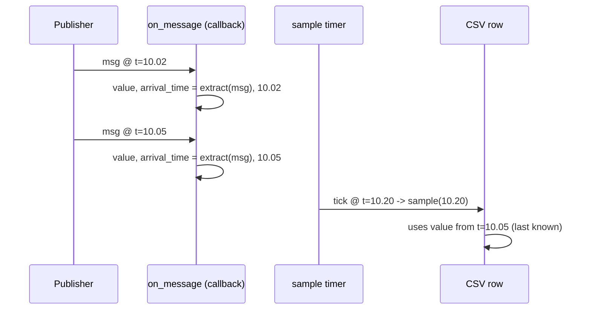

# Echo Column: last-known-value semantics

`metawtf` samples on a fixed timer, but ROS topics publish whenever they
publish — a `/odom` topic might arrive at 50 Hz while the trace samples at
5 Hz. `metawtf/echo_column.py` is where that mismatch gets resolved, with a
policy the feature spec calls "last known value": whatever the field was set
to by the most recent message *before* this tick is what gets printed, even
if that message arrived several callbacks ago.

## Separating "receiving" from "printing"

`EchoColumnState` has exactly two jobs, corresponding to two very different
execution contexts:

```python
class EchoColumnState:
    def __init__(
        self,
        name: str,
        field: str,
        stale_after: float | None,
        width: int | None = None,
    ):
        self.name = name
        self.field = field
        self.stale_after = stale_after
        self.width = width
        self.value = None
        self.arrival_time = None

    def on_message(self, msg, now: float) -> None:
        try:
            self.value = extract_field(msg, self.field)
        except FieldPathError:
            self.value = INVALID
        self.arrival_time = now
```

`width` is stored but never used here — the state carries it only so the
sampler, which iterates columns without knowing their concrete type, can read
`.width` uniformly across echo and hz columns. It is part of the column
`Protocol`, not of the echo semantics.

The `try`/`except` around extraction is a deliberate softening of the
"report, don't repair" rule, made at the runtime boundary. A bad field path is
almost always a config typo — but that typo is discovered per-message, deep in a
subscription callback, and letting it propagate there would crash the whole
trace (every other column included). Instead the message's arrival is still
recorded and the offending field is flagged with the `INVALID` sentinel, which
`sample` renders as `"?"`. The error is not swallowed silently — it shows up as
a visible `?` in that column on every row, which tells the user the path is
wrong without taking the process down. A subsequent readable message clears it.

`on_message` runs inside a ROS subscription callback — however often the
topic publishes, however large the message. It does the minimum possible
work: extract one field, store it, record when it arrived. No formatting,
no I/O. This mirrors a comment in `ros2 topic hz`'s own source: keep
callbacks cheap enough that they never become the bottleneck, so the
sampling timer (running on the same single-threaded executor) never gets
starved. Unlike `ros2 topic hz`, which prints from a dedicated thread to
sidestep this problem, `metawtf` doesn't need a second thread at all,
*because* its callbacks are this cheap.



## Staleness as an explicit opt-in

By default, a column that stops receiving messages keeps reporting its last
value forever — appropriate for something like a static parameter that's
published once. `stale_after` opts a column out of that:

```python
    def is_stale(self, now: float) -> bool:
        if self.stale_after is None or self.arrival_time is None:
            return False
        return now - self.arrival_time > self.stale_after

    def sample(self, now: float) -> str | None:
        if self.arrival_time is None or self.is_stale(now):
            return None
        if self.value is INVALID:
            return "?"
        return format_value(self.value)
```

`sample` takes `now` as a parameter rather than reading a clock itself —
the same injectable-clock pattern used throughout the codebase (see
`sampler.py` and `qos_select.py`'s siblings in F02/F03) so staleness logic
is testable with fake timestamps and no `time.sleep`.

Two distinct "nothing to show" states collapse into the same `None` →
empty-CSV-cell outcome: a column that has *never* received a message
(`arrival_time is None`) and one that *used to* have a value but has gone
stale. The feature spec is explicit that missing data must never be
rendered as `0` — a `0` reading is indistinguishable from a real zero value,
while an empty cell is unambiguous in a spreadsheet.

## Formatting lives here, not in the sampler

```python
def format_value(value) -> str:
    if isinstance(value, float):
        return f"{value:.6g}"
    return str(value)
```

`%.6g` gives six significant digits and switches to scientific notation for
very large or very small values, which keeps a spreadsheet column readable
without truncating meaningful precision. Non-float values (strings, ints,
bools extracted from a message) fall through to plain `str()`.

## Observations for future improvement

- **`format_value` doesn't handle ROS array fields.** If a field ever
  resolves to a list (e.g. a fixed-size array field), `str(value)` will
  print Python's list repr (`[1.0, 2.0, 3.0]`) into a single CSV cell,
  which will not import cleanly into a spreadsheet. Not reachable in v1
  since `field_extract.py` only supports scalar attribute paths, but worth
  a guard if array indexing is ever added.
- **`is_stale` re-reads `self.arrival_time`.** `sample` and `is_stale`
  both branch on it; a small simplification would be for `is_stale` to
  take `arrival_time` as a parameter, making it a pure function testable
  independent of the instance — a minor readability win, not a bug.
