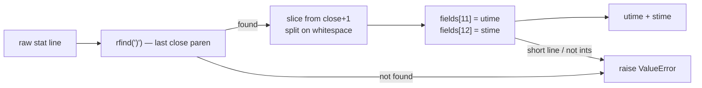
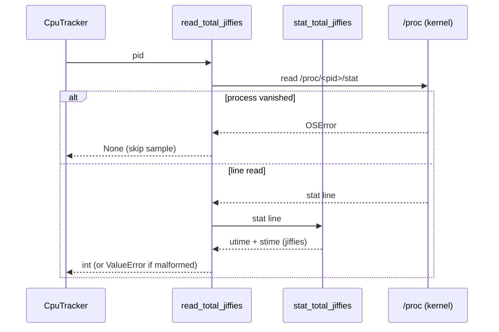

# Parsing `/proc/<pid>/stat` — `metawtf/proc_stat.py`

## Introduction

The `metawtf` package watches ROS2 topics and, alongside message rates, keeps an
eye on CPU consumption. To measure CPU it reads the kernel's own accounting:
the file `/proc/<pid>/stat`, which every Linux process exposes through the
procfs pseudo-filesystem. Each line of that file holds dozens of counters;
the two we care about are `utime` and `stime` — the number of clock ticks
("jiffies") the process has spent executing in user mode and in kernel mode.

This module is the small, sharp tool that turns one of those stat lines into a
single number: total jiffies consumed. Its entire job is *parsing done
correctly*, and the interesting part is that correct parsing of
`/proc/<pid>/stat` is a classic trap. The naive approach — split the line on
whitespace — is wrong, and this module exists to do it right in exactly one
place so the rest of the system (notably `cpu_tracker.py`) never has to think
about it again.

## The format problem: `comm` is a hostile field

A stat line looks like this:

```
1234 (my (weird) proc) S 1 1234 1234 ... 7 8 ...
 ^      ^              ^                    ^
 pid    comm           state                utime, stime
```

Field 2, `comm`, is the process name wrapped in parentheses. The kernel does
not sanitize it: a process may name itself almost anything, including names
containing spaces and parentheses — threads created by `pthread_setname_np`
and process names inherited from scripts do this routinely. That single fact
destroys every positional-parsing shortcut:

- **Splitting on whitespace fails**: `(my proc)` occupies two tokens, shifting
  every subsequent field index.
- **Splitting at the *first* `)` fails**: `(a)b)` ends at the second paren,
  not the first.

The only reliable anchor is the **last** `)` in the line. Everything before
and including it is `pid (comm)` and can be discarded wholesale; everything
after it is a clean, space-separated sequence of positional fields with no
quoting surprises. This is the parsing strategy recommended by `proc(5)`-aware
tools such as `ps` and `htop`, and it is the entire reason
`stat_total_jiffies` is written the way it is.



## Rebased indexing: why 14 and 15 became 11 and 12

In the kernel's documentation, `utime` and `stime` are fields 14 and 15 of the
stat line, counted from 1. But after we cut away `pid (comm) `, the remaining
sequence starts at field 3 (`state`), which becomes index 0 of the split
result. The offset arithmetic is:

- field 14 (utime) → post-split index `14 - 3 = 11`
- field 15 (stime) → post-split index `15 - 3 = 12`

Rather than hide this rebasing inside the function, the module names it at the
top, with a comment that lets a reader verify the mapping against `man 5 proc`
without re-deriving it:

```python
# utime and stime are fields 14 and 15 of the stat line; after splitting off
# "pid (comm) " the state field is index 0, so they land at indexes 11 and 12.
UTIME_INDEX = 11
STIME_INDEX = 12
```

This is a deliberate readability tradeoff: two module-level constants cost
nothing at runtime but turn two magic numbers into a documented claim that a
reviewer can check in one glance.

## The parser itself

With the split point and the indexes settled, the function is three logical
steps: anchor, slice-and-split, convert-and-add.

```python
def stat_total_jiffies(stat_line: str) -> int:
    # comm (field 2) may contain spaces or parens, so everything before the
    # LAST ")" is skipped; only the fields after it are positional.
    close = stat_line.rfind(")")
    if close == -1:
        raise ValueError(f"stat line has no closing paren: {stat_line!r}")
    fields = stat_line[close + 1:].split()
    try:
        utime = int(fields[UTIME_INDEX])
        stime = int(fields[STIME_INDEX])
    except (IndexError, ValueError) as error:
        raise ValueError(f"malformed stat line: {stat_line!r}") from error
    return utime + stime
```

Several small decisions are worth noticing:

- **`str.rfind`** does the anchoring in a single right-to-left scan — O(n) in
  the line length, with no regex engine and no tokenizing of the untrusted
  region. We never parse `comm` at all; we vault over it.
- **`str.split()` with no arguments** splits on runs of any whitespace, which
  conveniently also absorbs the trailing newline that `read_text()` leaves on
  the line. No `strip()` needed.
- **Failure is loud and specific.** A line with no `)` is rejected outright;
  a line that is too short (`IndexError`) or whose counters are not integers
  (`ValueError`) is wrapped in a single `ValueError` whose message carries the
  offending line via `!r`. The `from error` keeps the original exception
  chained, so a traceback still shows *which* of the two failure modes fired.

The function is also pure — string in, integer out, no I/O — which is why the
test suite can exercise it with synthetic stat lines, including adversarial
comms like `"my (weird) proc"` and `"a)b"`, without touching the filesystem.

## I/O with a conscience: the vanishing-process race

The second function adds the one thing the parser deliberately lacks: file
access. Its signature already tells the story — the return type is
`int | None`:

```python
def read_total_jiffies(proc_root: Path, pid: int) -> int | None:
    # None means the process vanished between the /proc scan and this read;
    # a malformed line from a live process raises instead of being guessed at.
    try:
        stat_line = (proc_root / str(pid) / "stat").read_text()
    except OSError:
        return None
    return stat_total_jiffies(stat_line)
```

`/proc` is a live view of a changing system. The caller (`CpuTracker`) first
scans `/proc` to find candidate PIDs, then reads each one's stat file — and a
process can exit in that gap, making the file disappear. That is a *normal*
event, not an error, so any `OSError` from the read (typically
`FileNotFoundError`, but also `PermissionError` or a race on
`/proc/<pid>` teardown) is collapsed into `None`, letting the caller simply
skip that sample.

The asymmetry is the design point: **absence is data, corruption is an
exception.** A vanished process yields `None` and the tracker moves on; a
*malformed line from a process that is still there* means our assumptions
about the kernel's format are wrong, and that propagates as a `ValueError`
rather than being silently guessed at. Silently returning `None` for a parse
failure would hide a real bug by making it indistinguishable from a routine
race.

Note also the `proc_root` parameter: production passes `/proc`, but tests pass
a `tmp_path` with hand-written stat files. This dependency injection of the
filesystem root is what keeps the I/O half as testable as the pure half.

## Where it fits

`CpuTracker` (in `metawtf/cpu_tracker.py`) binds this function with
`functools.partial(read_total_jiffies, proc_root)` and calls it once per
sample per watched PID. The tracker stores the returned jiffies and, on the
next sample, divides the delta by elapsed time and `SC_CLK_TCK` to get a CPU
percentage. This module's contribution to that pipeline is intentionally
minimal: one trustworthy number per read, with the race and the parse as its
only two outcomes.



## Observations and possible improvements

- **cstime/cutime are ignored on purpose**, but worth naming. Fields 16–17
  account for children's CPU time. Excluding them is the right default for
  tracking a ROS2 node's own cost, yet a docstring sentence stating "children
  excluded" would make the choice explicit rather than discoverable.
- **Error messages echo the whole stat line.** Helpful for debugging, but the
  line is ~50 fields long; truncating to, say, the first 120 characters would
  keep logs readable while preserving the diagnostic.
- **`read_text()` decodes as UTF-8.** Procfs content is effectively ASCII; an
  exotic `comm` with non-UTF-8 bytes would raise `UnicodeDecodeError` — which
  is an `OSError`-adjacent `ValueError` subclass and would escape as a parse
  failure rather than `None`. Arguably correct (the process is alive but
  unreadable by us), but it is an undocumented third outcome.
- **The split still allocates a list of ~50 strings** to read two of them.
  This is irrelevant at sampling rates (a handful of PIDs, a few times per
  second), but a `split(maxsplit=13)`-style early cut or a manual scan would
  shave allocations if this ever moved to a hot path. Clarity won here, and
  rightly so.
- **`close + 1` leaves a leading space**, which `split()` tolerates — fine,
  though `stat_line[close + 2:]` (skipping the known single space after `)`)
  would state the format assumption more precisely, at the cost of trusting it.
