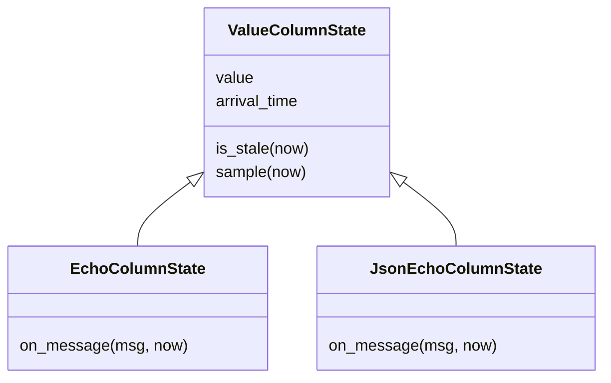

# Value column: the shared shape of "last known scalar"

When F04 added JSON subfield columns, they needed exactly the machinery the
echo column already had: remember the most recent value, know when it arrived,
render `?` when the message was readable but the value wasn't, go blank when
stale. Duplicating that in a second class would have been the classic
copy-drift trap, so `metawtf/value_column.py` extracts it into a small base
class both column kinds derive from.

## One sentinel, three cell states

A sampled cell can be in one of three states, and the encoding is deliberate:

```python
INVALID = object()  # a message arrived but its value could not be read

class ValueColumnState:
    def __init__(self, name: str, stale_after: float | None, width: int | None):
        self.name = name
        self.stale_after = stale_after
        self.width = width
        self.value = None
        self.arrival_time = None
```

- **No message yet / stale** → `arrival_time is None` or past `stale_after` →
  empty cell.
- **Message arrived, value unreadable** → `self.value is INVALID` → `?`.
- **Message arrived, value read** → formatted scalar.

`INVALID` is a bare `object()` rather than `None` or a magic string because it
must be distinguishable from every possible legitimate field value — a topic
could genuinely publish the string `"?"` or `None`-like data; identity
comparison against a private sentinel can never collide.

```python
    def sample(self, now: float) -> str | None:
        if self.arrival_time is None or self.is_stale(now):
            return None
        if self.value is INVALID:
            return "?"
        return format_value(self.value)
```

Subclasses implement only `on_message`, i.e. *how* to get a value out of a
message; everything about *presenting* that value over time is inherited.



## Formatting

```python
def format_value(value) -> str:
    if isinstance(value, float):
        return f"{value:.2f}"
    return str(value)
```

Floats print with exactly two decimals — a deliberate trade of precision for
column readability in a live terminal trace. Strings, ints, and bools fall
through to `str()`.

## Observations for future improvement

- **Two decimals is a global policy.** A per-column `precision` config field
  would be a natural extension if a trace ever needs micro-scale values, which
  currently flatten to `0.00`.
- **`is_stale` could be a pure function** taking `arrival_time` as an argument;
  as a method it re-reads instance state that `sample` has already checked.
