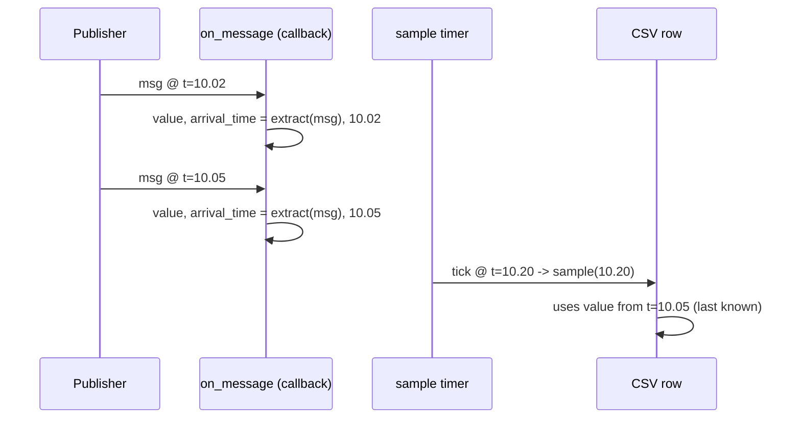

# Echo Column: last-known-value semantics

`metawtf` samples on a fixed timer, but ROS topics publish whenever they
publish — a `/odom` topic might arrive at 50 Hz while the trace samples at
5 Hz. `metawtf/echo_column.py` is where that mismatch gets resolved, with a
policy the feature spec calls "last known value": whatever the field was set
to by the most recent message *before* this tick is what gets printed, even
if that message arrived several callbacks ago.

Since F04 the mechanics of holding a value over time — staleness, the
`INVALID` → `?` rendering, float formatting — live in the shared
`ValueColumnState` base (chapter 07). What remains here is only the part
specific to echo: how a value gets out of a message.

## Separating "receiving" from "printing"

```python
class EchoColumnState(ValueColumnState):
    def __init__(
        self,
        name: str,
        field: str,
        stale_after: float | None,
        width: int | None = None,
    ):
        super().__init__(name, stale_after, width)
        self.field = field

    def on_message(self, msg, now: float) -> None:
        try:
            self.value = extract_field(msg, self.field)
        except FieldPathError:
            self.value = INVALID
        self.arrival_time = now
```

The `try`/`except` around extraction is a deliberate softening of the
"report, don't repair" rule, made at the runtime boundary. A bad field path is
almost always a config typo — but that typo is discovered per-message, deep in a
subscription callback, and letting it propagate there would crash the whole
trace (every other column included). Instead the message's arrival is still
recorded and the offending field is flagged with the `INVALID` sentinel, which
the inherited `sample` renders as `"?"`. The error is not swallowed silently —
it shows up as a visible `?` in that column on every row, which tells the user
the path is wrong without taking the process down. A subsequent readable
message clears it.

`on_message` runs inside a ROS subscription callback — however often the
topic publishes, however large the message. It does the minimum possible
work: extract one field, store it, record when it arrived. No formatting,
no I/O. This mirrors a comment in `ros2 topic hz`'s own source: keep
callbacks cheap enough that they never become the bottleneck, so the
sampling timer (running on the same single-threaded executor) never gets
starved. Unlike `ros2 topic hz`, which prints from a dedicated thread to
sidestep this problem, `metawtf` doesn't need a second thread at all,
*because* its callbacks are this cheap.



## What the base class provides

Staleness (`stale_after` opt-in), the empty-cell-before-first-message rule,
and `format_value`'s two-decimal float policy are all inherited from
`ValueColumnState` — see chapter 07 for the rationale, including why missing
data renders as an empty cell rather than `0`, and why `INVALID` is an
identity-compared sentinel object.

## Observations for future improvement

- **`format_value` doesn't handle ROS array fields.** If a field ever
  resolves to a list (e.g. a fixed-size array field), `str(value)` will
  print Python's list repr (`[1.0, 2.0, 3.0]`) into a single CSV cell,
  which will not import cleanly into a spreadsheet. Not reachable in v1
  since `field_extract.py` only supports scalar attribute paths, but worth
  a guard if array indexing is ever added.
