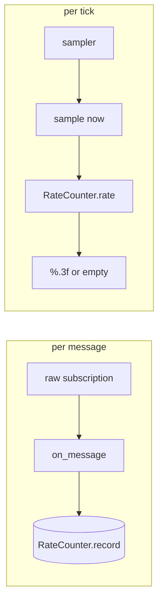

# Hz column: an arrival-time recorder that is also a column

`metawtf/hz_column.py` is the `hz` counterpart to `echo_column.py`. Where an
echo column stores the latest *value* of a field, an hz column stores nothing
about the message at all — only *that* a message arrived, and when. Everything
numeric is delegated to the `RateCounter` from the previous chapter; this class
exists to satisfy the sampler's column contract and to name itself correctly.

## The column contract, restated

The sampler depends on a `Protocol`: anything with a `name`, a `width`, and a
`sample(now) -> str | None` is a column. `HzColumnState` implements exactly
that, wrapping a counter:

```python
class HzColumnState:
    def __init__(self, name: str, window: float, width: int | None = None):
        self.name = name
        self.width = width
        self.counter = RateCounter(window)

    def on_message(self, raw_msg, now: float) -> None:
        self.counter.record(now)

    def sample(self, now: float) -> str | None:
        rate = self.counter.rate(now)
        if rate is None:
            return None
        return f"{rate:.3f}"
```

`on_message` takes the message and ignores it. That is the whole point of the
`hz` metric: the subscription that feeds it is created with `raw=True`, so the
payload is never even deserialized (see `column_manager`). Counting bytes we
never decode is what makes it safe to point an hz column at a high-rate camera
or point-cloud topic. The unused `raw_msg` parameter is kept because it is a
callback signature the subscription calls — a boundary adapter, not dead code.

`sample` turns the counter's `float | None` into the column's `str | None`:
`None` (fewer than two arrivals in the window) becomes an empty cell, and a
real rate is formatted to three decimals.

## Naming a discovered topic

A single-topic hz column gets its name from config. But a `match` column is born
at runtime, one per discovered topic, so it needs to derive its own header from
the topic name. That rule — strip the leading `/`, turn the rest into `_` — is
the same `sanitize_topic` the config module uses, reused here through a factory:

```python
    @classmethod
    def from_topic(cls, topic: str, window: float, width: int | None = None):
        return cls(name=sanitize_topic(topic), window=window, width=width)
```

Keeping the naming in one place means `/robot/scan` becomes `robot_scan`
identically whether it came from a `topic:` entry or was matched live.



## Observations for future improvement

- **`from_topic` and the plain constructor duplicate almost nothing**, which is
  the goal, but note the factory is the only intended way to build a match
  column; a stray `HzColumnState("/tf", ...)` would keep the slash in its
  header. A brief docstring on that invariant would help.
- **Format precision is fixed at `%.3f`.** Fine for typical robotics rates, but
  a topic running at thousands of hz would show three now-meaningless decimals;
  a significant-figures format could adapt automatically.
