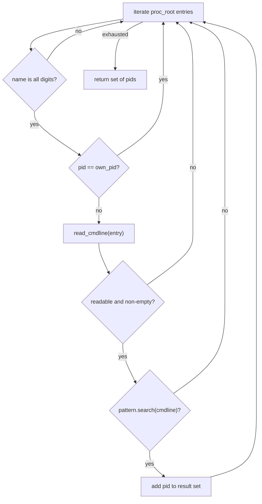
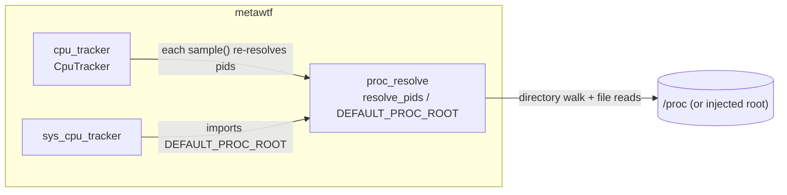

# Chapter 8 — `proc_resolve`: finding processes by what they run

## Introduction

metawtf is a tracer: it watches ROS2 topics and, alongside the message
traffic, reports how much CPU the processes *behind* those topics are
burning. To do that it needs an answer to a deceptively simple question:
**which operating-system processes belong to the thing we care about?**

ROS2 complicates this. Almost every Python-based ROS node shows up in the
kernel's process table with the same short name — `comm` is just `python3`.
The only reliable way to tell "the `talker` node from my demo launch file"
apart from "some unrelated Python interpreter" is to look at the process's
full command line: the script path, the launch arguments, the `__node:=`
remapping arguments rclpy tacks on. That is what `proc_resolve` does. It is
the small, pure lookup layer underneath `CpuTracker`: given a compiled regex
and a place to look, it returns the set of pids whose command line matches.

The module is deliberately tiny — two functions, no state, no I/O beyond
reading files. Its whole design is about making one kernel interface,
`/proc`, safe and testable to consume.

## The /proc filesystem as a data source

Linux exposes the process table as a pseudo-filesystem rooted at `/proc`.
Each live process has a directory named after its pid, and inside it
`/proc/<pid>/cmdline` holds the process's argument vector: the raw `argv`
the process was started with, with the arguments separated by NUL bytes
(`\0`) rather than spaces. This is a deliberate kernel convention — spaces
are legal *inside* an argument, so a space-separated format would be
ambiguous, and NUL is the one byte that can never appear in a C string.

Reading `/proc` has three properties that shape everything in this module:

1. **It is just file I/O.** No special privileges, no syscalls beyond
   `open`/`read`, no parsing of binary structures. A directory listing plus
   a small file read per candidate process is the entire cost.
2. **It is a moving target.** Processes are born and die constantly, so any
   scan is a snapshot of something that is changing underneath you. A pid
   directory can vanish between the moment you listed it and the moment you
   open its `cmdline`. The module treats this as normal, not exceptional.
3. **It is permission-scoped.** You can read your own processes' `cmdline`
   freely; other users' processes may be unreadable. Again: normal, not
   exceptional.

The module's contract flows directly from these properties — a scan returns
the pids that were *observably* matching at scan time, and quietly skips
everything it cannot see.

## Injection instead of hard-coding: the seam for tests

The module names its default once, at module level:

```python
DEFAULT_PROC_ROOT = Path("/proc")
```

but `resolve_pids` never reads that constant unless the caller declines to
provide its own root. This is the module's central design decision: the
proc root is a *parameter*, not a fact. In production the caller is
`CpuTracker`, which passes the default through; in tests the caller passes
a `tmp_path` populated with fake pid directories like `100/cmdline`
containing hand-written bytes. The same trick shows up in `own_pid` — in
production it is `os.getpid()`, injected by `CpuTracker`; in tests it is
just another argument.

This is the classic *dependency injection at the module boundary* pattern,
applied to the operating system itself. `/proc` is global mutable state
from the program's point of view; parameterizing it converts an
untestable kernel dependency into a plain directory walk that pytest can
stage with a few `write_bytes` calls. The payoff is visible in
`test/test_proc_resolve.py`, which exercises the real code path — regex,
directory iteration, NUL-splitting and all — without ever touching a real
process.

## The scan: filter, then match

The public entry point is a single pass over the proc root. Read it as a
pipeline of three filters feeding a collector:

```python
def resolve_pids(
    pattern: re.Pattern,
    proc_root: Path = DEFAULT_PROC_ROOT,
    own_pid: int | None = None,
) -> set[int]:
    pids = set()
    for entry in proc_root.iterdir():
        if not entry.name.isdigit():
            continue
        pid = int(entry.name)
        if pid == own_pid:
            continue
        cmdline = read_cmdline(entry)
        if cmdline is not None and pattern.search(cmdline):
            pids.add(pid)
    return pids
```

The three filters each reject a different class of false positive, in
increasing order of cost:

- **Not a pid at all.** `/proc` contains far more than process directories:
  `cpuinfo`, `meminfo`, `net/`, `self`, and dozens of other entries. The
  `entry.name.isdigit()` check discards all of them before any file is
  opened. Note the check is on the *name*, so a symlink like `self`
  (which points at a pid directory) is correctly excluded — its name is
  not digits. Cheap string test, no I/O.
- **Ourselves.** A tracer that matched its own command line would report
  its own CPU as part of the target's. `own_pid` is skipped explicitly.
  Still no I/O.
- **Does not match.** Only now does the module pay for a file read. The
  cmdline is fetched and the compiled regex is searched against it.

Ordering the filters this way is a small performance choice with a real
effect: the regex — the most expensive test — runs only against genuine,
readable, non-self processes, typically a few dozen entries out of the
hundreds in `/proc`.

The result is a `set[int]`. A set is the right shape here for two reasons:
membership is what callers care about (`CpuTracker.sample` iterates it and
reconciles it against a baseline dict), and set semantics state honestly
that the scan is unordered and that each pid is unique. The function is
also a *pure query*: it stores nothing, so calling it twice tells you
about process churn — new matches appear, dead ones disappear — which is
exactly how `CpuTracker` uses it to follow restarted nodes.



## Reading a cmdline honestly

The second function is where the kernel's data format meets Python's type
system. Its signature advertises the design: `str | None`. There is no
exception path for the routine failures; `None` is a first-class result
meaning "this process cannot or should not be matched."

```python
def read_cmdline(pid_dir: Path) -> str | None:
    try:
        raw = (pid_dir / "cmdline").read_bytes()
    except OSError:
        return None
    args = [arg for arg in raw.decode(errors="replace").split("\0") if arg]
    if not args:
        return None
    return " ".join(args)
```

Several non-obvious choices are packed into these few lines:

- **Bytes first, decode second.** `read_bytes()` followed by
  `decode(errors="replace")` rather than `read_text()`. Command lines can
  contain bytes that are not valid UTF-8 — a mangled locale, a filename in
  some other encoding. `errors="replace"` swaps those for the U+FFFD
  replacement character, which keeps the scan alive; a strict decode would
  turn one oddball process into a `UnicodeDecodeError` that kills the whole
  pass. The regex may not match across a replacement char, but that only
  *narrows* matching for an already-corrupt cmdline — a safe direction to
  err.

- **NUL-splitting, then filtering empties.** `split("\0")` reverses the
  kernel's encoding of `argv`. The trailing NUL after the last argument
  yields a final empty string, which the `if arg` filter drops; the same
  filter also absorbs any stray double-NULs.

- **Rejoining with spaces.** After splitting into faithful arguments, the
  code *deliberately re-flattens* them into one space-joined string for the
  regex to search. This looks like it throws away the very fidelity the NUL
  split recovered — and it does — but it is a pragmatic choice: callers
  write patterns like `ros2 launch` or `talker` against a single string,
  not against an argv list. The split-then-join round trip normalizes the
  raw bytes into clean, single-spaced text; arguments that genuinely
  contain spaces are rare in ROS launch command lines, and the cost of a
  false match across an argument boundary is low for a monitoring tool.

- **Empty means "skip," not "match nothing."** Kernel threads have no
  userspace command line, so their `cmdline` file is empty — zero bytes,
  an empty `args` list after filtering. Returning `None` folds them into
  the same "uninteresting" bucket as unreadable processes, keeping them out
  of the matcher's way.

- **`OSError` is expected, not exceptional.** The inline comment says it
  plainly: an unreadable cmdline means "the process vanished mid-scan or
  belongs to another user — both are skips, not errors." Because the scan
  races with process death as a matter of course, the `try/except OSError`
  around the read is not defensive paranoia but the *normal* control flow.
  Swallowing the exception into `None` keeps one dying process from
  aborting a scan of hundreds of live ones.

There is also a race the code accepts knowingly: between `iterdir()` and
`read_bytes()` the pid can be recycled by the kernel for a different
process. In theory the scan could attribute a match to a pid that now
belongs to someone else. In practice pid recycling is slow (pids wrap at
/proc/sys/kernel/pid_max, typically 4 million), the window is microseconds,
and the next sample corrects any mistake — for a tracer, a transient
misattribution is far cheaper than locking the process table, which Linux
does not even offer.

## How it fits the package

`proc_resolve` sits at the bottom of the CPU-tracking stack. It has one
consumer and one shared constant:



The contract `resolve_pids` offers `CpuTracker` is precisely what a
per-sample reconciler needs: a fresh, honest set of matching pids, with
self excluded and the unreadable silently dropped. `CpuTracker.sample`
diffs that set against its stored baselines to pick up restarted nodes and
forget dead ones; it can do so only because `resolve_pids` is stateless and
idempotent. `sys_cpu_tracker` borrows just the `DEFAULT_PROC_ROOT` constant
so both trackers agree on where the process table lives and both stay
injectable in tests.

## Improvements and observations

- **A stricter `pid` type.** `isdigit()` admits entries like `007`; in a
  fake proc root that is fine, but a `entry.name.isdecimal()` check would
  be no clearer, so this is fine as-is. More useful might be documenting
  that `own_pid` accepts `None` to mean "exclude nobody," which is the
  current behavior but is only implied by the default.
- **Match against argv list instead of the joined string.** Returning the
  split `args` list (or matching each argument separately) would let
  callers write anchored patterns (`^ros2$ ^launch$`) that cannot
  false-positive across an argument boundary. It would complicate the
  common case, though, so it is a tradeoff, not a clear win.
- **Early exit when nothing can match.** The scan reads every pid's
  cmdline even when the caller will only sample a few. Not worth changing —
  regex cost dominates file-read cost at this scale — but worth noting
  that no short-circuit exists.
- **Narrower exception handling.** Catching `OSError` also catches
  `PermissionError` (which is intended) but also `IsADirectoryError` and
  other oddities. All resolve to "skip," so the behavior is right; a
  comment already covers the intent.
- **The regex is pre-compiled by the caller.** This is good — it avoids
  recompiling per sample — but the signature `pattern: re.Pattern` is
  unenforced; passing a string would crash on `.search`. Type hints carry
  the contract; runtime validation would be over-engineering here.
- **Portability is deliberately scoped to Linux.** Everything in the module
  is `/proc`-specific, which matches the package's ROS2-on-Ubuntu target.
  The injectable `proc_root` makes that assumption testable rather than
  removing it — an honest and sufficient design.
