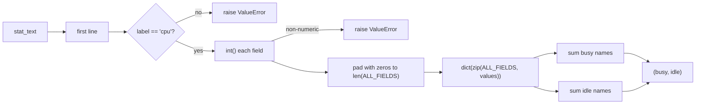
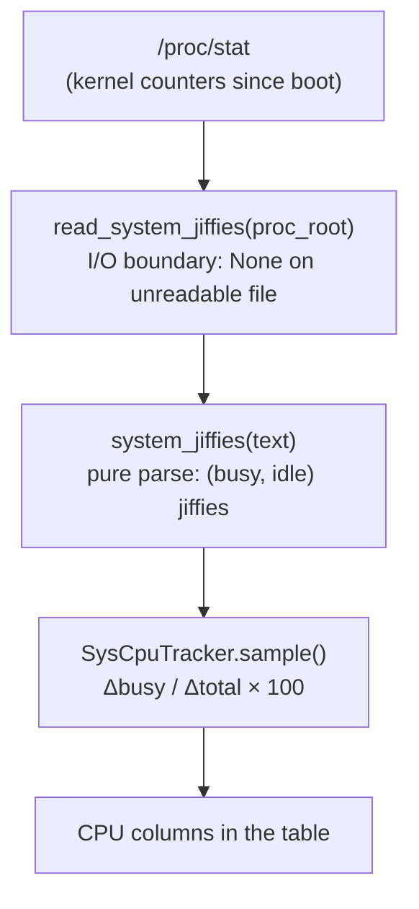

# sys_stat: reading the machine's pulse from `/proc/stat`

A CPU-percentage column for the *whole machine* needs one fact from the
kernel: since boot, how much time has the CPU spent working versus waiting?
Linux publishes exactly that in `/proc/stat` as the aggregate `cpu` line — a
row of counters, one per way the CPU can spend its time. `metawtf/sys_stat.py`
is the tiny, pure parser that turns that line into a single `(busy, idle)`
pair of *jiffies* (kernel clock ticks). Everything else — taking deltas,
computing percentages — lives upstream in `sys_cpu_tracker.py`; this module's
only job is to read the counters faithfully.

Keeping the parser pure and text-in/pair-out is a deliberate design choice:
`system_jiffies(stat_text)` takes a string, so tests can feed it synthetic
kernel output (as `test/test_sys_stat.py` does) with no filesystem, no
`/proc`, and no root access. The thin wrapper `read_system_jiffies(proc_root)`
is the only function that touches the disk.

## Background: what the `cpu` line actually is

The kernel does not measure "CPU percent." It counts *time slices*. Each
jiffy is one tick of the system timer (`1 / SC_CLK_TCK` seconds, usually 10
ms), and every tick the scheduler charges the current CPU to exactly one
bucket: `user` if it ran user code, `system` if it ran kernel code, `idle` if
nothing was runnable, and so on. The aggregate line is the sum across all
cores since boot:

```
cpu  100 0 50 800 20 10 5 15 0 0
      |   |  |  |   |  |  |  |  +--- guest, guest_nice
      |   |  |  |   |  |  |  +------ steal
      |   |  |  |   |  |  +--------- irq, softirq
      |   |  |  |   +------------- iowait
      |   |  |  +----------------- idle
      +---+--+--------------------- user, nice, system
```

Two subtleties in this line drive nearly all of the module's logic, so it is
worth being precise about them:

- **The line grew over time.** Ancient kernels printed only
  `user nice system idle`; `iowait` arrived with Linux 2.5.41, `irq`/`softirq`
  with 2.6.0, `steal` with 2.6.11, and the `guest` fields with 2.6.24. A
  parser that hard-codes ten fields breaks on old (or stripped-down)
  kernels — and on truncated fixtures.
- **`guest` and `guest_nice` are already counted.** Time spent running
  virtual machines is *included* in `user` and `nice`; the guest columns are
  a breakout for information, not additional time. A parser that sums every
  number on the line double-counts them and overstates busy time — this is a
  classic real-world bug in naive `/proc/stat` readers.

## Naming the fields instead of numbering them

The module's first move is to give every position a name and to declare,
explicitly, which names mean "working" and which mean "waiting":

```python
BUSY_FIELDS = ("user", "nice", "system", "irq", "softirq", "steal")
IDLE_FIELDS = ("idle", "iowait")
ALL_FIELDS = BUSY_FIELDS[:3] + IDLE_FIELDS + BUSY_FIELDS[3:]
```

There are two ideas packed into these three lines.

First, the busy/idle split follows the `top`/`htop` convention: `iowait` —
ticks where the CPU had nothing to do *because* it was waiting on disk — is
idle time, not work. That is a judgment call (a saturated disk arguably makes
the machine "busy"), but matching the tool every operator already reads keeps
metawtf's numbers comparable with what the user sees in `top`.

Second, note the odd construction of `ALL_FIELDS`: the first three busy
fields, then both idle fields, then the remaining busy fields. That is not
arbitrary shuffling — it reconstructs the kernel's on-disk column order

```
user nice system | idle iowait | irq softirq steal
```

from two tuples that are grouped by *meaning* (busy vs. idle) rather than by
*position*. The payoff is that the two classifications each live in one
place; the cost, an honest one, is that the order relationship is implicit.
A reader adding an eleventh kernel field has to place it correctly inside
this spliced expression.

The `guest`/`guest_nice` columns simply do not appear anywhere in
`ALL_FIELDS` — the double-counting trap is defused by omission, not by a
subtraction later.

## The parsing pipeline

With the schema declared, parsing is a short pipeline: isolate the first
line, split it, validate the label, convert to integers, pad, zip, and sum:



The first two steps collapse into a neat Python idiom. `split("\n", 1)` with
a max-split of 1 is the efficient way to take a first line: it scans only up
to the first newline instead of building a list of every line in the file
(`/proc/stat` has one `cpuN` line per core plus a dozen more, so this is not
entirely free to skip). Taking `[0]` of the result works whether or not the
text contains a newline at all:

```python
    first_line = stat_text.split("\n", 1)[0]
    fields = first_line.split()
    if not fields or fields[0] != "cpu":
        raise ValueError(f"no aggregate cpu line: {first_line!r}")
```

The label check matters because the *aggregate* line is the one spelled
exactly `cpu`; the per-core lines are `cpu0`, `cpu1`, … . A bare
`startswith("cpu")` would silently accept a per-core line and report one
core's counters as the machine's — exactly the kind of quiet wrongness the
explicit equality test prevents. And because the aggregate line is guaranteed
to be first in real kernel output, taking line one *and* checking the label
is both cheap and safe.

Conversion failures get the same treatment — re-raised as `ValueError` with
the offending line quoted, wrapped around the original error via
`from error` so the traceback keeps its root cause:

```python
    try:
        values = [int(field) for field in fields[1:]]
    except ValueError as error:
        raise ValueError(f"malformed cpu line: {first_line!r}") from error
```

## Tolerating short lines: padding as schema evolution

The heart of the parser is how it handles the "the line grew over time"
problem. Rather than branching on how many fields were found, it pads the
value list with zeros up to the schema length and lets the missing fields
contribute nothing:

```python
    # Older kernels report fewer fields; the missing ones contribute zero.
    values += [0] * (len(ALL_FIELDS) - len(values))
    jiffies = dict(zip(ALL_FIELDS, values))
    busy = sum(jiffies[name] for name in BUSY_FIELDS)
    idle = sum(jiffies[name] for name in IDLE_FIELDS)
    return busy, idle
```

This is the *null object* pattern applied to schema versioning: a kernel that
predates `steal` is treated as a kernel that reports zero `steal` — which is
semantically true, since pre-2.6.11 kernels never charged ticks to that
bucket. The alternative, an `if len(values) >= 8` ladder around each field,
would spread the kernel-history knowledge across every consumer of the dict.
Here the history lesson is confined to a single padding line, and everything
downstream can assume a complete schema.

The `dict(zip(...))` step deserves a second look too. `zip` stops at the
*shorter* sequence, which gives a graceful behavior for the opposite case — a
kernel with *more* fields than the schema knows (today: `guest`,
`guest_nice`, and anything future kernels append). Those extra values are
silently dropped, which is precisely correct for `guest`/`guest_nice` (they
must not be summed) and safe for unknown future fields. So one idiom handles
both directions of schema drift: pad when short, truncate when long.

Mapping names to values and then summing by name, rather than summing by
index (`values[0] + values[1] + values[2] + values[5] ...`), is what makes
the busy/idle policy readable and auditable: the classification at the top of
the file is the single source of truth, and the sums just execute it.

## The I/O boundary: `None` versus `raise`

The only impure function is a three-line wrapper, and its contract is a
small study in distinguishing failure modes:

```python
def read_system_jiffies(proc_root: Path) -> tuple[int, int] | None:
    # None means the stat file could not be read at all; a malformed line
    # raises instead of being guessed at.
    try:
        stat_text = (proc_root / "stat").read_text()
    except OSError:
        return None
    return system_jiffies(stat_text)
```

Two different problems get two different signals:

- **Unreadable file → `None`.** On a non-Linux host, in a container without
  `/proc` mounted, or in a test sandbox, there is simply no data. `None`
  tells the caller ("this source is unavailable") and lets
  `SysCpuTracker.sample()` degrade gracefully by clearing its baseline and
  reporting no value for that cycle.
- **Malformed content → exception.** A file that *was* read but does not
  parse means something is genuinely wrong — wrong file, corrupted test
  fixture, an unexpected format. Guessing a value here would corrupt CPU
  percentages silently, so the parser refuses loudly instead.

Taking `proc_root` as a parameter (rather than hard-coding `/proc`) keeps the
function testable against a `tmp_path` fixture — the same dependency-
injection-by-path pattern used by `proc_stat.py` and `proc_resolve.py`
elsewhere in the package.

## How it fits together

In the running system, this module sits at the very bottom of the system-CPU
pipeline. It converts raw kernel text into the currency — jiffy counters —
that the tracker above it reasons about:



The split of responsibilities is deliberate: `sys_stat.py` knows the kernel
file format and nothing about sampling; `sys_cpu_tracker.py` knows deltas and
percentages and nothing about file formats. Because both busy and idle come
from the same counters, no wall clock or `SC_CLK_TCK` conversion is needed at
this level at all — percentages fall out of the ratio of deltas, and this
module never has to know what a jiffy is *worth* in seconds.

## Observations and possible improvements

- **The spliced `ALL_FIELDS` is the cleverest and most fragile line.** The
  busy/idle grouping is nicely DRY, but the positional order of the kernel's
  columns is encoded implicitly in `BUSY_FIELDS[:3] + IDLE_FIELDS +
  BUSY_FIELDS[3:]`. A single literal tuple in kernel order with busy/idle
  membership expressed as sets would trade a little duplication for a schema
  that is self-evidently in the right order and safer to extend when the
  kernel adds fields.
- **Extra fields are silently discarded.** Truncating unknown trailing
  values is the right call for `guest`/`guest_nice`, but if a future kernel
  adds a genuinely new *busy* bucket (as `steal` once was), this parser will
  under-report busy without any signal. A debug-level note or an
  `extra_fields` return channel would make the drift visible without breaking
  the contract.
- **No range sanity checks.** Counters that go backwards (which would make
  `delta_total <= 0`) are handled upstream, and absurd per-field values are
  not this module's problem — but a docstring stating "jiffies are
  monotonically non-decreasing per boot" would help callers understand what
  they can assume.
- **Whole-file read for one line.** `read_text()` slurps all of
  `/proc/stat` (per-core lines, `intr`, `ctxt`, …) to use only the first
  line. The file is small and virtual so this is cheap, but opening and
  reading one line would match the parser's actual appetite.
- **Type of the return could be a named tuple.** `(busy, idle)` relies on
  positional discipline at every call site; a two-field `NamedTuple` would
  make `SysCpuTracker.percents_since` self-documenting at zero runtime cost.
- **The `not fields` guard is unreachable in practice.** `"".split()` is the
  only way to get an empty list, and that still fails the `!= "cpu"` check —
  but on an empty *first line* the guard's error message quotes the empty
  line rather than the empty input. Harmless, though it hints the two
  conditions could be one check.
