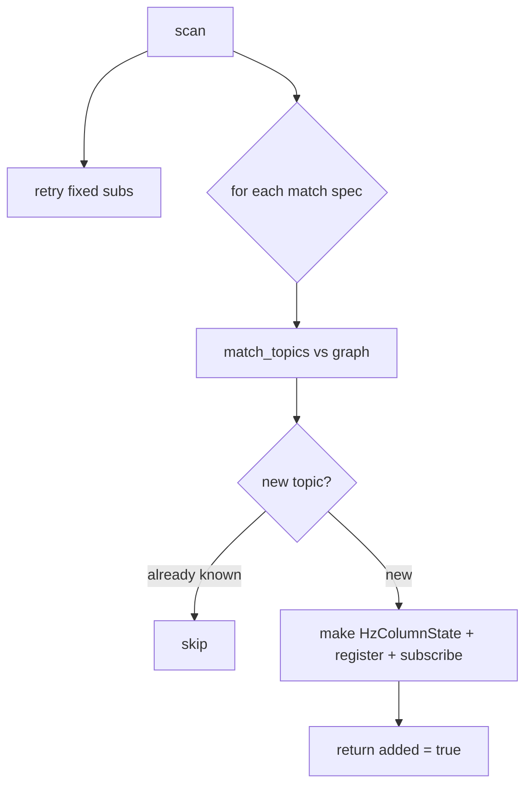

# Column manager: one place that owns subscriptions

Early in F01 the node itself created echo subscriptions inline. F02 adds two new
shapes — single-topic hz columns and regex `match` columns that spawn new
columns at runtime — and doing all three inside the node would have turned it
into a tangle. `metawtf/column_manager.py` extracts that responsibility into
`ColumnManager`: it owns the list of column states the sampler iterates, and it
owns the logic that lazily subscribes each one as its topic appears.

Crucially, it depends on a *node-like object*, not on `rclpy`. Anything offering
`get_topic_names_and_types`, `get_publishers_info_by_topic`,
`create_subscription`, and `get_logger` will do — which is how
`test_column_manager.py` drives the whole thing with a fake node and asserts on
which subscriptions were made.

## Echo and hz are almost the same subscription

The key realization that keeps this module small: an echo subscription and an hz
subscription differ in only two ways — the `raw` flag, and (for echo) a
configured message type. Both callbacks are literally `state.on_message(msg,
now)`. So a single `Subscription` record captures every case:

```python
@dataclass
class Subscription:
    state: object
    topic: str
    configured_type: str | None
    raw: bool
    subscribed: bool = False
    failed: bool = False
```

Building the initial column set is then a three-way branch on the config column:

```python
    def add_config_column(self, column) -> None:
        if isinstance(column, EchoColumn):
            state = EchoColumnState(
                column.name, column.field, column.stale_after, column.width
            )
            self.register(state, column.topic, column.type, raw=False)
        elif column.match is not None:
            self.match_specs.append(
                MatchSpec(column.match, column.window, column.width)
            )
        else:
            state = HzColumnState(column.name, column.window, column.width)
            self.register(state, column.topic, None, raw=True)
```

Echo and single-topic hz columns register a fixed `Subscription` immediately (to
be filled once the topic exists). A `match` column registers no column yet — it
becomes a `MatchSpec` that produces columns later.

## Scanning: fixed subscriptions plus discovered ones

```python
    def scan(self) -> bool:
        for sub in list(self.subscriptions):
            self.try_subscribe(sub)
        added = False
        for spec in self.match_specs:
            added = self.scan_match(spec) or added
        return added
```

`scan` runs at construction and then on a 1 Hz timer. Each pass retries every
not-yet-subscribed fixed column (so a late-starting topic still connects), then
expands every match spec. `scan_match` is where the column list grows:

```python
    def scan_match(self, spec: MatchSpec) -> bool:
        names_and_types = self.node.get_topic_names_and_types()
        added = False
        for topic, _type in match_topics(spec.pattern, names_and_types):
            if topic in self.matched_topics:
                continue
            self.matched_topics.add(topic)
            state = HzColumnState.from_topic(topic, spec.window, spec.width)
            self.register(state, topic, None, raw=True)
            self.try_subscribe(self.subscriptions[-1])
            added = True
        return added
```

`matched_topics` is the dedup set that guarantees "never subscribe to the same
topic twice," even across rescans or overlapping patterns. A topic that later
vanishes is deliberately *not* removed: its column stays, and its rate simply
decays to empty — matching the F02 promise that columns don't disappear
mid-run. The `bool` return bubbles up "the column set grew," which the sampler
uses to reprint its header.



## Subscribing: validate at the boundary, then trust

```python
    def try_subscribe(self, sub: Subscription) -> None:
        if sub.subscribed or sub.failed:
            return
        names_and_types = self.node.get_topic_names_and_types()
        try:
            msg_class = resolve_message_type(
                sub.topic, sub.configured_type, names_and_types
            )
        except TopicNotFoundError:
            return
        except MessageTypeError as error:
            self.node.get_logger().error(str(error))
            sub.failed = True
            return
        qos = select_qos(self.node.get_publishers_info_by_topic(sub.topic))
        callback = make_callback(sub.state)
        self.node.create_subscription(
            msg_class, sub.topic, callback, qos, raw=sub.raw
        )
        sub.subscribed = True
```

The two exceptions are treated very differently, and that difference matters. A
`TopicNotFoundError` is *transient* — the topic may appear later — so the
subscription is left pending and retried next scan. A `MessageTypeError` (a bad
configured type, or a genuinely multi-type topic) will not fix itself, so the
column is marked `failed` and never retried, which prevents the same error from
being logged once per second forever.

`make_callback` is a free function rather than an inline lambda so the
late-binding `state=state` default is captured correctly for each column — the
classic closure-in-a-loop trap, avoided by construction:

```python
def make_callback(state):
    return lambda msg, state=state: state.on_message(msg, time.monotonic())
```

## Observations for future improvement

- **QoS is chosen once, at subscribe time.** If a topic's publishers change
  their QoS after we connect, we don't renegotiate. Rare, but a periodic re-check
  could be added for long-running traces.
- **`Subscription.state` is typed `object`.** It is always an `EchoColumnState`
  or `HzColumnState`; a small union type would document the contract the
  callback relies on.
- **A vanished topic keeps consuming a column slot forever.** Intentional for
  now, but a very long run against a churning graph could accumulate empty
  columns; an optional prune could be offered later.
