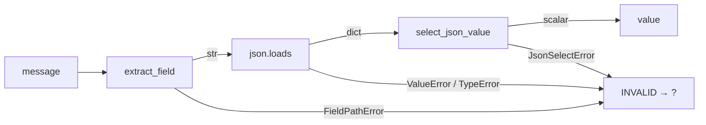

# JSON column: a scalar hiding inside a string field

Some topics smuggle structured data past the ROS type system as a JSON string
in a single field — the motivating case is `/explore/status`, a
`std_msgs/msg/String` whose `data` is `{"state": "idle", "reached": 0, ...}`.
Echoing `data` directly dumps the whole blob into one unplottable cell.
`metawtf/json_column.py` gives each selected JSON key its own column.

## Three hops from message to cell

A `JsonEchoColumnState` tracks one key of one JSON field. Each message makes
three hops, any of which can fail:

```python
class JsonEchoColumnState(ValueColumnState):
    def on_message(self, msg, now: float) -> None:
        try:
            raw = extract_field(msg, self.field)
            self.value = select_json_value(json.loads(raw), self.key)
        except (FieldPathError, JsonSelectError, ValueError, TypeError):
            self.value = INVALID
        self.arrival_time = now
```

1. `extract_field` walks the ROS attribute path (usually just `data`) —
   `FieldPathError` on a typo.
2. `json.loads` parses the string — `ValueError` on malformed JSON,
   `TypeError` if the field wasn't a string at all.
3. `select_json_value` walks the dotted key and enforces scalar-ness —
   `JsonSelectError` otherwise.

All four failures collapse to the same outcome: the `INVALID` sentinel, which
the inherited `sample` renders as `?`. This is the same runtime-boundary
softening the echo column makes — a malformed message deep in a subscription
callback must flag the cell, not kill the trace — and the same recovery rule:
the next well-formed message replaces the sentinel with a real value.

Note that `arrival_time` is updated even on failure. A message *did* arrive;
staleness tracks the topic's liveliness, not the payload's validity.



## The dotted-key selector

The selector lives in its own module (`json_select.py`, see appendix X01)
because it walks *dict keys*, not object attributes — deliberately separate
from `field_extract` despite the superficially similar dotted syntax. It
returns only scalars (`str`/`int`/`float`, with `bool` riding along as an
`int` subclass); an object, array, or `null` raises, because a stringified
blob in a CSV cell is exactly what this feature exists to avoid.

## A parse per column, by design

Two subfields of the same topic mean two `JsonEchoColumnState`s sharing one
subscription (see `column_manager`), and each one re-parses the same JSON
string per message. At trace rates (a few Hz on small status payloads) this
is negligible; parsing once and fanning out the dict is noted as a future
optimization, not done now, to keep each column state self-contained.

## Observations for future improvement

- **Shared parsing**: a per-message parse cache (keyed on the raw string) would
  remove the duplicate `json.loads` when many subfields watch one topic.
- **Error visibility**: all failure modes render identically as `?`. A debug
  flag that logs *which* hop failed (path vs parse vs key) would speed up
  config typo hunting.
