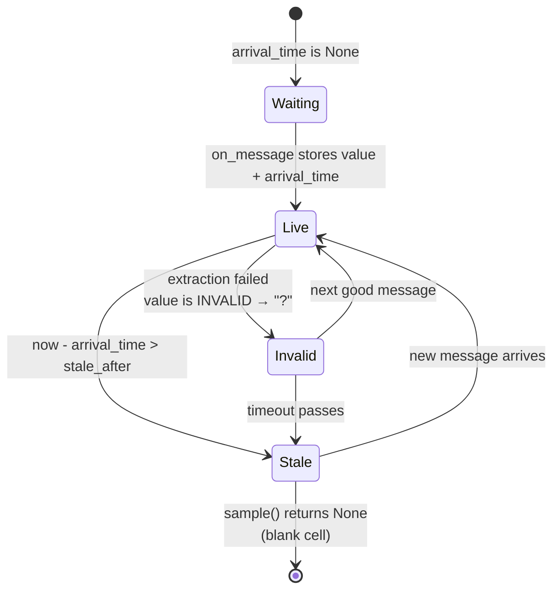
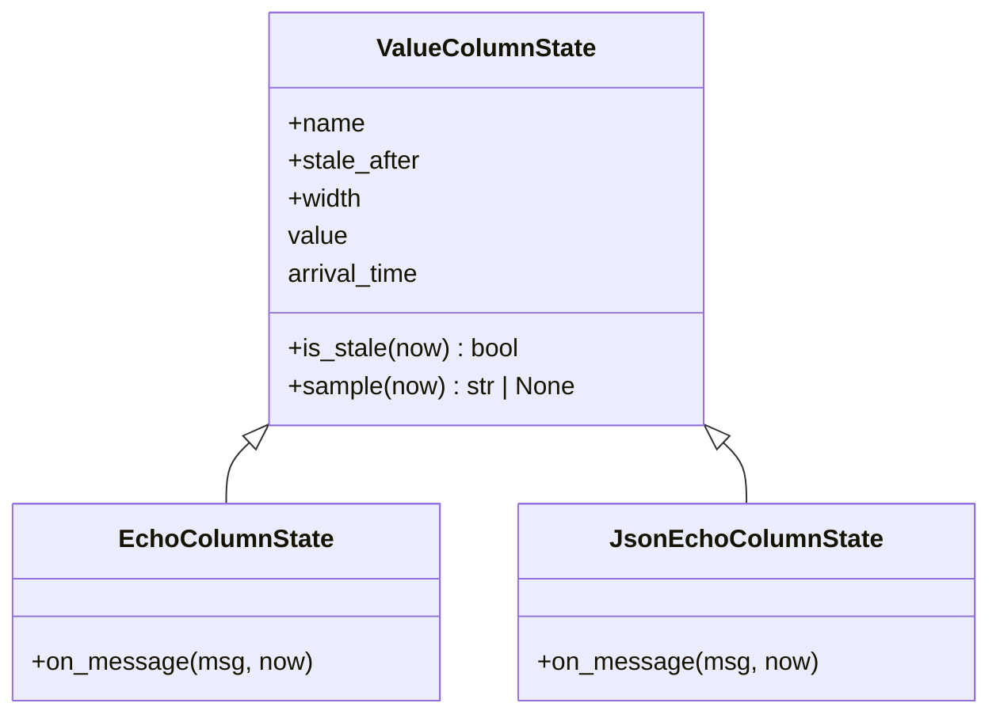

# Value column: the shared shape of "last known scalar"

Several columns in the trace do the same conceptual thing: every time a
message arrives on their topic, extract one scalar and remember it; every time
the sampler ticks, render that remembered value — or render nothing, if it has
been too long. When the JSON subfield columns needed exactly the machinery the
echo column already had (remember the most recent value, know when it arrived,
render `?` when the message was readable but the value wasn't, go blank when
stale), duplicating it in a second class would have been the classic
copy-drift trap. `metawtf/value_column.py` extracts it into a small base
class, `ValueColumnState`, that both column kinds derive from.

The module is forty-odd lines, but it encodes three design decisions worth
understanding: how the cell's state is represented, who decides *what* a
message means versus *how* a value ages, and how "no data" flows out to the
terminal.

## One sentinel, three cell states

A sampled cell can be in one of three states, and the encoding of those states
across just two fields is deliberate:

```python
INVALID = object()  # a message arrived but its value could not be read

class ValueColumnState:
    def __init__(self, name: str, stale_after: float | None, width: int | None):
        self.name = name
        self.stale_after = stale_after
        self.width = width
        self.value = None
        self.arrival_time = None
```

- **No message yet, or stale** — `arrival_time is None`, or the last arrival
  is older than `stale_after` → empty cell.
- **Message arrived, value unreadable** — `self.value is INVALID` → `?`.
- **Message arrived, value read** — formatted scalar.

`INVALID` is a bare `object()` rather than `None` or a magic string. This is
the classic *sentinel object* idiom: the marker must be distinguishable from
every possible legitimate payload. A topic could genuinely publish the string
`"?"`, or data that stringifies like `None`; only identity comparison against
a private, module-level object can never collide with user data. It is also
why the check is `self.value is INVALID` — `is`, not `==`. The sentinel has no
meaningful equality semantics; identity is the contract.

Note what the representation does *not* have: there is no explicit state enum.
The state machine is implicit, folded into `(value, arrival_time)` — fewer
invariants to keep consistent, and the two fields are the only things the
subclasses ever need to write.



Staleness itself is a plain timeout predicate, lazy rather than driven by any
timer:

```python
    def is_stale(self, now: float) -> bool:
        if self.stale_after is None or self.arrival_time is None:
            return False
        return now - self.arrival_time > self.stale_after
```

Two defaults are worth calling out. If `stale_after is None`, the column never
expires — the last value is pinned on screen forever, which is the right
behavior for a topic that publishes rarely. And a column that has never seen a
message cannot be stale: it is *empty*, a different thing, which the next
method distinguishes.

## Template Method: subclasses answer "what", the base answers "how long"

The sampling path is the other half of the design. Subclasses implement only
`on_message(msg, now)` — *how* to extract a value from a message (the echo
column applies a field path, the JSON column parses JSON and digs out a key).
Everything about *presenting* that value over time lives here:

```python
    def sample(self, now: float) -> str | None:
        if self.arrival_time is None or self.is_stale(now):
            return None
        if self.value is INVALID:
            return "?"
        return format_value(self.value)
```

This is the Template Method pattern in miniature: the base class fixes the
skeleton (arrive → remember → render → expire) and leaves one hook open.
The ordering of the checks matters. Staleness is tested *before* the `INVALID`
check, so a dead topic's stale `?` quietly reverts to a blank cell rather than
shouting about a problem that is no longer current.

The return contract is `str | None`, not `str` with `""` for empty. `None`
means "no cell content" and lets the consumer decide how to pad: the sampler
(`sampler.py:54`) maps `None` to `""` before joining cells, so the
blank-padding policy lives in one place instead of being smeared across every
column class. Distinguishing `None` from `""` also keeps the door open for a
topic that legitimately publishes an empty string as a value.



The subclass surface is tiny by design: write `self.value` and
`self.arrival_time` (or `INVALID`), inherit everything else. The subclasses
also agree to leave `value`/`arrival_time` untouched between messages, so the
rendered cell holds steady at the last sample regardless of the sampler's tick
rate — display frequency and message frequency are fully decoupled.

## Formatting

The last shared piece is purely presentational:

```python
def format_value(value) -> str:
    if isinstance(value, float):
        return f"{value:.2f}"
    return str(value)
```

Floats print with exactly two decimals — a deliberate trade of precision for
column readability in a live terminal trace, where a value like
`0.123456789` would jitter the column width on every tick. Strings, ints, and
bools fall through to `str()`. Because this is a module-level function rather
than a method, it is a single global policy point: every value column formats
identically, and a subclass that wants something different must override
`sample` wholesale (none currently do).

One subtlety: `isinstance(value, float)` also catches `bool`... no — in Python
`bool` subclasses `int`, not `float`, so `True` renders as `True`, not `1.00`.
The type test does exactly what it says.

## Observations for future improvement

- **Two decimals is a global policy.** A per-column `precision` config field
  would be a natural extension if a trace ever needs micro-scale values, which
  currently flatten to `0.00`. Large-magnitude floats (e.g. timestamps stored
  as floats) also render poorly with fixed-point; a significant-digits format
  like `:.3g` would scale better across magnitudes at the cost of ragged
  column edges.
- **`is_stale` could be a pure function** taking `arrival_time` as an
  argument; as a method it re-reads instance state that `sample` has already
  partially checked. Minor, but it would make the timeout predicate trivially
  unit-testable without constructing a column.
- **No hysteresis on the stale boundary.** A topic publishing at almost
  exactly `stale_after` flickers between value and blank on consecutive ticks.
  That is honest reporting, but if it ever reads as noise, a small grace
  factor (or a "last value, dimmed" rendering state) would smooth it.
- **`width` is stored but unused in this module.** It is carried here only so
  the sampler can read it off the same object; the base class never touches
  it. Fine as a data-homing choice, but the docstring could say so — a reader
  might otherwise hunt for padding logic that does not exist here.
