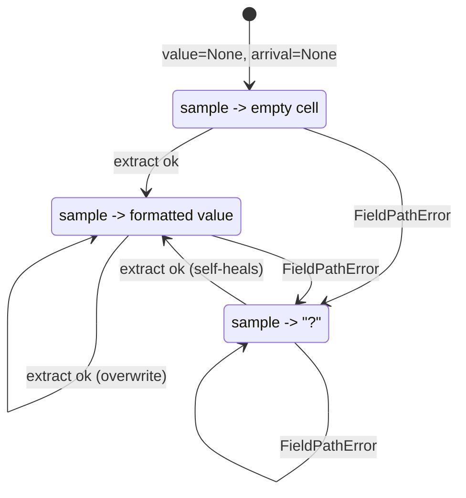

# Echo Column: sampling an asynchronous stream

## The problem this module solves

`metawtf` prints a trace table on a fixed timer — one row per tick. ROS 2
topics, meanwhile, publish whenever their publishers feel like it: a `/odom`
topic might fire at 50 Hz while the trace samples at 5 Hz, and a status
topic might go quiet for minutes at a time. Bridging those two clocks is
the whole job of the column-state classes, and `metawtf/echo_column.py`
holds the part of that bridge that is specific to `echo` columns: given a
message, pull one field out of it and remember it.

The policy it implements is sometimes called *zero-order hold* in the
signal-processing world: a sampled system reconstructs a continuous (or
at least more frequent) signal by holding the most recent sample constant
until the next one arrives. Here the "signal" is the topic stream and the
"reconstruction" is the value printed on each timer tick — whatever the
field contained in the most recent message *before* the tick, even if that
message arrived several callbacks ago, and nothing at all if no message
has arrived yet.

## A subclass with almost nothing in it

The entire module is one small class:

```python
class EchoColumnState(ValueColumnState):
    def __init__(
        self,
        name: str,
        field: str,
        stale_after: float | None,
        width: int | None = None,
    ):
        super().__init__(name, stale_after, width)
        self.field = field

    def on_message(self, msg, now: float) -> None:
        # A bad path is usually a config typo, but crashing a live trace over it
        # is worse than flagging the cell; show "?" and keep the other columns.
        try:
            self.value = extract_field(msg, self.field)
        except FieldPathError:
            self.value = INVALID
        self.arrival_time = now
```

Everything this class *doesn't* define is the point. How a held value
becomes a printed cell — the empty-cell rule before the first message, the
staleness check against `stale_after`, the `"?"` rendering for unreadable
values, the two-decimal float formatting — all of that is inherited from
`ValueColumnState` (chapter 10) and shared with every other value column.
`EchoColumnState` only contributes the two things that are genuinely
echo-specific:

- the `field` dotted path from the config, stored at construction, and
- `on_message`, the write side of the hold: extract the field and stamp
  the arrival time.

This is a template-method shape in miniature: the base class owns the
read path (`sample(now)`) and the subclass owns the write path
(`on_message(msg, now)`). The two never call each other; they communicate
only through the shared `self.value` / `self.arrival_time` pair. That
decoupling is what makes the zero-order hold work — the write side runs
at the topic's rate, the read side at the timer's rate, and neither needs
to know the other's frequency.

```mermaid
sequenceDiagram
    participant Pub as Publisher (topic rate)
    participant CB as on_message callback
    participant State as value / arrival_time
    participant Timer as sample timer (tick rate)

    Pub->>CB: msg @ t=10.02
    CB->>State: value = extract(msg), arrival = 10.02
    Pub->>CB: msg @ t=10.05
    CB->>State: value = extract(msg), arrival = 10.05
    Timer->>State: sample(10.20)
    State-->>Timer: "..." from t=10.05 (last known value)
    Note over Timer,State: 10.05 message printed at 10.20 tick;<br/>the 10.02 message is never seen by the output
```

Note what the diagram implies about data loss: at these rates, most
messages are *never printed*. That is by design — a trace column is a
monitoring view, not a logger. Holding the latest value and dropping the
rest keeps output rate and table width constant regardless of topic
behavior, which is exactly what a human scanning a live table wants.

## Why the callback stays tiny

`on_message` runs inside a ROS subscription callback on the same
single-threaded executor that drives the sampling timer. Anything slow
here — formatting, I/O, allocation churn — delays the timer and every
other subscription. So the callback does the irreducible minimum: walk a
dotted path, store a reference, store a float. `extract_field` itself is
a linear `getattr` walk over `path.split(".")` — O(depth) attribute
lookups, no parsing, no copying of the message. All rendering work
(`sample`, `format_value`) is deferred to the tick, where it runs once
per row instead of once per message.

The general principle — keep event callbacks cheap enough that they never
become the scheduling bottleneck — is the same one `ros2 topic hz`
follows, except that tool moves its printing to a dedicated thread to get
around it. `metawtf` gets the same guarantee structurally: because the
callbacks are this cheap, no second thread is needed at all.

## Softening failure at the runtime boundary

The `try`/`except FieldPathError` is a deliberate exception to the
project's usual "report, don't repair" stance, and the inline comment
says why. A bad field path is almost always a typo in the user's config —
but the typo is only discovered per-message, deep inside a subscription
callback, where an unhandled exception would kill the whole trace,
innocent columns included. Failing a *process* over a *typo* is the wrong
trade at a runtime boundary.

```python
try:
    self.value = extract_field(msg, self.field)
except FieldPathError:
    self.value = INVALID
self.arrival_time = now
```

Two details of the recovery are easy to miss:

- **`arrival_time` is still updated.** The message *did* arrive; only its
  value is unreadable. That distinction matters because staleness is
  computed from `arrival_time` — recording the arrival means a bad path
  shows `"?"` forever rather than eventually degrading to a stale empty
  cell, which would look like the publisher went silent.
- **The failure is visible, not silent.** `INVALID` is an
  identity-compared sentinel object defined in `value_column.py`, which
  `sample` renders as `"?"`. So the typo announces itself as a column
  full of `?` on every row — a loud signal to fix the config — while the
  rest of the trace keeps running. And because each message re-attempts
  extraction, a good message after the bad ones clears the `?` with no
  reset logic at all; the hold has no memory beyond the last write.



## What stays in the base class

None of the rendering policy lives here. `ValueColumnState` decides that
missing data is an empty cell rather than `0` (a real zero and "no data"
must never be confused), that staleness is opt-in via `stale_after`, and
that floats render with two decimals. Those choices, and the sentinel
pattern behind `INVALID`, are documented in chapter 10. This class just
feeds it values.

## Observations for future improvement

- **No array-field rendering.** If a field path ever resolves to a list
  or array, `str(value)` in the inherited `format_value` will dump
  Python's list repr (`[1.0, 2.0, 3.0]`) into a single CSV cell, which
  will not import cleanly into a spreadsheet. Not reachable today —
  `field_extract.py` only supports dotted scalar attribute paths — but
  worth a guard (e.g. join with a separator, or flag `INVALID`) if array
  indexing is ever added to the path language.
- **Extraction is repeated per message even for constant paths.** The
  `getattr` walk is cheap, but the path string is split on every call.
  Pre-splitting `self.field` into a tuple of parts at construction (or
  compiling it to a small closure) would shave the per-message cost
  further; only worth it if profiling ever shows extraction hot.
- **No type stability check.** If a field changes type between messages
  (rare but possible with dynamic-ish publishers), the column silently
  alternates formats. A debug-mode warning on type change could help
  users catch misconfigured paths that *do* resolve but to the wrong
  thing.
- **The `?` state carries no cause.** `INVALID` says "unreadable" but not
  *why* — the `FieldPathError` message (which names the missing part and
  how far the walk got) is discarded. Keeping the exception text from the
  most recent failure, even just for a one-line log or a `--verbose`
  footer, would shorten the typo-fix loop.
