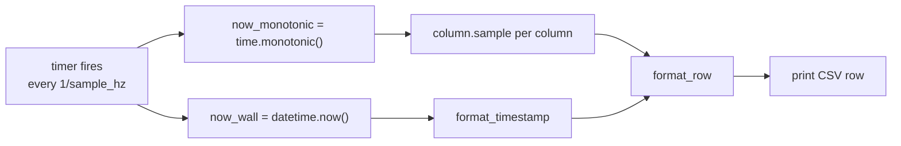

# Sampler: turning column state into a CSV stream

Everything upstream of `metawtf/sampler.py` — config parsing, subscriptions,
QoS, per-field extraction — exists to produce a handful of objects that each
know how to answer one question: "what's your value right now?" `Sampler`
is where those answers become the actual output of the program: a header
row, then one CSV row per tick, to stdout.

## Depending on a shape, not a class

`Sampler` doesn't import `EchoColumnState`. It depends on a `Protocol`:

```python
class SampledColumn(Protocol):
    name: str
    width: int | None

    def sample(self, now: float) -> str | None: ...


class Sampler:
    def __init__(
        self,
        columns: list[SampledColumn],
        time: TimeColumn = None,
        out: TextIO = sys.stdout,
    ):
        self.columns = columns
        self.time = time or TimeColumn()
        self.out = out
        self.header_width = None
```

This is what makes the module trivially testable without any ROS
machinery: `test_sampler.py` hands it a list of a tiny local `FakeColumn`
class that just returns a canned string from `sample()`. It's also what lets
F02's `hz` columns — and F03's future `proc_cpu` columns — plug into the
exact same sampler with zero changes here: anything with a `.name`, a `.width`,
and a `.sample(now)` is a column, regardless of what it measures. F02 proved
this out; adding hz required no change to the column contract.

`out` defaults to `sys.stdout` but is injectable, the same trick `load_config`
uses for the filesystem. `time` is the parsed `TimeColumn` controlling the
leading timestamp column's format and width; it defaults to `None` (rather than
a shared `TimeColumn()` instance, which would be a mutable default) and is
replaced with a fresh default inside the constructor.

## Two clocks, one tick

```python
    def tick(self, now_monotonic: float, now_wall: datetime) -> None:
        if self.header_width != len(self.columns):
            print(self.format_header(), file=self.out)
            self.header_width = len(self.columns)
        print(self.format_row(now_monotonic, now_wall), file=self.out)
```

`tick` takes two different notions of "now," because they answer two
different questions. `now_monotonic` — `time.monotonic()` — feeds every
column's `sample()` call, since staleness and (later, in F02) rate
calculations need a clock immune to NTP adjustments or the system clock
being stepped backward. `now_wall` — `datetime.now()` — is purely cosmetic:
it becomes the human-readable `HH:MM:SS.mmm` timestamp printed at the start
of each row, because that's what a person skimming the CSV, or a spreadsheet
plotting it, wants to see. Conflating the two would risk a subtly wrong
staleness check every time the wall clock jumps.



## Header-on-change, and column padding

```python
    def format_header(self) -> str:
        cells = [("time", self.time.width)]
        cells += [(column.name, column.width) for column in self.columns]
        return join_cells(cells)

    def format_row(self, now_monotonic: float, now_wall: datetime) -> str:
        cells = [(format_timestamp(now_wall, self.time.format), self.time.width)]
        for column in self.columns:
            value = column.sample(now_monotonic)
            cells.append(("" if value is None else value, column.width))
        return join_cells(cells)
```

In F01 the header was printed once behind a boolean, because the column set was
fixed. F02's `match` columns change that: a graph rescan can append a column
mid-run. So the guard became `header_width != len(self.columns)` — the header
reprints whenever the column *count* changes. Since columns are only ever
appended, a count change always means "a new column arrived," and the reader
gets a fresh, correctly-labelled header before the wider rows begin. (This is
the documented CSV caveat: a single file may contain more than one header line.)

`None` from any column still becomes an empty string, never `"None"` and never
`0`. Formatting collects `(text, width)` pairs and hands them to `join_cells`.

## Padding: comma first, spaces after

```python
def join_cells(cells: list[tuple[str, int | None]]) -> str:
    parts = []
    last_index = len(cells) - 1
    for index, (text, width) in enumerate(cells):
        if index < last_index:
            text = f"{text},"
            width = None if width is None else width + 1
        parts.append(pad(text, width))
    return "".join(parts)


def pad(text: str, width: int | None) -> str:
    if width is None:
        return text
    return text.ljust(width)
```

The comma binds to the value it terminates, and the padding spaces come
*after* it — `1.50,      ` rather than `1.50      ,`. Visually the separator
hugs its value instead of floating in front of the next column, and the file
still parses as CSV (each field simply carries leading spaces, which
spreadsheets strip). The `width + 1` accounts for the comma now occupying a
character inside the padded cell; the last cell gets no comma and no
adjustment.

`width` is a *minimum*. `ljust` pads a short value with trailing spaces so
columns line up when eyeballed in a terminal, but a value longer than `width` is
returned untouched — metawtf never truncates data to fit. An over-long cell
overflows and nudges that row's later columns out of alignment until the next
row, which is the accepted trade-off for never losing a value.

## A configurable timestamp

```python
def format_timestamp(now_wall: datetime, fmt: str | None) -> str:
    if fmt is None:
        milliseconds = now_wall.microsecond // 1000
        return f"{now_wall:%H:%M:%S}.{milliseconds:03d}"
    return now_wall.strftime(fmt)
```

The `time:` config block can supply a `strftime` string. The default path is
kept separate because `strftime` cannot express milliseconds directly, and the
millisecond-precision default (`HH:MM:SS.mmm`) is what a person skimming a trace
usually wants. Supplying a `format` hands full control to the user at the cost
of that precision.

## Observations for future improvement

- **`format_timestamp` truncates rather than rounds.** `microsecond // 1000`
  discards sub-millisecond precision by truncation, not rounding. Harmless
  for a human-readable timestamp column, but worth knowing if timestamps are
  ever compared numerically across rows.
- **No CSV escaping.** Cells are joined with a bare `","` — fine for numeric
  and simple string fields, but a `str`-typed message field containing a
  literal comma (unlikely for `nav_msgs`-style numeric fields, more likely
  for arbitrary `std_msgs/String` topics) would silently corrupt the column
  count of that row. Worth switching to Python's `csv` module if string
  fields become common.
