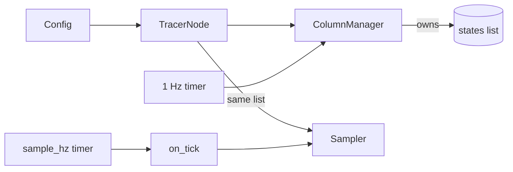

# Tracer Node: assembling the pieces and running until you quit

`metawtf/tracer_node.py` is the top of the dependency stack — the only module
that imports `rclpy` at module scope, and the only one that knows about "a
running program with a config file and a keypress to quit." Every other module
(`config`, `field_extract`, `msg_type`, `qos_select`, `echo_column`,
`hz_column`, `rate_counter`, `topic_match`, `column_manager`, `sampler`) is
logic that `TracerNode` wires into something that actually subscribes to topics
and prints CSV.

Since F02, this module is deliberately thin. Everything about *which* topics to
subscribe to, and *when*, now lives in `ColumnManager` (see its chapter). The
node's job is assembly and lifecycle.

## The node is mostly a constructor

```python
class TracerNode(Node):
    def __init__(self, config: Config):
        super().__init__("metawtf")
        self.manager = ColumnManager(self, config)
        self.states = self.manager.states
        self.sampler = Sampler(self.states, config.time)
        self.manager.scan()
        self.create_timer(RESCAN_PERIOD_SEC, self.manager.scan)
        self.create_timer(1.0 / config.sample_hz, self.on_tick)

    def on_tick(self) -> None:
        self.sampler.tick(time.monotonic(), datetime.now())
```

Three collaborators, one shared list. The manager builds `self.states` (the
column state objects); the node hands that *same list object* to the sampler.
That aliasing is what makes dynamic `match` columns work end to end: when the
manager appends a newly discovered column to `states`, the sampler — holding the
same list — sees it on the next tick and reprints its header. No event, no
callback; just a shared reference.

Two timers run at unrelated cadences for unrelated reasons. `manager.scan` at
1 Hz is a discovery mechanism — cheap enough to run constantly, no reason to tie
it to the output rate. `on_tick` runs at the configured `sample_hz`. Because
`rclpy`'s default executor is single-threaded, the two timers and every
subscription callback never run concurrently, which is exactly why
`on_message` in the column states can be a plain, lock-free assignment.



## Finding the config in the current directory

```python
def default_config_path() -> Path:
    return Path.cwd() / CONFIG_FILENAME
```

`metawtf.yaml` is resolved from the current working directory. An earlier design
read it next to the installed module, but once `metawtf` became a PATH command
that broke the edit-and-run loop: `Path(__file__)` at runtime points at the
*install-space* copy, so a user's edits to the source config had no effect until
the next `colcon build`. Reading from the current directory is the ordinary CLI
convention — edit `./metawtf.yaml`, run `metawtf`, see the change immediately.

## A nicer way to quit than Ctrl-C

`rclpy.spin` blocks until a signal, which leaves Ctrl-C as the only exit. F02's
usability pass adds a bare `q` keypress. The heart of it is a tiny, pure loop
that is unit-tested with a `StringIO`:

```python
def wait_for_quit(stream, on_quit) -> None:
    while True:
        char = stream.read(1)
        if char == "" or char.lower() == "q":
            break
    on_quit()
```

Reading one character at a time (`read(1)`) rather than a line is what lets `q`
work without Enter — but only if the terminal is in *cbreak* mode, where
keystrokes are delivered immediately instead of being line-buffered by the tty.
Setting that mode, and restoring it afterwards, is the wrapper's job:

```python
def start_quit_watcher(on_quit):
    if sys.stdin is None or not sys.stdin.isatty():
        return None
    fd = sys.stdin.fileno()
    old_settings = termios.tcgetattr(fd)
    tty.setcbreak(fd)
    print("metawtf running — press q or Ctrl-C to quit.", file=sys.stderr)
    thread = threading.Thread(
        target=wait_for_quit, args=(sys.stdin, on_quit), daemon=True
    )
    thread.start()
    return lambda: termios.tcsetattr(fd, termios.TCSADRAIN, old_settings)
```

Two details matter. First, the `isatty` guard: when stdin is a pipe or file
(no terminal), there is no keypress to wait for, so the watcher is skipped and
Ctrl-C remains the only exit — the returned `None` says "nothing to restore."
Second, `setcbreak` (not raw mode) leaves signal generation enabled, so Ctrl-C
still produces `SIGINT` as usual. The prompt goes to `stderr`, never `stdout`,
so it can't corrupt the CSV a spreadsheet reads. And the watcher runs on a
daemon thread so it can't keep the process alive on its own.

## The spin loop and a clean shutdown

```python
def spin_until_quit(node) -> None:
    stop = threading.Event()
    restore = start_quit_watcher(stop.set)
    try:
        while rclpy.ok() and not stop.is_set():
            rclpy.spin_once(node, timeout_sec=0.1)
    finally:
        if restore is not None:
            restore()


def main(args=None) -> None:
    rclpy.init(args=args)
    config = load_config(default_config_path())
    node = TracerNode(config)
    try:
        spin_until_quit(node)
    except (KeyboardInterrupt, ExternalShutdownException):
        pass
    finally:
        print("metawtf stopped.", file=sys.stderr)
        node.destroy_node()
        if rclpy.ok():
            rclpy.shutdown()
```

`spin_once(timeout_sec=0.1)` instead of a blocking `spin` is what lets the loop
notice `stop.is_set()` (the watcher fired) or `not rclpy.ok()` (a signal shut
the context down) within a fraction of a second. The `finally` in
`spin_until_quit` guarantees the terminal is put back into its normal mode
whether we left via `q`, Ctrl-C, or an exception — a raw-ish terminal left
behind would make the user's shell unusable.

`main`'s own `finally` handles the rclpy side: both `KeyboardInterrupt` and
`ExternalShutdownException` are treated as ordinary "time to stop," so neither
prints a traceback; and `rclpy.shutdown()` is guarded by `rclpy.ok()` because
calling it twice (once by the signal handler, once here) raises.

## Observations for future improvement

- **The quit key is fixed at `q`.** Fine, but a caller wanting a different key,
  or wanting to disable the watcher entirely, would have to edit the module.
- **`config` path has no override.** A `--config PATH` argument would make the
  CLI more flexible now that it is invoked as a bare command; it was an explicit
  non-goal earlier and could be revisited.
- **No live reconfiguration.** Editing `metawtf.yaml` mid-run has no effect;
  the config is read once at startup. A SIGHUP-driven reload could be added if
  long traces need it.
