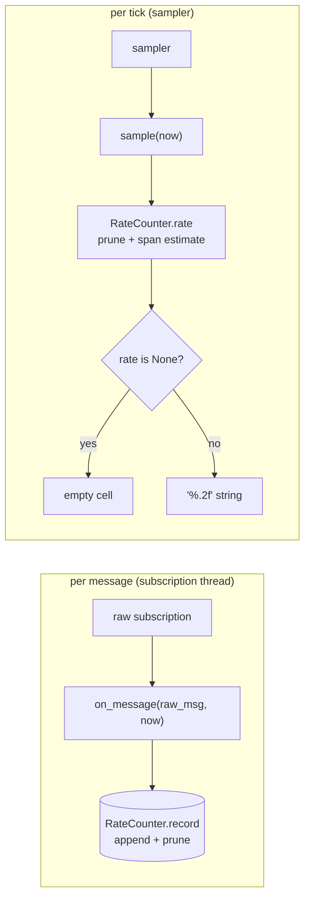
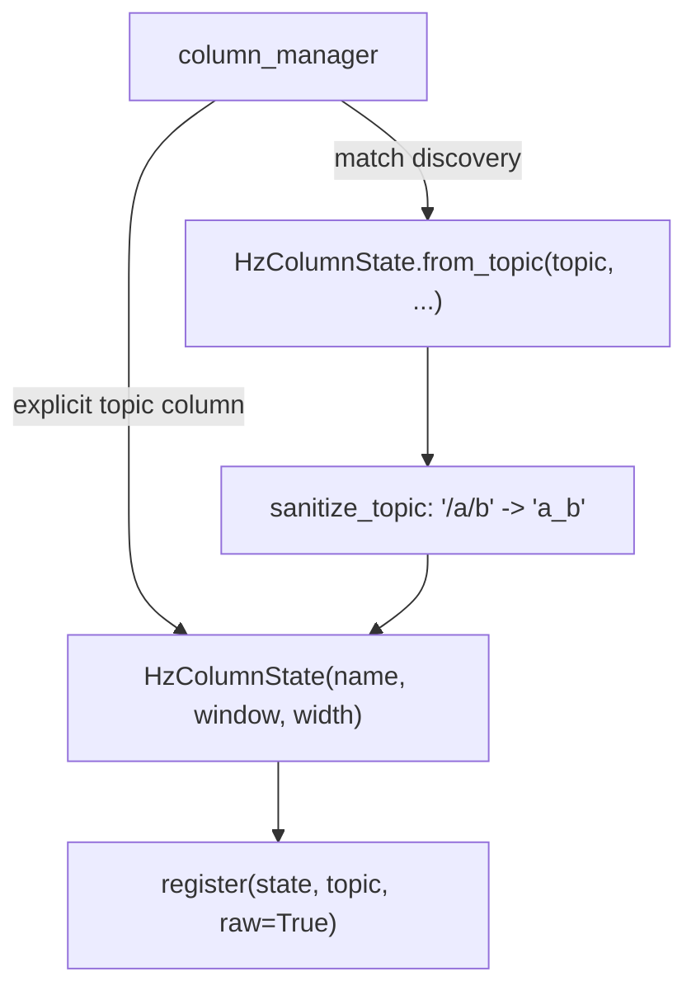

# Hz column: an arrival-time recorder that is also a column

`metawtf/hz_column.py` is the `hz` counterpart to `echo_column.py`. Where an
echo column stores the latest *value* extracted from a message, an hz column
stores nothing about the message at all — only *that* a message arrived, and
when. Everything numeric is delegated to the `RateCounter` (see the previous
chapter, `06-rate_counter.md`); this class exists to satisfy the sampler's
column contract, to feed the counter at the right moment, and to name itself
correctly.

The module is one small class, `HzColumnState`, with one factory classmethod.
Its interest lies not in volume but in the two boundaries it sits on: the
subscription boundary, where a raw ROS message arrives and is deliberately
ignored, and the display boundary, where an optional float becomes either a
formatted string or an empty cell.

## The column contract, restated

The sampler depends on a structural contract — a `Protocol` — rather than a
base class: anything with a `name`, a `width`, an `on_message(raw_msg, now)`
hook, and a `sample(now) -> str | None` method can be rendered as a column.
`HzColumnState` implements exactly that, wrapping a counter:

```python
class HzColumnState:
    def __init__(self, name: str, window: float, width: int | None = None):
        self.name = name
        self.width = width
        self.counter = RateCounter(window)
```

Note what the constructor does *not* take: no topic object, no node, no clock.
The clock is injected per call as a plain `now: float`, which keeps this class
trivially testable — a test can feed it synthetic timestamps and assert on
exact rates without standing up ROS or sleeping. The dependency on ROS is
entirely in `column_manager`, which constructs these states and wires their
`on_message` into real subscriptions.

## Why the message is ignored, and why that is safe

```python
    def on_message(self, raw_msg, now: float) -> None:
        self.counter.record(now)
```

`on_message` takes the message and throws it away. That is the whole point of
the `hz` metric: `column_manager` creates the feeding subscription with
`raw=True`, so the payload is never even deserialized. The unused `raw_msg`
parameter is not dead code — it is a boundary adapter. The subscription calls a
callback with a message argument; the hz column only cares about the *edge*, not
the *payload*.

This is what makes it safe to point an hz column at a high-rate camera or
point-cloud topic: the per-message cost is one timestamp append to a deque plus
an amortized O(1) prune, independent of message size. In data-flow terms the
column is a *decimation* of the stream — megabytes per second of imagery reduced
to a handful of float seconds per window.

## Delegating the rate math

```python
    def sample(self, now: float) -> str | None:
        rate = self.counter.rate(now)
        if rate is None:
            return None
        return f"{rate:.2f}"
```

`sample` is a thin adapter across two `Optional` domains: the counter's
`float | None` becomes the column's `str | None`. `None` — fewer than two
arrivals in the window, or a zero/negative time span — propagates outward and
the sampler renders an empty cell rather than a misleading `0.00`. A real rate
is formatted to two decimals.

It is worth being precise about the estimator being wrapped, because the choice
is deliberate and non-obvious. `RateCounter.rate` computes

    rate = (n - 1) / (t_newest - t_oldest)

over the arrivals still inside the rolling window — the *span-based* estimator
that `ros2 topic hz` itself uses. The naive alternative, `n / window`,
systematically under-reports: at startup the window is not yet full, and for a
sparse topic (say one message every two seconds inside a five-second window)
the count is correct but the divisor is arbitrary, so the reported rate swings
with window size rather than with the topic. The span-based form instead treats
n arrivals as n−1 *intervals* and divides by the time those intervals actually
spanned — a classic rate-from-interarrival-times estimate, unbiased by how much
of the window happens to be populated.

The deque underneath gives the rolling window its complexity profile: arrivals
are timestamp-ordered, so pruning expired entries is always a prefix removal
(`popleft`, O(1) each), and every entry is appended once and removed once, so a
burst of k messages costs O(k) total regardless of window contents. Pruning
happens in `record` as well as in `rate` — sampling can pause while messages
keep arriving, and the deque must stay bounded regardless.



## Naming a discovered topic

A single-topic hz column gets its `name` from config, so the plain constructor
is enough. But a `match` column is born at runtime, one state per discovered
topic, and needs to derive its own header from the topic name. That rule —
strip the leading `/`, turn the remaining separators into `_` — is the same
`sanitize_topic` the config module uses, reused here through a factory:

```python
    @classmethod
    def from_topic(cls, topic: str, window: float, width: int | None = None):
        return cls(name=sanitize_topic(topic), window=window, width=width)
```

Keeping the naming in one place means `/robot/scan` becomes `robot_scan`
identically whether the column came from an explicit `topic:` entry
(`column_manager` calls the plain constructor with the configured name) or was
matched live (`column_manager` calls `from_topic`). The factory exists purely
to couple construction to sanitization, so the match path cannot forget it.



## Observations for future improvement

- **The two construction paths rely on convention.** `from_topic` sanitizes;
  the plain constructor trusts its caller. A stray `HzColumnState("/tf", ...)`
  would keep the slash in its header. Only `column_manager` builds these today,
  but a one-line docstring stating "name must already be sanitized" would make
  the invariant explicit.
- **Format precision is fixed at `%.2f`.** Fine for typical robotics rates, but
  a topic running at thousands of hz shows now-meaningless decimals, and a
  0.004 hz topic rounds to `0.00`. An adaptive significant-figures format could
  handle both ends.
- **`width` is stored but never used in this module.** It is part of the column
  contract (the sampler reads it for layout), which is correct, but a reader of
  this file alone may wonder why an unused attribute is kept; the protocol
  relationship is the answer.
- **`raw_msg` could be annotated or renamed to `_`‑style** to signal
  intentional non-use, though the current name documents the callback's origin
  and is arguably clearer.
