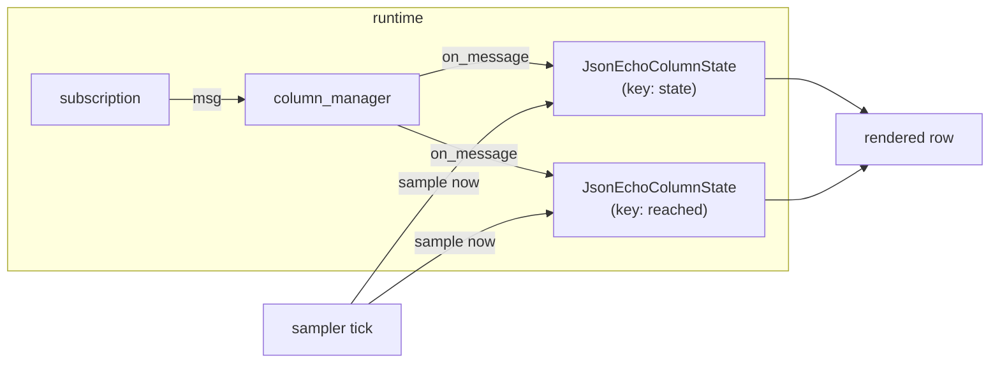
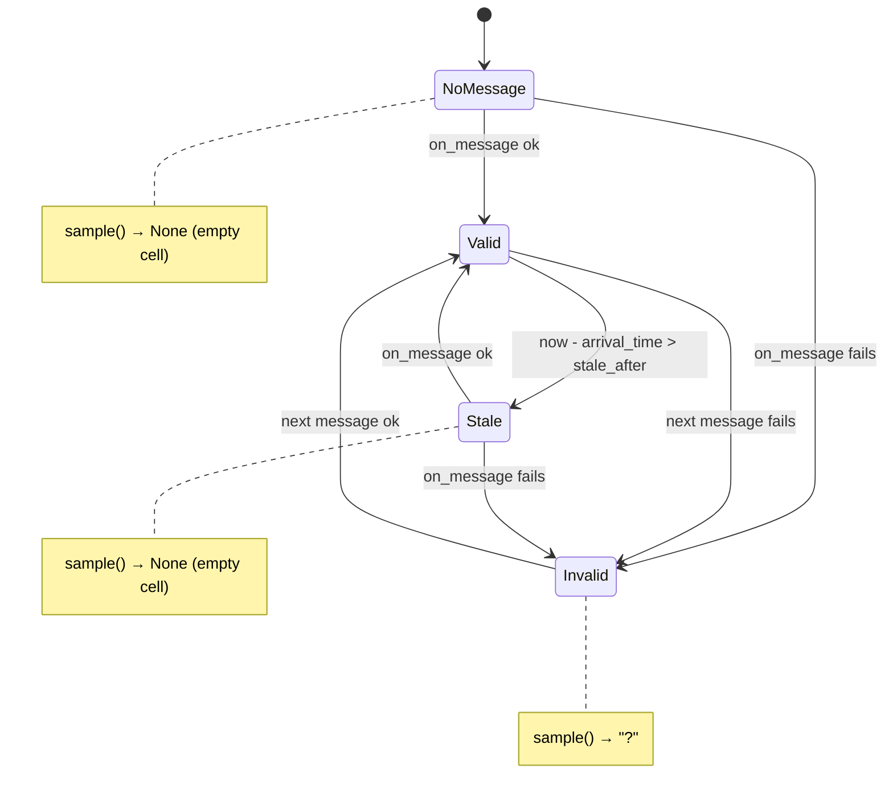

# JSON column: a scalar hiding inside a string field

Some ROS topics smuggle structured data past the type system by packing a JSON
document into a single string field. The motivating case in this project is
`/explore/status`, a `std_msgs/msg/String` whose `data` carries something like
`{"state": "idle", "reached": 0, ...}`. Echoing the raw field dumps the whole
blob into one unplottable cell; what the tracer actually wants is one column
per interesting key — `state` here, `reached` there.

`metawtf/json_column.py` provides that column. It is one of the smallest
modules in the package — a single class, one method of consequence — but it
sits at an interesting junction: three different "languages" (ROS attribute
paths, JSON text, dotted dict keys) must be crossed to turn a message into a
cell value, and every crossing can fail. The module's whole design is about
making that pipeline fail *softly*.

## Where it fits

`JsonEchoColumnState` is a leaf in the column-state family. The sampler ticks
on a timer and asks each column for a rendered string; the column manager owns
subscriptions and fans each incoming message out to every state subscribed to
that topic. The column state itself is a tiny state machine: it remembers the
last extracted value and the time it arrived, and derives everything else
(emptiness, staleness, formatting) from those two facts.



The inheritance does the heavy lifting. `ValueColumnState` (see
`10-value_column.md`) owns `value`, `arrival_time`, staleness, and the
three-way rendering decision; the subclass only has to answer one question:
*given this message, what is the value — or is there none?*

## Three hops from message to cell

Each message makes three hops, and any of them can fail:

```python
class JsonEchoColumnState(ValueColumnState):
    def on_message(self, msg, now: float) -> None:
        try:
            raw = extract_field(msg, self.field)
            self.value = select_json_value(json.loads(raw), self.key)
        except (FieldPathError, JsonSelectError, ValueError, TypeError):
            self.value = INVALID
        self.arrival_time = now
```

1. `extract_field` walks a dotted *attribute* path on the ROS message object
   (usually just `data`). A typo in the configured path raises
   `FieldPathError`.
2. `json.loads` parses the resulting string. Malformed JSON raises
   `ValueError` (`json.JSONDecodeError` is a subclass); a field that is not a
   string at all raises `TypeError`.
3. `select_json_value` walks a dotted *key* path through the parsed dict and
   insists the endpoint be a scalar, raising `JsonSelectError` otherwise.

The composition is worth a look: the intermediate parsed dict is never stored.
The class is a pure function of the message wrapped in stateful book-keeping —
`value` and `arrival_time` are the only memory, which is exactly what makes
the shared `sample()` logic in the base class possible.

## The fail-soft contract, and the sentinel that implements it

All four failure modes collapse to the same outcome: the `INVALID` sentinel, a
bare `object()` defined in `value_column.py`. The base class's `sample()`
renders it as `"?"`:

```python
def sample(self, now: float) -> str | None:
    if self.arrival_time is None or self.is_stale(now):
        return None
    if self.value is INVALID:
        return "?"
    return format_value(self.value)
```

This is a classic use of the *sentinel pattern*, and the choice of
`object()` over a magic value like `None` or `"?"` is deliberate. `None`
already means "no message yet" (`arrival_time is None` handles that case), and
any string or number could collide with legitimate data. A unique object
identity can never be confused with payload data — the check is `is`, not
`==`, so no value semantics get involved at all.

The deeper design decision is *where* errors are absorbed. This code runs
inside a subscription callback deep in the ROS executor; an exception escaping
`on_message` would not just lose one cell, it would kill the callback and
potentially the whole trace. So the module treats the extraction pipeline as a
runtime boundary — like a parser reading untrusted input — and converts every
failure into data. This is the same softening `EchoColumnState` makes for a
bad field path; the JSON column simply has a longer pipeline and therefore a
wider `except` clause. Recovery is free: the next well-formed message
overwrites the sentinel with a real value, no reset logic required.

Note also the ordering inside `on_message`: `arrival_time` is updated *even on
failure*, because it sits outside the `try`. A message did arrive — the topic
is alive — so staleness must not fire. The class cleanly separates two
questions that are easy to conflate: *is the topic alive?* (arrival time) and
*was the payload usable?* (value vs. `INVALID`). A `?` cell on a live topic is
a config or payload problem; an empty cell after `stale_after` is a liveliness
problem. Rendering them differently is what makes the trace diagnosable at a
glance.



## Two walkers that look alike but aren't

Hops one and three use nearly identical algorithms — split a dotted string,
walk it segment by segment, fail with a message that reconstructs how far the
walk got. Compare them side by side:

```python
# field_extract.py — walks object attributes
if not hasattr(value, part):
    raise FieldPathError(...)
value = getattr(value, part)

# json_select.py — walks dict keys
if not isinstance(value, dict) or part not in value:
    raise JsonSelectError(...)
value = value[part]
```

The similarity is superficial, and keeping them in separate modules is a real
design choice rather than missed deduplication. `extract_field` navigates the
*static* structure of a ROS message — attributes declared by the message
definition, where a miss is almost always a configuration typo.
`select_json_value` navigates the *dynamic* content of a JSON document — keys
that exist only at runtime, where a miss can mean the producer changed its
payload. Different failure meanings, different exception types, different
evolution paths; merging them into one "dotted walker" would buy a few lines
and cost that distinction.

Algorithmically both are the same O(k) walk over k path segments — a special
case of path resolution in a tree, linear in path depth, with the error
message reconstructing the walked prefix (`".".join(parts[:index])`) so a
failure tells you exactly which segment went missing.

## Why scalars only

`select_json_value` rejects anything that is not `str`, `int`, or `float`:

```python
# bool is a subclass of int, so it is accepted here as a scalar; None,
# lists, and nested objects are not plottable and are rejected.
if isinstance(value, (str, int, float)):
    return value
raise JsonSelectError(...)
```

The rationale: a column exists so values can be compared tick-to-tick and
plotted; a stringified nested object or array in a CSV cell is precisely the
unplottable blob this feature was built to eliminate. Rejecting non-scalars at
extraction time turns "the user picked a bad key" into the same gentle `?` as
every other failure, rather than a silently useless column.

Two subtleties hide in that one `isinstance` check. First, `bool` rides along
because `bool` subclasses `int` in Python — `True`/`False` are accepted, which
is what you want for flags like `"reached"`. Second, JSON `null` becomes
Python `None`, which is *not* in the tuple, so `null` raises rather than
flowing downstream to be rendered — a small but deliberate-looking bit of
strictness, since a `null` is more likely a missing reading than a value.

## A parse per column, by design

Two subfields of the same topic mean two `JsonEchoColumnState`s sharing one
subscription (the column manager fans the message out), and each state
re-parses the same JSON string on every message. The cost is O(n × m) for n
columns and m-byte payloads, but at trace rates — a few Hz on small status
payloads — `json.loads` of a few hundred bytes is microseconds. Keeping every
column self-contained (no shared parse cache, no cross-column coordination)
preserves the architecture's central invariant: a column state is just
`on_message` + `sample()`, and the manager need know nothing about JSON.
Parsing once and fanning out the dict is a legitimate future optimization, not
a current defect.

## Observations for future improvement

- **Shared parsing**: a per-message parse cache keyed on the raw string (or on
  `(topic, message id)`) would remove duplicate `json.loads` calls when many
  subfields watch one topic. The natural home would be the column manager or a
  small per-topic helper, so individual states stay simple.
- **Error visibility**: all failure modes render identically as `?`. The
  exceptions already carry precise messages (which path segment, which key);
  a debug flag that logs the *first* failure per column — path typo vs. parse
  error vs. missing key vs. non-scalar — would make config debugging much
  faster without changing steady-state output.
- **Sticky-failure distinction**: a column whose path is misspelled shows `?`
  forever, indistinguishable from one whose payloads are intermittently bad.
  Counting consecutive failures (cheap, two fields) could drive a louder
  signal for "this has never once succeeded."
- **Key validation at configure time**: the key path is only exercised per
  message. The config layer could at least reject syntactically odd keys
  (empty segments, leading dots) up front, catching a class of typos before
  the trace starts.
