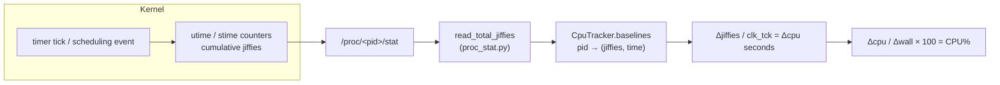
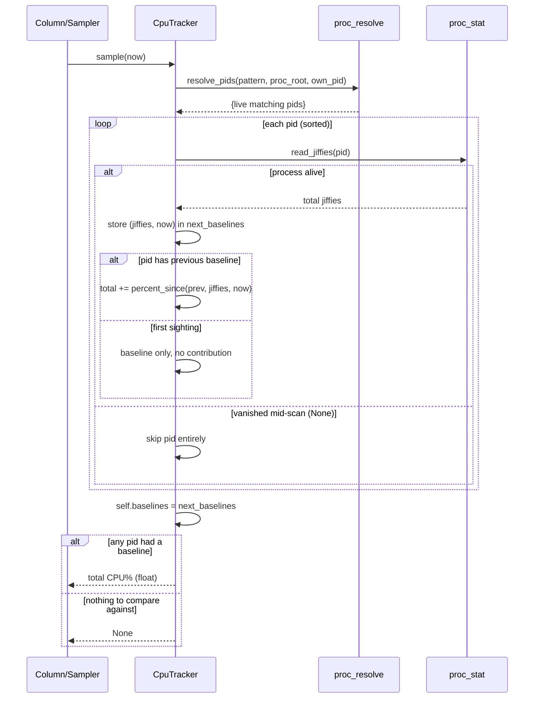

# Chapter 14 — `cpu_tracker.py`: Per-Pid CPU% from /proc Stat Deltas

## What this module is for

metawtf traces ROS2 topics, and one of its columns reports how much CPU the
processes behind a topic are burning. But Linux gives you no direct "CPU
percent" number for a process — the kernel only keeps *cumulative* counters.
`CpuTracker` turns those counters into a rate: it watches the set of
processes whose command line matches a regex, reads their CPU-time counters
out of `/proc` on every sample, and converts the difference between
consecutive readings into a percentage. Because it is *processes* (plural)
being watched — a regex can match several pids at once — the tracker sums the
contributions and returns one number.

The module is deliberately small (about 75 lines) because the fiddly parts
are delegated: finding matching pids lives in `proc_resolve.py`, and parsing
the `/proc/<pid>/stat` line lives in `proc_stat.py`. What remains here is the
interesting part: the sampling algorithm, the baseline bookkeeping, and the
arithmetic that turns jiffies into percent.

## The underlying model: jiffies and `/proc/<pid>/stat`

To follow the code you first need the kernel's accounting model, which the
code assumes but never explains. The kernel charges CPU time to each process
in units of **clock ticks**, conventionally called *jiffies*: on every timer
interrupt (or, on tickless kernels, at scheduling events) the running task is
credited with the elapsed ticks, split into *user* and *system* time. The
totals are exposed in `/proc/<pid>/stat` as fields 14 (`utime`) and 15
(`stime`), cumulative since the process started. The tick rate is a kernel
compile-time constant, almost always 100 on x86 Linux, exposed to user space
as `sysconf("SC_CLK_TCK")`.

So instantaneous CPU usage is not stored anywhere; it must be estimated as a
finite difference: read the counter now, read it again later, and divide the
elapsed CPU time by the elapsed wall time. That is the entire algorithm.
Everything in `CpuTracker` exists to make this differencing robust in the
face of processes appearing, disappearing, and being replaced.



## The psutil formula, and what "100%" means

The computation in `percent_since` is lifted from psutil's
`Process.cpu_percent`:

```python
def percent_since(self, baseline, jiffies: int, now: float) -> float:
    prev_jiffies, prev_time = baseline
    delta_wall = now - prev_time
    if delta_wall <= 0:
        return 0.0
    return ((jiffies - prev_jiffies) / self.clk_tck) / delta_wall * 100.0
```

Reading the expression inside out: `(jiffies - prev_jiffies)` is ticks of CPU
consumed; dividing by `clk_tck` converts that to *CPU-seconds*; dividing by
`delta_wall` gives CPU-seconds per wall-second, i.e. the average number of
cores the process saturated over the interval; multiplying by 100 makes it a
percentage.

The docstring calls this "top's Irix-mode convention": one fully utilized core
is 100%, so a process running flat out on four cores of a multi-core machine
reports 400%. The alternative (top's "Solaris mode", or dividing by the core
count) normalizes to total machine capacity. Irix mode is the right choice for
a tracer because it makes a runaway process *visible* — 350% is a signal, 22%
of machine capacity is not.

Two guards are worth noting. `delta_wall <= 0` returns 0.0 rather than
dividing by zero — two samples can land within the same clock resolution, or
a caller can pass a non-monotonic timestamp. And no guard is needed against
`jiffies - prev_jiffies` going negative *given a stable pid*, because the
kernel counters are monotonic — but see the observations section for the
pid-reuse caveat.

## Construction: everything is injectable

The constructor's signature tells you how the module stays testable despite
being glued to the kernel's process table:

```python
def __init__(
    self,
    pattern: re.Pattern,
    proc_root: Path = DEFAULT_PROC_ROOT,
    clk_tck: int | None = None,
    read_jiffies=None,
    own_pid: int | None = None,
):
```

Only `pattern` is truly required — the regex (already compiled by the caller)
that selects which processes count. Every interaction with the outside world
has a seam:

- `proc_root` defaults to `/proc` but can point at a fixture directory, so
  tests never touch the real process table.
- `clk_tck` defaults to the live `sysconf("SC_CLK_TCK")` but can be pinned to
  a round number so expected percentages come out exact.
- `read_jiffies` is the function used to read one pid's counter. The default
  is built with `functools.partial`, pre-binding `proc_root` onto
  `read_total_jiffies`:

```python
self.read_jiffies = read_jiffies or partial(
    read_total_jiffies, proc_root
)
```

This is a neat use of `partial`: `read_total_jiffies` takes `(proc_root,
pid)`, and the tracker only ever varies the pid, so the partial adapts the
general function to the one-argument call shape the sampling loop wants. A
test can instead inject a fake that hands out scripted jiffy values.
`own_pid` defaults to `os.getpid()` and is forwarded to `resolve_pids`, which
skips it — without that, a tracer run whose own command line matches the
pattern would count itself.

Finally, `self.baselines = {}` — the data structure at the heart of the
design, examined next.

## The baseline map: remembering just enough

A finite-difference estimate needs memory: you cannot compute a delta from one
reading. `CpuTracker` keeps exactly one reading per pid in a plain dict:

```python
baselines: dict[int, tuple[int, float]]  # pid -> (total_jiffies, timestamp)
```

This is the classic *previous-sample* pattern you find in every counter-based
monitor (network byte counters, disk I/O counters, Prometheus rate
calculations): store the last observation, and on each new observation emit
`f(current, previous)` and overwrite. Two things distinguish this
implementation from the naive version.

First, the key is the pid, not the pattern. Because a regex can match many
processes — say, every `ros2 launch` child — each match needs its own
baseline; merging them into one counter would conflate per-process histories
and corrupt the deltas whenever the membership of the set changed.

Second, the map is **rebuilt wholesale on every sample** rather than updated
in place. The sampling loop writes into a fresh `next_baselines` and only at
the end does `self.baselines = next_baselines` swap it in. Pids that vanished
since the last sample — or failed their stat read this time — simply never get
copied over, so stale baselines are dropped for free. There is no explicit
eviction code; garbage collection of dead pids falls out of building the new
map from what is actually alive.

## The sampling pass

`sample(now)` is the whole runtime behavior, driven by an external clock (the
caller passes the timestamp, keeping the tracker itself free of time sources):

```python
def sample(self, now: float) -> float | None:
    pids = resolve_pids(self.pattern, self.proc_root, self.own_pid)
    next_baselines = {}
    total = 0.0
    has_baseline = False
    for pid in sorted(pids):
        jiffies = self.read_jiffies(pid)
        if jiffies is None:
            continue
        next_baselines[pid] = (jiffies, now)
        previous = self.baselines.get(pid)
        if previous is None:
            continue
        has_baseline = True
        total += self.percent_since(previous, jiffies, now)
    self.baselines = next_baselines
    if not has_baseline:
        return None
    return total
```

The pass has four deliberate design decisions baked in:

**1. The pid set is re-resolved every sample.** `resolve_pids` walks
`/proc`, matches each process's full cmdline against the pattern, and returns
the live set (hence `own_pid` — to keep the tracer out of its own
measurement). Re-resolving each time means the tracker tracks the *role*
described by the regex, not a fixed list of processes: when a watched node
crashes and a supervisor restarts it, the new pid is picked up on the very
next sample, with no notification mechanism. The cost is a `/proc` scan per
sample — cheap relative to the tracer's sampling period.

**2. A missing stat read is a skip, not an error.** `read_jiffies` returns
`None` when the process vanished between the directory scan and the read — an
unavoidable race in `/proc`, which is a live view, not a snapshot. That pid
is left out of `next_baselines`, so a reappearance is treated as a first
sighting. Contrast with a *malformed* stat line from a live process, which
raises (inside `proc_stat`) rather than being swallowed: a parse bug should
be loud, a disappearing process should be silent.

**3. First sightings establish a baseline and contribute nothing.** When a
pid has no previous entry, the loop stores its reading and `continue`s without
adding to the total. You cannot compute a rate from one observation, so the
first sample of any process — including the very first sample ever — yields
no number for that process.

**4. `None` means "no data", and it is different from 0.0.** The
`has_baseline` flag distinguishes two situations that would otherwise both
look like zero: *no matching process existed last sample* (or none exists at
all), versus *matching processes existed and burned no CPU*. The former
returns `None` so the display layer can show a blank; the latter returns a
genuine `0.0`. Note the flag is set only when at least one pid had a usable
previous baseline — finding pids this sample is not enough.



The `sorted(pids)` in the loop is a quiet determinism touch: set iteration
order is arbitrary, and a stable order makes behavior reproducible under test
and in debugging.

## How the pieces fit together

`CpuTracker` sits at the leaf of a small dependency fan-in: the sampling
loop in the tracer (via the CPU column) calls `sample(now)` once per period
and renders whatever comes back; the tracker itself owns only the delta
arithmetic and baseline lifecycle, pushing pid discovery to `proc_resolve`
and stat parsing to `proc_stat`. Thanks to the injected seams it can be
exercised end to end with a fake filesystem and a scripted clock — and indeed
`test/test_cpu_tracker.py` does exactly that. There is no thread, no timer,
and no I/O of its own initiative: it is a pure function of "the state of
`/proc` now" plus its remembered baselines.

## Observations and possible improvements

- **Pid reuse can corrupt a delta.** Linux recycles pids. If a watched
  process dies and an unrelated new process reuses the same pid *and* matches
  the pattern, the tracker diffs the new process's (small, fresh) jiffy count
  against the old process's (large) baseline and produces a bogus reading for
  one sample. The cmdline match makes collision unlikely — the impostor must
  also match the regex — but adding the process start time
  (`/proc/<pid>/stat` field 22) to the baseline tuple would eliminate it.
- **A dying process's last CPU burst is silently lost.** When a pid vanishes
  between samples, its final interval of work never enters any total. For a
  crash-looping process — exactly the case a tracer user cares about — CPU%
  can read low or `None` while the machine churns. A short grace cache of
  "recently seen" baselines could attribute partial credit, at some cost in
  complexity.
- **No smoothing.** The value is the raw interval average, so on a short
  sample period the display will be jumpy. An exponential moving average (or
  letting the column layer smooth) would read better; keeping it out of this
  class is arguably the right separation, but the decision is undocumented.
- **Per-pid breakdown is computed and then thrown away.** The loop knows each
  pid's individual percentage but only exposes the sum. Optionally exposing
  the per-pid dict would let the column show "top offender pid 1234 at 180%"
  — useful diagnostics for free, since the data is already in hand.
- **`percent_since` could be private.** The leading-underscore convention
  (`_percent_since`) would better signal that it is an internal helper;
  nothing outside the class calls it.
- **`read_jiffies=None` is untyped.** Every other parameter has an
  annotation; giving this one `Callable[[int], int | None]` would make the
  injection seam self-documenting.
