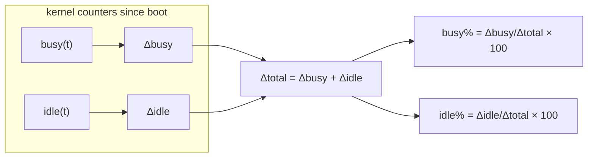
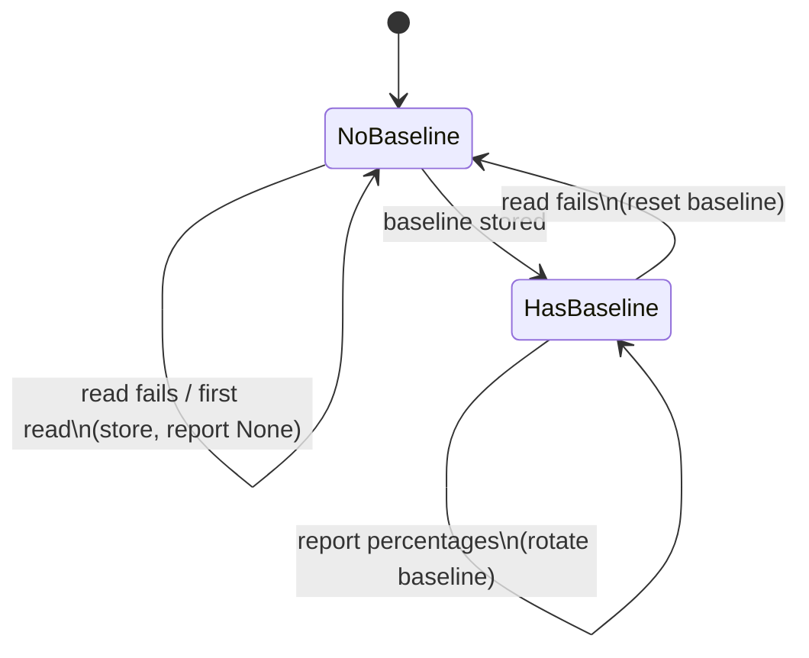
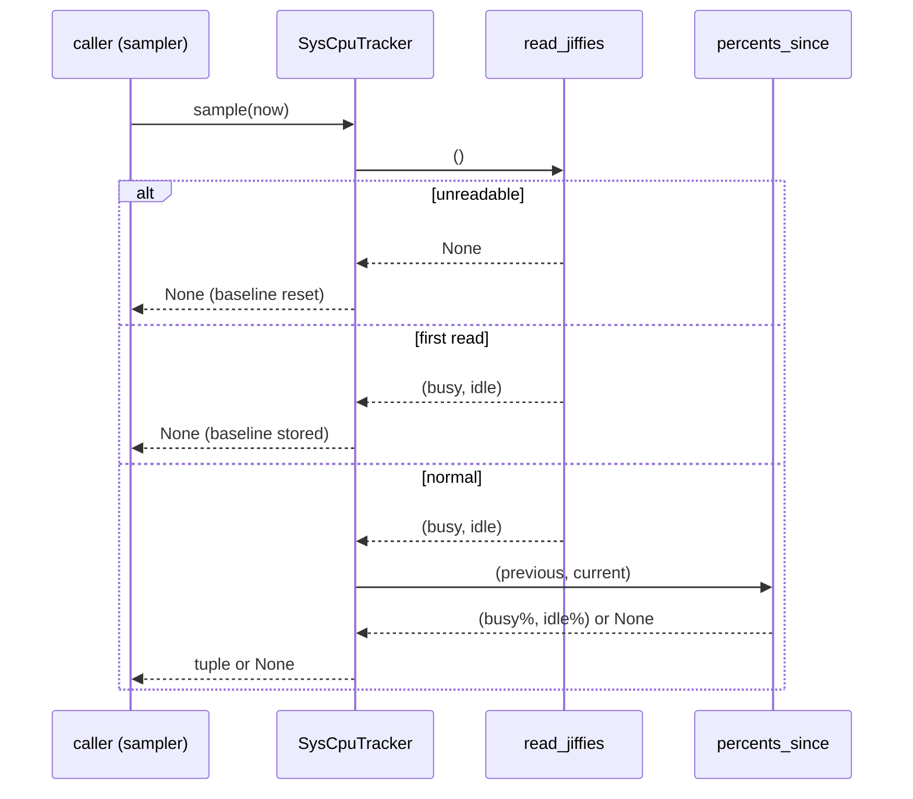

# System-wide CPU from `/proc/stat` deltas — `metawtf/sys_cpu_tracker.py`

## Introduction

The `metawtf` package tracks how much CPU a ROS2 system is burning. It does
this at two resolutions: per-process (`cpu_tracker.py`, "how much is *this
node* using?") and machine-wide (this module, "how busy is the *whole box*?").
`SysCpuTracker` answers the second question by reading the aggregate `cpu`
line of `/proc/stat` — the kernel's running tally of how every core has spent
its time — and turning two consecutive readings into a busy/idle percentage
pair.

The module is tiny (one class, one helper function, ~50 lines), but it is a
nice study in how choosing the right *denominator* simplifies a measurement.
Its sibling `CpuTracker` needs wall-clock timestamps and the `SC_CLK_TCK`
constant to convert jiffies into seconds; this tracker needs neither, because
it never asks "how many seconds of CPU?" — it asks "what *fraction* of the
total was busy?" When the question is a ratio, the units cancel.

## Two counters, one total

The parser in `sys_stat.py` hands this tracker a pair of jiffy counters:
`(busy, idle)`, where busy is user + nice + system + irq + softirq + steal and
idle is idle + iowait (the usual top/htop convention). The crucial property
of this pair is that **busy + idle accounts for all CPU time on the machine**.
These are cumulative counters across every core since boot, so between two
samples:

```
Δtotal = Δbusy + Δidle        (jiffies of CPU time that elapsed, all cores)
busy%  = Δbusy  / Δtotal × 100
idle%  = Δidle  / Δtotal × 100
```

Compare with the per-process formula, `(Δjiffies / clk_tck) / Δwall × 100`:
there the numerator is process jiffies and the denominator is *wall-clock
time converted to jiffies* — two different currencies that need `clk_tck` as
the exchange rate. Here both numerator and denominator come out of the same
ledger, so the jiffy unit cancels before it ever matters. This is what the
docstring means by "no wall clock or clk_tck is needed": the tracker takes a
`now` timestamp in its `sample()` signature purely for interface symmetry
with `CpuTracker`, and then ignores it.

The 0–100 range also differs deliberately. Per-process tracking uses top's
"Irix mode" (one fully used core = 100%, so a multithreaded process can
report 400%); system-wide tracking uses "Solaris mode" (all cores together =
100%). The docstring says so explicitly, because a reader comparing the two
numbers side by side in the tracer's output would otherwise assume a bug.



## The baseline lifecycle: why the first answer is `None`

A cumulative counter is meaningless on its own; only the *difference* between
two readings carries information. So the tracker is a small state machine
with one piece of state, `self.baseline`, and every call to `sample()`
advances it:

```python
def sample(self, now: float) -> tuple[float, float] | None:
    jiffies = self.read_jiffies()
    if jiffies is None:
        self.baseline = None
        return None
    previous, self.baseline = self.baseline, jiffies
    if previous is None:
        return None
    return percents_since(previous, jiffies)
```

Three cases, three outcomes:

1. **Unreadable `/proc/stat`** (the read returned `None`): the baseline is
   *reset* and `None` is reported. This is the subtle case — the tracker does
   not keep the old baseline and hope the file comes back, because an
   arbitrarily long gap would make the next delta span an unknown amount of
   time. Discarding the baseline forces a fresh two-sample warmup, so every
   reported percentage covers exactly one sampling interval.
2. **First successful read** (or first read after a gap): the counters are
   stored as the baseline and `None` is reported. One point, no delta.
3. **Normal case**: compute the percentages against the stored baseline, and
   rotate the current reading in as the new baseline.

The rotation is written as a single parallel assignment,
`previous, self.baseline = self.baseline, jiffies`. Because Python evaluates
the right-hand side before assigning, this captures the old baseline and
installs the new one in one step — no temporary variable, and no risk of
overwriting the baseline before it has been read.



The decision to return `None` rather than, say, reporting 0% or repeating the
last value runs through the whole package: `None` means "we don't know," and
the display layer renders it accordingly instead of showing a plausible lie.

## The pure core: `percents_since`

Everything testable is factored into a module-level pure function — two
counter pairs in, one percentage pair out, no I/O and no state:

```python
def percents_since(previous, current) -> tuple[float, float] | None:
    prev_busy, prev_idle = previous
    busy, idle = current
    delta_busy = busy - prev_busy
    delta_idle = idle - prev_idle
    delta_total = delta_busy + delta_idle
    if delta_total <= 0:
        return None
    return (
        delta_busy / delta_total * 100.0,
        delta_idle / delta_total * 100.0,
    )
```

The guard `delta_total <= 0` deserves a second look. With monotonically
increasing counters, `delta_total` should always be positive — so why check?
Two reasons:

- **Division by zero.** If the sampling timer ever fires twice with no CPU
  accounting tick in between (possible when sampling fast on an idle
  machine), both deltas are 0 and an unguarded division would raise
  `ZeroDivisionError`. `None` again means "no information."
- **Counter discontinuities.** A negative delta means the counters went
  backwards, which can happen across a suspend/resume on some kernels, or
  when a test or a containerized `/proc` misbehaves. A negative total would
  otherwise produce a nonsense percentage greater than 100 or below 0;
  treating "impossible delta" the same as "no delta" keeps the output domain
  clean.

This mirrors the same guard in `CpuTracker.percent_since`
(`delta_wall <= 0 → 0.0`): both trackers refuse to divide by a non-positive
denominator, differing only in what they substitute.

Note also that both percentages are returned even though
`idle% = 100 − busy%` arithmetically. Keeping them as independent results of
one division makes the pair's meaning obvious at the call site and leaves
room for the display to show either or both.

## Dependency injection as the test strategy

The constructor offers two seams:

```python
def __init__(self, proc_root: Path = DEFAULT_PROC_ROOT, read_jiffies=None):
    self.read_jiffies = read_jiffies or partial(
        read_system_jiffies, proc_root
    )
    self.baseline = None
```

`proc_root` redirects the filesystem root (tests point it at a `tmp_path`
with a hand-written `stat` file, exactly as `cpu_tracker.py` does), and
`read_jiffies` replaces the reader outright with a stub that replays a script
of counter values. The second seam is the stronger one: because
`percents_since` is pure and `read_jiffies` is injectable, the *entire*
module can be tested without touching `/proc` at all — feed it a sequence of
`(busy, idle)` pairs and assert on the sequence of `None`s and percentages
that come back. The default case uses `functools.partial` to bind
`proc_root`, producing a zero-argument callable that matches what `sample()`
expects to call.



## Where it fits

`SysCpuTracker` is the system-wide sibling of `CpuTracker`. Both are driven
by the sampler on a timer, both take a `now` argument they may or may not
use, both report `None` for "unknown," and both delegate their `/proc`
parsing to a small helper module (`sys_stat.py` here, `proc_stat.py` for the
per-pid case). The consistent `sample(now) → value | None` contract is what
lets the column layer consume either tracker without knowing which one it
holds.

## Observations and possible improvements

- **The `now` parameter is dead weight in this class.** It exists only for
  interface compatibility with `CpuTracker.sample`, which is a reasonable
  price for polymorphism — but a one-line comment at the signature saying
  "accepted for interface symmetry; unused" would save a reader the hunt for
  where it matters. (The docstring implies it; the code doesn't.)
- **`read_system_jiffies` failures and gaps collapse into the same `None`.**
  A stat file that disappears mid-run is treated identically to one that was
  never there. That's fine for display, but a counter of consecutive failed
  reads (or a single logged warning on the transition) would help distinguish
  "running in a container without `/proc`" from a transient race.
- **iowait is folded into idle, invisibly to this module.** That's the right
  default, but it means a disk-bound box reads as "idle." If the tracer ever
  wants to surface iowait pressure, `sys_stat` already parses the field
  separately — the tracker could carry a third number without changing its
  ratio-based design. Documenting the convention here (it currently lives
  only in `sys_stat.py`'s comment) would make the semantics discoverable from
  the class docstring.
- **The `delta_total <= 0` guard conflates two distinct anomalies.** A zero
  delta (harmless, fast sampling) and a negative delta (counter went
  backwards — suspend/resume, or a test harness bug) both return `None`.
  Splitting them costs one comparison and would let a negative delta log a
  warning instead of passing silently.
- **Busy and idle percentages are computed by two divisions where one
  suffices.** `idle%` could be `100.0 - busy%`, guaranteeing the pair sums to
  exactly 100 (the two-division version can differ by a float epsilon). The
  current form is more symmetric and self-documenting; the alternative is
  more numerically tidy. Either is defensible — this is a style call, not a
  bug.
- **No smoothing across samples.** Each percentage describes exactly one
  sampling interval, so a fast timer on a bursty machine will jitter. A
  short exponential moving average (as some monitors apply) would steady the
  display at the cost of lag; if added, it belongs here rather than in the
  display layer, so the semantics of "the number" stay in one place.
