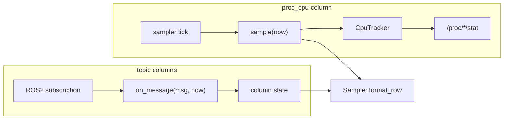

# ProcCpu column: a column with no topic at all

`metawtf/proc_cpu_column.py` is the smallest column state in the package —
thirty-odd lines — and yet it is the one that most clearly shows what the
sampler's column abstraction *really* is. Every other column exists to turn
ROS2 subscription traffic into a cell value. This one never sees a message,
never has a topic, and never subscribes to anything. Its entire job is to ask
a `CpuTracker` "how much CPU is the matched process using right now?" once
per sampler tick, and to format the answer.

## The column contract, minus half of it

The sampler's `SampledColumn` Protocol (see `sampler.py`) asks for three
things: a `name`, a `width`, and a `sample(now) -> str | None`. Topic-backed
columns like `HzColumnState` and `EchoColumnState` additionally carry an
`on_message(msg, now)` so the subscription callback can feed them data. The
crucial observation is that `on_message` is *not* part of the Protocol — the
sampler only ever calls `sample`. That asymmetry is what makes a
subscription-free column possible at all:

```python
class ProcCpuColumnState:
    """Reports the summed CPU% of the matched process(es) on each tick.

    Unlike the other columns this one has no topic and no subscription — the
    sampler's tick is the only trigger, and all the work happens in the
    tracker against /proc.
    """
```

The `ColumnManager` encodes the same fact from the other side: when it
builds the column list from config, a `ProcCpuColumn` config entry produces
a state that is appended directly to `self.states` with no `Subscription`
record at all (`column_manager.py:75-80`). Compare the echo/hz paths, which
always go through `register([state], topic, ...)`. There is nothing to
subscribe, nothing to wait for in `scan()`, and nothing to lazily discover
— the column is fully formed the moment config is loaded.



## Composition over configuration: the injected tracker

The constructor's signature tells a deliberate design story:

```python
    def __init__(
        self,
        name: str,
        process: re.Pattern,
        width: int | None = None,
        tracker: CpuTracker | None = None,
    ):
        self.name = name
        self.width = width
        self.tracker = tracker or CpuTracker(process)
```

In production, `tracker` is always `None` and the line
`tracker or CpuTracker(process)` builds a real tracker that reads live
`/proc` entries. But the parameter exists so a test can hand in a fake
tracker — one that returns canned percentages without any processes,
regexes against `/proc`, or real time. This is the classic *dependency
injection* seam: the class depends on the tracker *interface* (one
`sample(now) -> float | None` method), not on the filesystem. The
`process` regex is only needed to construct the default tracker, which is
why it is a constructor argument rather than stored state — the column
itself never touches it.

## What a sample actually means

`sample` is a pure adapter: pull a number from the tracker, render it or
pass through the "nothing to say" signal:

```python
    def sample(self, now: float) -> str | None:
        percent = self.tracker.sample(now)
        if percent is None:
            return None
        return f"{percent:.1f}%"
```

Two things are worth unpacking here.

First, the `None` pass-through. `CpuTracker.sample` returns `None` when it
has no baseline — on the very first tick (a delta needs two points), or
when no process matches the regex at all. The column does not try to
distinguish those cases or invent a `0.0%`; it forwards `None`, and the
sampler's `format_row` renders `None` as an empty cell
(`"" if value is None else value`). So the same empty cell means "wait one
tick" and "no such process" — a compact, if slightly ambiguous, UI choice.

Second, the formatting. `%.1f%%` bakes the unit into the cell: `12.3%`.
Unlike the hz column's bare `%.2f` (where the header carries the unit),
a CPU percentage gets its `%` inline — readable even if the column is
widened or the row is exported as CSV. One decimal is a sensible floor:
the tracker's math is a delta over at most a tick of wall time, so anything
finer would be noise.

## The algorithm underneath: jiffies deltas, top-style

The column delegates everything numeric to `CpuTracker`, but the reader of
this chapter should know what that number *is*, because the code spells out
only the mechanics. Linux accounts CPU time in **jiffies** — scheduler
ticks, typically 100 per second (`SC_CLK_TCK`). Every process exposes its
cumulative consumed jiffies in `/proc/<pid>/stat`. A single reading is a
monotone counter, meaningless alone; a *rate* comes from two readings:

$$\text{CPU\%} = \frac{\Delta\text{jiffies} / \text{clk\_tck}}{\Delta\text{wall}} \times 100$$

This is the psutil formula, and it follows `top`'s *Irix-mode* convention:
one fully saturated core reads as 100%, so a process hammering four cores
can legitimately print `398.7%`. The tracker re-resolves the pid set from
the cmdline regex on every sample — picking up restarted processes and
dropping dead ones — and sums the per-pid percentages, so one `proc_cpu`
column can track a whole family of matching processes. The data structure
behind it is a per-pid baseline map `{pid: (jiffies, time)}`, rebuilt each
sample; that rebuild is what makes vanished pids simply fall away instead
of needing explicit expiry logic.

Why do this on the tick rather than on a message? Because CPU usage has no
natural event — it is a property of wall-clock time itself. The sampler's
fixed cadence *is* the measurement interval, and the `now` passed down is
the same monotonic clock every column shares.

## Observations for future improvement

- **`None` conflates two states.** "First tick, no baseline yet" and "no
  matching process exists" both render as an empty cell. A tracker that
  distinguished them (e.g. returning `0.0` when pids exist but lack a
  baseline is impossible, but signaling "no pids matched" separately) would
  let the column show `0.0%` for a dead process — arguably more honest
  during a crash-and-restart watch.
- **The default-tracker fallback is implicit.** `tracker or CpuTracker(process)`
  is idiomatic, but a falsy custom tracker (an exotic test double defining
  `__bool__`) would silently be replaced by a real one. `if tracker is None`
  would be the stricter form; in practice no test double is falsy, so this
  is a nit.
- **Formatting is hardcoded.** `%.1f%%` lives in the column body while the
  analogous hz precision lives in its own body too — there is no shared
  convention or config knob. Fine at two call sites, but a third
  numeric column might motivate a small format-spec config field.
- **No staleness concept.** Topic columns can go stale (`stale_after`);
  a proc_cpu column never does, because its source is read synchronously
  on the tick. That is correct, but it means a `/proc` read that blocks or
  throws would stall the whole row — there is no timeout or error cell.
  Catching `OSError` in the tracker and reporting `None` (already its
  behavior for unreadable pids) is the current mitigation.
