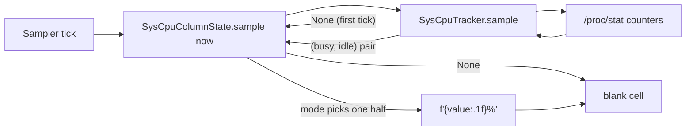
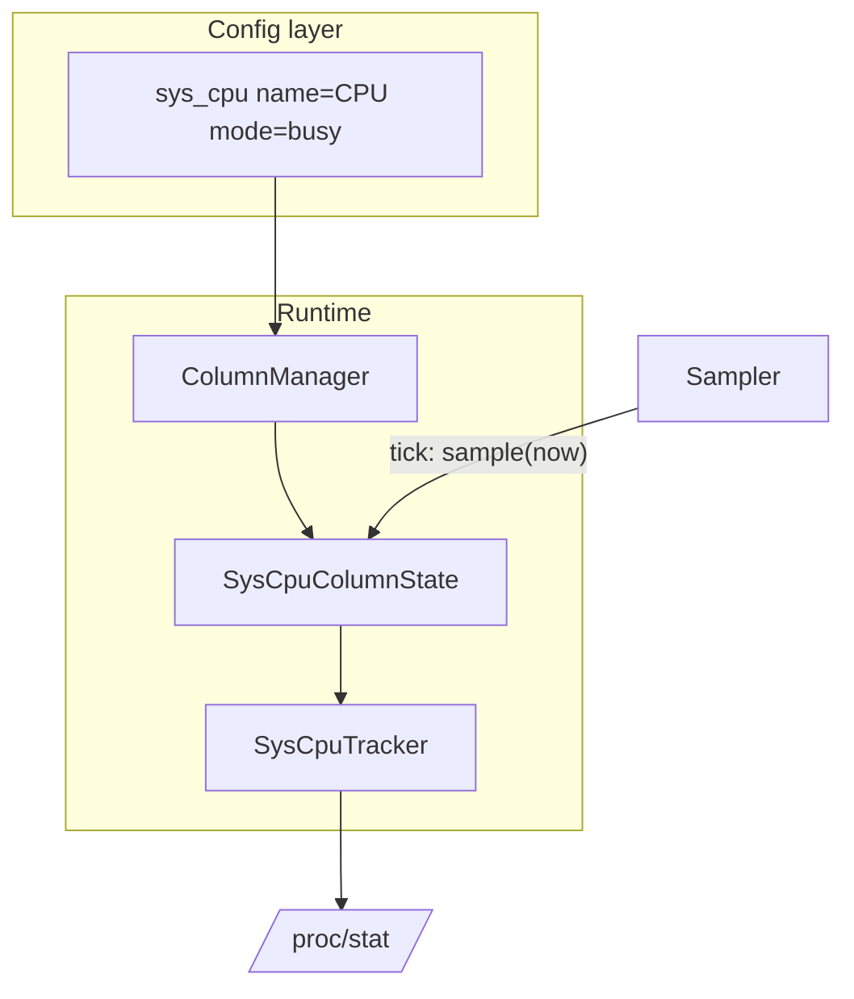

# `sys_cpu_column` — System-wide CPU% as a Column

## What this module is for

Most columns in metawtf are *topic-driven*: a ROS2 subscription delivers a
message, and the column renders a field of it (`echo`), a message rate
(`hz`), and so on. `sys_cpu` is one of two columns that ignore the topic
stream entirely. It answers a different question — *how busy is the whole
machine?* — by reading kernel counters out of `/proc/stat` and turning them
into a percentage on every sampler tick.

`sys_cpu_column.py` holds the per-column state object,
`SysCpuColumnState`. It is deliberately thin: the arithmetic lives in
`SysCpuTracker` (see its own chapter), and this class only decides *which
half* of the tracker's answer to display. A `sys_cpu` column is configured
with a `mode` of either `busy` or `idle`:

```python
BUSY = "busy"
IDLE = "idle"
```

So a tracer that wants both numbers shows two columns — one per mode — each
with its own state object.

## The column-state contract

Every column state in metawtf shares a small implicit contract, and this
class implements the minimal version of it. Construction just records the
column's identity and display width, and wires up a tracker (injectable for
tests, real by default):

```python
def __init__(
    self,
    name: str,
    mode: str,
    width: int | None = None,
    tracker: SysCpuTracker | None = None,
):
    self.name = name
    self.mode = mode
    self.width = width
    self.tracker = tracker or SysCpuTracker()
```

Two things are worth noticing in this signature:

- **There is no topic and no subscription.** Unlike `EchoColumnState`, the
  constructor never asks which topic to listen to. The column manager
  recognizes this and registers no subscription at all — it simply appends
  the state to the list of states the sampler will tick:

  ```python
  # column_manager.py
  elif isinstance(column, SysCpuColumn):
      # Same shape as proc_cpu: no topic, the state reads /proc/stat.
      state = SysCpuColumnState(column.name, column.mode, column.width)
      self.states.append(state)
  ```

- **The tracker is injected with a default.** Passing a hand-rolled tracker
  lets a unit test drive the column with scripted `(busy, idle)` pairs,
  without touching `/proc/stat` or even Linux. This is the classic
  *dependency injection at the seam* pattern: the class owns a policy
  (which half to show), the injected object owns the mechanism (how to
  measure).

## Sampling: select, then format

The `sample` method is called once per sampler tick and returns either the
formatted cell text or `None` ("no data yet"):

```python
def sample(self, now: float) -> str | None:
    percents = self.tracker.sample(now)
    if percents is None:
        return None
    busy, idle = percents
    value = busy if self.mode == BUSY else idle
    return f"{value:.1f}%"
```

Read bottom-up, three decisions are packed into four lines:

1. **Pass `None` through unchanged.** The tracker returns `None` on its
   very first sample — a CPU percentage is a *rate*, and a rate needs two
   counter readings to be defined (more on this below). Rather than
   inventing a placeholder like `0.0%` or `---`, the column propagates the
   "not yet" signal and lets the row renderer decide how to draw an empty
   cell. This keeps the honest signal path intact: missing data is missing,
   not zero.

2. **Mode selection is a pick from a tuple, not a branch in the math.** The
   tracker always computes *both* busy and idle percentages, and the column
   merely indexes into the pair. This is a deliberate separation: the
   measurement is mode-independent, so a mode change never perturbs the
   numbers. It also means the two modes are perfectly consistent — a busy
   column and an idle column sampled on the same tick will always sum to
   100%.

3. **Formatting is the column's job.** The tracker speaks in floats; the
   column speaks in cell text (`"37.4%"`). Keeping the `f"{value:.1f}%"`
   here means the tracker stays reusable for non-tabular consumers, and the
   width/precision convention (`%.1f%%`, matched by `DEFAULT_SYS_CPU_WIDTH
   = 6` in the config) lives with the other display concerns.

## Why a rate needs two reads: the jiffy-delta idea

The code here is thin because the interesting algorithm is one level down,
in the tracker — but understanding *why* the first sample is `None`
requires the idea, and the column's pass-through behavior only makes sense
in its light.

Linux exposes CPU usage not as a percentage but as **jiffies**: cumulative
counts of scheduler ticks spent in various states (user, system, idle, …),
summed over all cores in `/proc/stat`. A cumulative counter is monotone and
ever-growing — useless on its own. The standard technique (the same one
`top` uses) is to treat it like an odometer:

- read the counter now and remember it as a *baseline*,
- on the next tick, take **differences** between successive readings,
- divide each category's delta by the total delta to get a percentage.

This is a *ratio of deltas*, and it is why the first sample can only store
a baseline and report `None`: with one odometer reading there is no
distance yet. It also explains why no wall-clock calibration is needed for
the system-wide number (unlike the per-process `proc_cpu` tracker, which
must scale process jiffies against wall time using `clk_tck`): busy and
idle jiffies share the same total, so the clock cancels out of
`Δpart / Δtotal × 100`. The result is a 0–100 percentage for the whole
machine — what `top` calls "Solaris mode" — rather than the per-core
0–(100×N) scale.

The flow on each tick is therefore:



And the object's place in the larger machine:



## Validation lives elsewhere

A subtle design choice: `SysCpuColumnState` never validates `mode`. Any
string that isn't `"busy"` silently selects the idle half. This is safe
only because the config parser rejects unknown modes before a state object
can exist:

```python
# config.py
if mode not in SYS_CPU_MODES:
    raise ConfigError(
        f"'mode' must be one of {sorted(SYS_CPU_MODES)}, got {mode!r}"
    )
```

This is *parse, don't validate* pushed one level up: the runtime object
trusts its inputs because the boundary already enforced them. The tradeoff
is that the state class is not defensive when used outside the config
pipeline (e.g. constructed directly in a test with a typo'd mode) — it will
cheerfully report idle. A single-character sentinel check (`if mode not in
(BUSY, IDLE): raise ValueError(...)`) would close that hole at trivial
cost, but the current code prefers to keep the hot path branch-light.

## Observations and possible improvements

- **Duplicated trackers for paired columns.** If a config declares both a
  busy and an idle `sys_cpu` column, the column manager builds two
  `SysCpuColumnState` objects, each constructing its own `SysCpuTracker` —
  so `/proc/stat` is read twice per tick and two independent baselines are
  kept. The numbers still agree (both reads see nearly identical
  cumulative counters), but a shared tracker injected into both states
  would halve the file I/O and make the consistency guarantee structural
  rather than approximate. The constructor already supports this via the
  `tracker` parameter; only the column manager's wiring would need to
  change.
- **Mode is a string where a small enum or boolean would do.** `BUSY` /
  `IDLE` constants keep the literals centralized, but the comparison
  `self.mode == BUSY` is still a string check performed on every tick. An
  `Enum` (or resolving the mode to an index into the tuple at construction
  time) would be marginally faster and typo-proof at the point of use.
- **No validation of `mode` in the state itself.** As discussed above, the
  class relies on the config layer for enforcement. A cheap guard in
  `__init__` would make the class self-consistent when constructed
  directly, at no measurable cost.
- **Formatting is fixed.** The `%.1f%%` precision is hardcoded; the
  config's default width of 6 is sized for it, but a user supplying a
  larger width gets padding, never more precision. If a `precision` option
  were ever added to the config, this method is where it would land.
- **`now` is accepted but unused by this path.** The signature matches the
  column-state contract (the sampler passes a timestamp to every state),
  but the system tracker derives everything from counter deltas and
  ignores wall time. That is correct — and worth keeping visible, since a
  reader comparing with `proc_cpu` (which *does* use `now`) might assume
  an omission.
