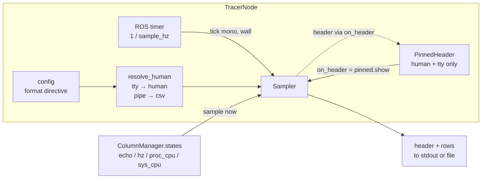
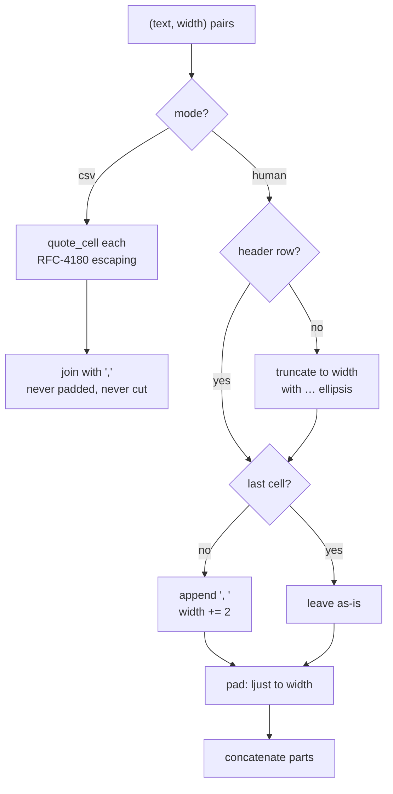

# Sampler: turning column state into rows of output

Everything upstream of `metawtf/sampler.py` — config parsing, subscriptions,
QoS negotiation, per-field extraction — exists to produce a handful of objects
that each know how to answer one question: "what's your value right now?"
`Sampler` is where those answers become the actual output of the program: a
header row, then one row per tick, written to a stream.

Its job sounds trivial — join some strings with commas — but the module earns
its keep on a tension that runs through the whole design: the same program
must serve *two audiences with contradictory needs*. A spreadsheet importing a
redirected file wants strict RFC 4180 CSV — bare commas, quoting, and no lost
data. A person watching a terminal wants aligned columns that stay put — which
means padding, and means truncating values that would otherwise shove the row
sideways. Earlier versions tried to satisfy both with a single hybrid format
(padded *and* quoted); feature F07 replaced that compromise with two honest
render modes, plus a hook that lets a terminal UI pin the header at the top of
the screen. The code is short because each concern is isolated in its own
small function.

## Where the sampler sits

`Sampler` is the sink of the whole data pipeline. `TracerNode` wires it to the
column manager's live state list, and a timer drives it:



Three things are worth noticing in this picture. First, the sampler knows
nothing about ROS: no topics, no messages, no subscriptions cross this
boundary — only strings and numbers. Second, the column list it receives is
the manager's *own* list object, shared by reference; that is what allows
columns to appear after the run has started, and it is also a coupling worth
remembering (see the observations at the end). Third, the sampler does not
decide which format to emit or whether the header is pinned — those decisions
are made in `TracerNode` (`resolve_human` maps the config's `format` directive
or, absent one, `sys.stdout.isatty()`, onto the `human` flag) and injected
through the constructor. The sampler just executes them.

## Depending on a shape, not a class

`Sampler` doesn't import `EchoColumnState` or any other concrete column type.
It depends on a `Protocol`:

```python
class SampledColumn(Protocol):
    name: str
    width: int | None

    def sample(self, now: float) -> str | None: ...


class Sampler:
    def __init__(
        self,
        columns: list[SampledColumn],
        time: TimeColumn | None = None,
        out: TextIO | None = None,
        *,
        human: bool,
        on_header=None,
    ):
        self.columns = columns
        self.time = time or TimeColumn()
        self.out = out or sys.stdout
        self.human = human
        # A pinned-header terminal intercepts header prints to redraw the
        # frozen header in place instead of scrolling a new one past.
        self.on_header = on_header
        self.header_width = None
```

A `Protocol` is Python's structural typing: an object conforms if it *has* the
right attributes, not if it inherits from the right base. That is what makes
the module trivially testable without any ROS machinery — the test suite hands
it a tiny fake column that returns canned strings from `sample()`. It is also
what lets `echo`, `hz`, `proc_cpu`, and `sys_cpu` columns plug into the same
sampler with zero changes here: anything with a `.name`, a `.width`, and a
`.sample(now)` is a column, regardless of what it measures or where its data
comes from.

The two keyword-only parameters after the `*` are the F07 additions, and the
bare `*` is deliberate: `human` *must* be spelled out at the call site.
Making it positional would invite a bare `True` whose meaning is invisible at
a glance, and — worse — would let old call sites keep compiling while silently
mis-binding. Forcing `human=True` or `human=False` to appear by name makes
every construction self-documenting and breaks stale callers loudly rather
than subtly.

`on_header` is an optional callback that receives each header line instead of
it being printed. The sampler's only job is to *route*; it has no idea what
the callback does. In the real application the callback is
`PinnedHeader.show`, which uses ANSI escape sequences to freeze the header at
the top of the terminal — but from the sampler's perspective it is just "some
function that wants headers."

Note also the two `None`-sentinel defaults. Writing `out=sys.stdout` directly
as a default would capture the stream object when the module is *imported*,
silently ignoring any later substitution (a test runner swapping `sys.stdout`,
for instance). Resolving `None` inside the body defers the lookup to
construction time. The same pattern gives each `Sampler` a fresh
`TimeColumn()` rather than one shared mutable instance.

## Two clocks, one tick

```python
    def tick(self, now_monotonic: float, now_wall: datetime) -> None:
        # Columns can grow when a `match` hz spec discovers a new topic; the
        # header is re-emitted so the added column is labelled (a documented
        # CSV caveat; a pinned header is redrawn in place instead).
        if self.header_width != len(self.columns):
            self.emit_header()
            self.header_width = len(self.columns)
        print(self.format_row(now_monotonic, now_wall), file=self.out)
```

`tick` takes two different notions of "now," because they answer two different
questions. `now_monotonic` — `time.monotonic()`, captured by the caller —
feeds every column's `sample()` call, since staleness and rate calculations
need a clock immune to NTP adjustments or the system clock being stepped
backward. `now_wall` — a `datetime` — is purely cosmetic: it becomes the
human-readable `HH:MM:SS.mmm` timestamp at the start of each row, which is
what a person skimming the trace, or a spreadsheet plotting it, wants to see.
Conflating the two would risk a subtly wrong staleness check every time the
wall clock jumps.

The header guard compares a remembered column *count* against the current one.
The column set is fixed at config time for most column kinds, but `match` hz
specs and key-less `json` echo columns append columns at runtime as they
discover topics and keys. Since columns are only ever appended, a count change
always means "new columns arrived," and the header is re-emitted so the wider
rows that follow are labelled.

## emit_header: one hook, two behaviors

Before F07, a re-emitted header was simply another printed line — fine for a
file, but in a terminal it scrolled a second header into the middle of the
data. The fix is not in the sampler at all; the sampler just gained an
indirection point:

```python
    def emit_header(self) -> None:
        header = self.format_header()
        if self.on_header is not None:
            self.on_header(header)
        else:
            print(header, file=self.out)
```

This is the classic *dependency inversion* move: instead of the sampler
learning about terminals, scroll regions, and escape sequences, it exposes a
single seam and lets the composition root (`TracerNode`) decide what headers
mean. When no callback is installed — csv mode, or human mode piped into a
file — behavior is exactly the old one: print the line. When a `PinnedHeader`
is installed (human mode on a real tty), the *first* `show()` sets up the
scroll region and the pin; every later `show()` — the column-growth redraw —
clears and redraws the frozen header in place. Either way, `tick` doesn't
change, and the count-based re-emission logic doesn't need to know which world
it's in. One consequence worth noting: in csv output a re-emitted header still
appears as an extra line mid-file — a documented caveat of the CSV the tool
produces.

## Formatting a row: cells as (text, width) pairs

Both the header and the data row reduce to the same intermediate
representation: a list of `(text, width)` pairs:

```python
    def format_header(self) -> str:
        cells = [("time", self.time.width)]
        cells += [(column.name, column.width) for column in self.columns]
        return self.join_row(cells, is_header=True)

    def format_row(self, now_monotonic: float, now_wall: datetime) -> str:
        stamp = format_timestamp(now_wall, self.time.format)
        cells = [(stamp, self.time.width)]
        for column in self.columns:
            value = column.sample(now_monotonic)
            cells.append(("" if value is None else value, column.width))
        return self.join_row(cells, is_header=False)
```

Three details carry the design here:

- **Both header and row use the same width for a column** — the column's
  configured `width`, unchanged. That is what keeps the header aligned over the
  data in human mode: every row, including the header, is laid out against the
  same per-column width. When a name is wider than that width the *header* is
  cut to fit (see below), never the column widened — so the column's extent is
  fixed by its `width` and both rows honor it.
- **`None` from a column becomes an empty string**, never `"None"` and never
  `0`. A column that has nothing to report yet (its topic hasn't published,
  say) leaves a blank cell, preserving the row's column count.
- **The intermediate representation survives all the way to the mode
  dispatch.** Keeping an explicit list of pairs — rather than f-strings all
  the way down — is exactly what makes the two render modes possible: all the
  shared work (sampling, `None`-handling, width computation) happens once,
  and only the final assembly differs.

The dispatch itself is one `if`:

```python
    def join_row(
        self, cells: list[tuple[str, int | None]], is_header: bool
    ) -> str:
        if self.human:
            return join_human(cells, is_header)
        return join_csv(cells)
```

Note the asymmetry in the interface: `join_csv` ignores `is_header` entirely —
a CSV header is just a row that happens to contain names — while `join_human`
needs it, for reasons explained below.

## Headers wider than their columns: keep the tail

A column's configured `width` is chosen for its *data* — a rate column might
declare width 6 because `142.50` fits. But its header might be `cpu_nav2`,
eight characters. An earlier design widened the column to fit the name; F08
reverses that, because a wide name would blow up the column and waste terminal
width on the label. Instead the header is cut to the column's width — but,
unlike a data value, it keeps its **tail**:

```python
def truncate_tail(text: str, width: int | None) -> str:
    if width is None or len(text) <= width:
        return text
    return "…" + text[-(width - 1):]
```

The distinguishing part of a metric name is usually its end — the topic in
`cpu_nav2`, the field in `pose_z` — so `cpu_nav2` in a width-6 column becomes
`…_nav2`, not `cpu_n…`. A leading `…` signals the elision and the result fits
the width exactly, so header and data rows stay aligned. `None` width (the
"no layout constraints" case a user gets by omitting `width`) is passed through
untouched. csv mode ignores widths entirely, so headers there are never cut.

## join_csv: the pure mode

```python
def join_csv(cells: list[tuple[str, int | None]]) -> str:
    # Pure RFC-4180: no padding, bare commas, values never truncated.
    return ",".join(quote_cell(text) for text, _width in cells)
```

After the hybrid years, csv mode is almost defiantly minimal: quote each cell,
join with bare commas, done. No padding, no spaces after separators, widths
ignored. Padding was dropped from csv because a field padded with trailing
spaces is *not* the same value to every consumer — some parsers strip, some
don't, and diffs of captured output fill with whitespace noise. A file meant
for machines should contain only the data and the structural characters the
standard defines.

The one non-negotiable is quoting, garden-variety RFC 4180 escaping:

```python
def quote_cell(text: str) -> str:
    # A cell containing a comma, quote, or line break is wrapped in quotes with
    # inner quotes doubled, so a string value cannot corrupt the row's cells.
    if any(mark in text for mark in ',"\n\r'):
        return '"' + text.replace('"', '""') + '"'
    return text
```

A value containing a comma, double quote, or line break is wrapped in double
quotes with inner quotes doubled. Without this, an echoed `std_msgs/String`
like `a,b` would silently become two cells and corrupt the column count of
that row — exactly the failure a tool promising "imports into a spreadsheet
without further processing" cannot ship.

Equally deliberate is what csv mode does *not* do: truncate. When the audience
is a machine, fidelity beats layout every time — a truncated value is data
silently destroyed. So csv rows may be arbitrarily wide, and that's correct.

## join_human: layout with a truncation contract

Human mode makes the opposite trade. A person watching a live terminal cannot
use a row whose columns have drifted sideways, so alignment is guaranteed —
and the price of that guarantee is that over-wide values are cut:

```python
def join_human(cells: list[tuple[str, int | None]], is_header: bool) -> str:
    parts = []
    last_index = len(cells) - 1
    for index, (text, width) in enumerate(cells):
        text = truncate_tail(text, width) if is_header else truncate(text, width)
        if index < last_index:
            text = f"{text}, "
            width = None if width is None else width + 2
        parts.append(pad(text, width))
    return "".join(parts)
```

Three steps, in deliberate order:

**Step 1 — truncate.** Before anything else, an over-wide cell is shortened to
its column width. Data values and headers each get cut, but from opposite ends
— a data value keeps its head (`truncate`, `…` at the end), a header keeps its
tail (`truncate_tail`, `…` at the front):

```python
def truncate(text: str, width: int | None) -> str:
    if width is None or len(text) <= width:
        return text
    return text[: width - 1] + "…"
```

The cut keeps `width - 1` characters and ends with a single-character
horizontal ellipsis (`…`), so the result fits the width *exactly* and the
reader can see that data was elided. This is the policy reversal at the heart
of F07: human mode *does* truncate, because for a live display a slightly
shortened value that stays in its column is more truthful than a full value
that breaks the table. Truncation happens first so that every later step —
separator, padding — operates on text whose length is already known to fit.
The `is_header` branch (F08) cuts the header from the front instead of the
back, so a wide `cpu_nav2` label becomes `…_nav2` and keeps the part that
tells the columns apart.

**Step 2 — separate.** Every cell except the last gets `", "` appended —
comma *then* a single space. The comma binds to the value it terminates, and
padding comes after the separator rather than before it: `1.50,      ` rather
than `1.50      ,`. Visually the separator hugs its value instead of floating
in front of the next column. The space is always emitted, so there is always
at least one character of breathing room between cells.

**Step 3 — pad.** Because the separator now occupies two characters inside the
padded cell, the target width is bumped by 2 before padding. The last cell
gets no separator and no adjustment — trailing whitespace on the final column
would be pure noise. Padding itself is minimal:

```python
def pad(text: str, width: int | None) -> str:
    # Left-justify to a minimum width; over-wide values are truncate()'s job,
    # applied before the comma suffix is added.
    if width is None:
        return text
    return text.ljust(width)
```

`pad` no longer carries the no-truncation policy it once documented — that
concern moved upstream into `truncate`, and `pad`'s comment now says so. Each
function answers exactly one question.



The two branches of this diagram *are* the F07 story: what used to be one
path that pleased neither audience is now two paths, each free to be exactly
right for its consumer. The shared cell pipeline upstream is what keeps that
split cheap.

## A configurable timestamp

```python
def format_timestamp(now_wall: datetime, fmt: str | None) -> str:
    # Default keeps millisecond precision, which strftime cannot express
    # directly; a configured strftime string takes over when present.
    if fmt is None:
        milliseconds = now_wall.microsecond // 1000
        return f"{now_wall:%H:%M:%S}.{milliseconds:03d}"
    return now_wall.strftime(fmt)
```

The `time:` config block can supply a `strftime` format string. The default
path is kept separate because `strftime` cannot express milliseconds directly
— there is no `%`-code for them — and the millisecond-precision default
(`HH:MM:SS.mmm`) is what a person skimming a trace usually wants. The
millisecond component is computed by integer-dividing `microsecond` by 1000
and zero-padding to three digits. Supplying a `format` hands full control to
the user at the cost of that precision.

## Observations for future improvement

- **`truncate` assumes single-width characters.** Length is measured in code
  points, but terminals measure in display cells: a value full of CJK
  characters (two cells each) can still overflow its column after truncation,
  and the `…` itself is single-width in practice but not guaranteed everywhere.
  A display-width-aware truncation (e.g. via `wcwidth`) would close the gap if
  wide characters ever become common in traced data.
- **Truncation happens before the separator, not after.** A value truncated to
  `width` then has `", "` appended and the total padded to `width + 2` — so the
  *value* honors the configured width and the column's visual extent is
  `width + 2` for all but the last cell. Consistent, but a user who sets
  `width=6` might expect a 6-character column and get 8.
- **`human` as a `bool` forecloses a third mode.** The flag reads naturally
  today, but a `mode: Literal["human", "csv"]` (or an enum) would extend more
  gracefully — to a `jsonl` mode, say — than a second boolean ever would.
- **The sampler and column manager share one mutable list.** `TracerNode`
  hands the manager's `states` list object to the `Sampler`, and dynamic
  columns work only because every mutation of that list is in-place. A single
  future `self.states = [...]` reassignment in the manager would silently
  freeze the output. Passing a columns provider (or the manager itself)
  instead would remove the coupling.
- **The header guard keys on count, not identity.** Because columns are only
  ever appended, `header_width != len(self.columns)` is a correct proxy for
  "the column set changed." If removal or replacement ever became possible, a
  swap that preserved the count would slip past the guard; keying on column
  identity (e.g. a tuple of names) would be more robust.
- **`format_timestamp` truncates rather than rounds.** `microsecond // 1000`
  discards sub-millisecond precision by truncation, not rounding. Harmless for
  a human-readable timestamp column, but worth knowing if timestamps are ever
  compared numerically across rows.
