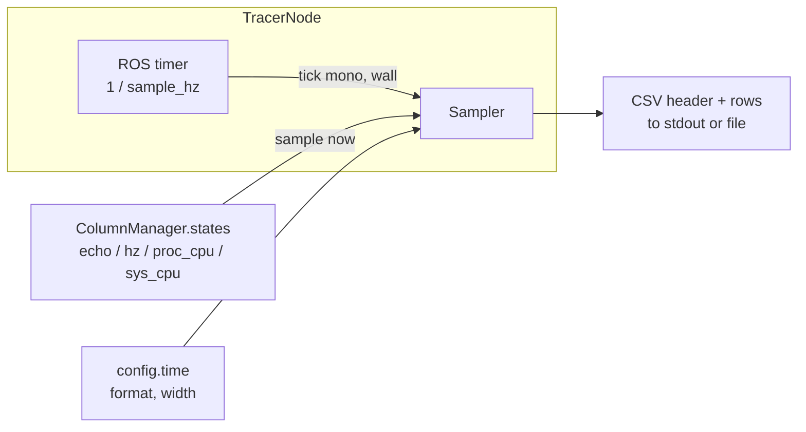
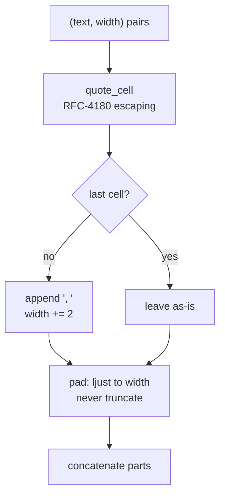

# Sampler: turning column state into a CSV stream

Everything upstream of `metawtf/sampler.py` — config parsing, subscriptions,
QoS negotiation, per-field extraction — exists to produce a handful of objects
that each know how to answer one question: "what's your value right now?"
`Sampler` is where those answers become the actual output of the program: a
header row, then one CSV row per tick, written to a stream.

Its job sounds trivial — join some strings with commas — but the module earns
its keep on three subtleties: the output must be *simultaneously* valid CSV
(for spreadsheets) and column-aligned (for humans watching a terminal), the
column set can grow mid-run, and a column's configured width can be narrower
than its own header. The code is short because each of those problems is
isolated in its own small function.

## Where the sampler sits

`Sampler` is the sink of the whole data pipeline. `TracerNode` wires it to the
column manager's live state list, and a timer drives it:



Two things are worth noticing in this picture. First, the sampler knows
nothing about ROS: no topics, no messages, no subscriptions cross this
boundary — only strings and numbers. Second, the column list it receives is
the manager's *own* list object, shared by reference; that is what allows
columns to appear after the run has started, and it is also a coupling worth
remembering (see the observations at the end).

## Depending on a shape, not a class

`Sampler` doesn't import `EchoColumnState` or any other concrete column type.
It depends on a `Protocol`:

```python
class SampledColumn(Protocol):
    name: str
    width: int | None

    def sample(self, now: float) -> str | None: ...


class Sampler:
    def __init__(
        self,
        columns: list[SampledColumn],
        time: TimeColumn | None = None,
        out: TextIO | None = None,
    ):
        self.columns = columns
        self.time = time or TimeColumn()
        self.out = out or sys.stdout
        self.header_width = None
```

A `Protocol` is Python's structural typing: an object conforms if it *has* the
right attributes, not if it inherits from the right base. That is what makes
the module trivially testable without any ROS machinery — the test suite hands
it a tiny fake column that returns canned strings from `sample()`. It is also
what lets `echo`, `hz`, `proc_cpu`, and `sys_cpu` columns plug into the same
sampler with zero changes here: anything with a `.name`, a `.width`, and a
`.sample(now)` is a column, regardless of what it measures or where its data
comes from.

Note the constructor's two `None`-sentinel defaults. Writing
`out=sys.stdout` directly as a default would capture the stream object when
the module is *imported*, silently ignoring any later substitution (a test
runner swapping `sys.stdout`, for instance). Resolving `None` inside the body
defers the lookup to construction time. The same pattern gives each `Sampler`
a fresh `TimeColumn()` rather than one shared mutable instance.

## Two clocks, one tick

```python
    def tick(self, now_monotonic: float, now_wall: datetime) -> None:
        # Columns can grow when a `match` hz spec discovers a new topic; reprint
        # the header so the added column is labelled (a documented CSV caveat).
        if self.header_width != len(self.columns):
            print(self.format_header(), file=self.out)
            self.header_width = len(self.columns)
        print(self.format_row(now_monotonic, now_wall), file=self.out)
```

`tick` takes two different notions of "now," because they answer two different
questions. `now_monotonic` — `time.monotonic()`, captured by the caller —
feeds every column's `sample()` call, since staleness and rate calculations
need a clock immune to NTP adjustments or the system clock being stepped
backward. `now_wall` — a `datetime` — is purely cosmetic: it becomes the
human-readable `HH:MM:SS.mmm` timestamp at the start of each row, which is
what a person skimming the CSV, or a spreadsheet plotting it, wants to see.
Conflating the two would risk a subtly wrong staleness check every time the
wall clock jumps.

The header guard compares a remembered column *count* against the current one.
The column set is fixed at config time for most column kinds, but `match` hz
specs and key-less `json` echo columns append columns at runtime as they
discover topics and keys. Since columns are only ever appended, a count change
always means "new columns arrived," and the sampler reprints the header so the
wider rows that follow are labelled. A single output file can therefore
contain more than one header line — a documented caveat of the CSV the tool
produces.

## Formatting a row: cells as (text, width) pairs

Both the header and the data row reduce to the same intermediate
representation: a list of `(text, width)` pairs, handed to `join_cells`:

```python
    def format_header(self) -> str:
        cells = [("time", effective_width("time", self.time.width))]
        cells += [
            (column.name, effective_width(column.name, column.width))
            for column in self.columns
        ]
        return join_cells(cells)

    def format_row(self, now_monotonic: float, now_wall: datetime) -> str:
        stamp = format_timestamp(now_wall, self.time.format)
        cells = [(stamp, effective_width("time", self.time.width))]
        for column in self.columns:
            value = column.sample(now_monotonic)
            width = effective_width(column.name, column.width)
            cells.append(("" if value is None else value, width))
        return join_cells(cells)
```

Two details carry the design here:

- **Both header and row use the same width for a column** — the
  `effective_width` of its *name*, not of its current value. That is what
  keeps the header aligned over the data: every row, including the header,
  pads to the same per-column width. Computing the header's width from the
  header text and the row's width from something else would break alignment
  immediately.
- **`None` from a column becomes an empty string**, never `"None"` and never
  `0`. A column that has nothing to report yet (its topic hasn't published,
  say) leaves a blank cell, preserving the row's column count.

Keeping an explicit intermediate representation — rather than f-strings all
the way down — is what lets the quoting, separating, and padding concerns each
live in one place downstream.

## effective_width: headers wider than their columns

```python
def effective_width(name: str, width: int | None) -> int | None:
    if width is None:
        return None
    return max(width, len(name))
```

A column's configured `width` is chosen for its *data* — a rate column might
declare width 6 because `142.50` fits. But its header might be
`camera_rate_hz`, eleven characters. Without correction, the header overflows
its column and pushes that row's later cells right of where the data rows put
theirs; header and rows would never line up. `effective_width` widens the
column to at least fit the name, so the header and every data row agree on the
column's extent. `None` is passed through untouched, preserving the
"no padding at all" semantics a user gets by omitting `width`.

## Quoting first, then separating, then padding

`join_cells` applies three transformations in a deliberate order:

```python
def join_cells(cells: list[tuple[str, int | None]]) -> str:
    parts = []
    last_index = len(cells) - 1
    for index, (text, width) in enumerate(cells):
        text = quote_cell(text)
        if index < last_index:
            text = f"{text}, "
            width = None if width is None else width + 2
        parts.append(pad(text, width))
    return "".join(parts)
```

**Step 1 — quote.** Each cell passes through `quote_cell`, garden-variety
RFC 4180 escaping:

```python
def quote_cell(text: str) -> str:
    if any(mark in text for mark in ',"\n\r'):
        return '"' + text.replace('"', '""') + '"'
    return text
```

A value containing a comma, double quote, or line break is wrapped in double
quotes with inner quotes doubled. Without this, an echoed `std_msgs/String`
like `a,b` would silently become two cells and corrupt the column count of
that row — exactly the failure a tool promising "imports into a spreadsheet
without further processing" cannot ship. Quoting happens *first* so the
separator-and-padding logic treats the quoted text as opaque; it never needs
to know whether the text contains a protected comma.

**Step 2 — separate.** Every cell except the last gets `", "` appended — comma
*then* a single space. The comma binds to the value it terminates, and any
padding comes after the separator rather than before it: `1.50,      ` rather
than `1.50      ,`. Visually the separator hugs its value instead of floating
in front of the next column, and the file still parses as CSV (each field
simply carries leading spaces, which spreadsheets strip). The space is always
emitted, even when a value overflows its column width, so there is always at
least one character of breathing room between cells.

**Step 3 — pad.** Because the separator now occupies two characters inside the
padded cell, the target width is bumped by 2 before padding. The last cell
gets no separator and no adjustment — trailing whitespace on the final column
would be pure noise.

Padding itself is minimal and, importantly, one-directional:

```python
def pad(text: str, width: int | None) -> str:
    # Left-justify to a minimum width; never truncates.
    if width is None:
        return text
    return text.ljust(width)
```

`width` is a *minimum*. `ljust` pads a short value with trailing spaces so
columns line up when eyeballed in a terminal, but a value longer than `width`
is returned untouched — metawtf never truncates data to fit. An over-long cell
overflows and nudges that row's later columns out of alignment until the next
row, which is the accepted trade-off for never losing a value.



The pipeline order is the non-obvious choice: quote → separate → pad. Quoting
before separating keeps the separator logic naive; padding last means padding
never has to account for quote characters or separators added afterwards.

## A configurable timestamp

```python
def format_timestamp(now_wall: datetime, fmt: str | None) -> str:
    if fmt is None:
        milliseconds = now_wall.microsecond // 1000
        return f"{now_wall:%H:%M:%S}.{milliseconds:03d}"
    return now_wall.strftime(fmt)
```

The `time:` config block can supply a `strftime` format string. The default
path is kept separate because `strftime` cannot express milliseconds directly
— there is no `%`-code for them — and the millisecond-precision default
(`HH:MM:SS.mmm`) is what a person skimming a trace usually wants. The
millisecond component is computed by integer-dividing `microsecond` by 1000
and zero-padding to three digits. Supplying a `format` hands full control to
the user at the cost of that precision.

## Observations for future improvement

- **`format_timestamp` truncates rather than rounds.** `microsecond // 1000`
  discards sub-millisecond precision by truncation, not rounding. Harmless for
  a human-readable timestamp column, but worth knowing if timestamps are ever
  compared numerically across rows.
- **The sampler and column manager share one mutable list.** `TracerNode`
  hands the manager's `states` list object to the `Sampler`, and dynamic
  columns work only because every mutation of that list is in-place. A single
  future `self.states = [...]` reassignment in the manager would silently
  freeze the output. Passing a columns provider (or the manager itself)
  instead would remove the coupling.
- **The header guard keys on count, not identity.** Because columns are only
  ever appended, `header_width != len(self.columns)` is a correct proxy for
  "the column set changed." If removal or replacement ever became possible, a
  swap that preserved the count would slip past the guard; keying on column
  identity (e.g. a tuple of names) would be more robust.
- **`effective_width` is recomputed for every cell of every row.** Cheap, but
  the column widths change only when the column set or config does; caching
  them alongside `header_width` would make the per-tick path marginally leaner
  and put the width logic in one place.
- **Overflowing cells desynchronize only visually.** An over-long value shifts
  that row's later columns in the terminal, but the CSV stays valid. If
  terminal alignment mattered more than fidelity, an optional truncation mode
  could live in `pad` — today the function's docstring-adjacent comment makes
  the no-truncation stance explicit, which is the right default for a tracer.
