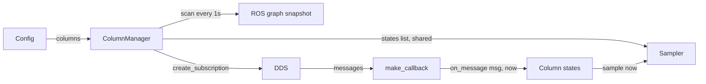
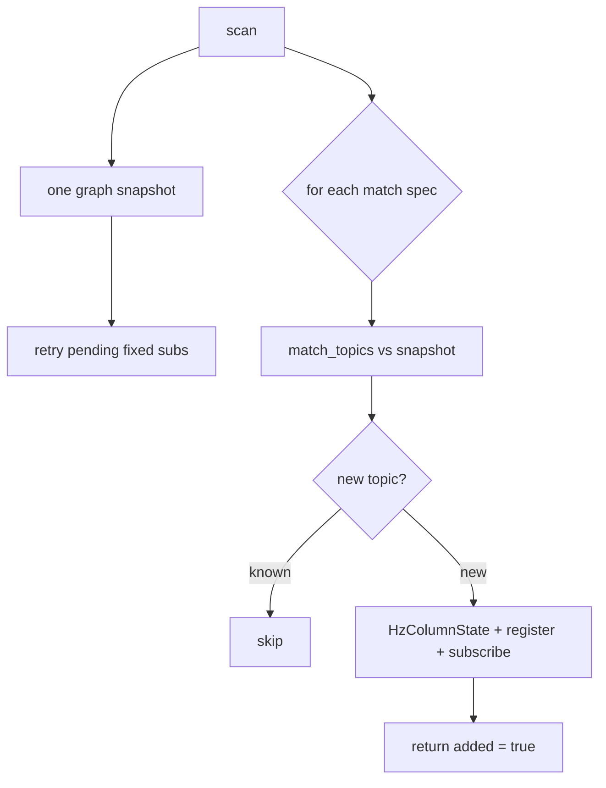

# Column manager: one place that owns columns and subscriptions

A metawtf run is, at heart, two loops that never meet directly: ROS2
callbacks delivering messages, and a sampler ticking out CSV rows. Between
them sits a list of *column states* — objects that remember the latest value
(or a sliding rate window) for one column. Someone has to build that list,
grow it when the ROS graph reveals new topics, and connect each state to its
data source. That someone is `ColumnManager` in `metawtf/column_manager.py`.

It has absorbed every new column kind: echo columns (plain, JSON-subfield,
and JSON-key-discovering), hz columns (single-topic and regex `match`), and
the two CPU columns that read `/proc` and have no topic at all. Doing all of
that inside the node would have turned it into a tangle; here it is one class
with a small, testable surface.

Crucially, it depends on a *node-like object*, not on `rclpy`. Anything
offering `get_topic_names_and_types`, `get_publishers_info_by_topic`,
`create_subscription`, and `get_logger` will do — which is how
`test_column_manager.py` drives the whole thing with a fake node.

## How the pieces fit together

The architecture worth seeing before the details: the manager produces one
list, and the sampler holds *that same list object*.

`ColumnManager.__init__` walks `config.columns` once, dispatching each entry
to a handler that appends states, a subscription, or both. Because the
sampler keeps a reference to `manager.states` rather than a copy, columns
discovered later (by a `match` spec or a JSON key expander) simply appear in
the sampler's iteration — the sampler notices the length changed and reprints
its header. No observer pattern, no events: shared mutable state,
deliberately, between exactly two owners on one thread (the executor).



The control flow splits cleanly by *who talks to ROS*: the manager is the only
component that creates subscriptions or queries the graph; the states and
sampler never touch rclpy at all. (`TracerNode` wires it up by constructing
`ColumnManager(self, config)`, passing `manager.states` straight into
`Sampler`, and running `manager.scan` once at startup and then on a 1 Hz
timer.)

## The subscription record: one subscription, many columns

The key realization that keeps this module small: an echo subscription and an
hz subscription differ in only two ways — the `raw` flag, and (for echo) a
configured message type. Both callbacks are literally `state.on_message(msg,
now)`. And one subscription may feed *several* column states (one per JSON
subfield), so the record holds a list:

```python
@dataclass
class Subscription:
    states: list
    topic: str
    configured_type: str | None
    raw: bool
    subscribed: bool = False
    failed: bool = False
```

The two boolean flags encode a small state machine: pending → subscribed, or
pending → failed. Both terminal states are checked at the top of
`try_subscribe`, so a scan can blindly re-attempt everything and only pending
subscriptions do any work.

## Dispatching on the config: four kinds of column

Building the initial column set is a branch on the config column's type, with
echo handling split out because it has three shapes of its own:

```python
    def add_config_column(self, column) -> None:
        if isinstance(column, EchoColumn):
            self.add_echo_column(column)
        elif isinstance(column, ProcCpuColumn):
            # No topic, no subscription: the state samples /proc on each tick.
            state = ProcCpuColumnState(
                column.name, column.process, column.width
            )
            self.states.append(state)
        elif isinstance(column, SysCpuColumn):
            state = SysCpuColumnState(column.name, column.mode, column.width)
            self.states.append(state)
        elif column.match is not None:
            self.match_specs.append(
                MatchSpec(column.match, column.window, column.width)
            )
        else:
            state = HzColumnState(column.name, column.window, column.width)
            self.register([state], column.topic, None, raw=True)
```

The four outcomes show the two axes the design runs on — *does it have a
topic?* and *is the column set fixed?*:

- **CPU columns** append a state and nothing else: they read `/proc` at
  sample time, so they need no subscription and no graph scanning.
- **Plain hz and plain echo** register one fixed `Subscription` immediately;
  it subscribes once the topic exists.
- **Echo with `subfields:`** fans out at config time: one
  `JsonEchoColumnState` per key, all sharing one subscription. The column
  names were already computed by `config.py`, keeping naming policy in one
  place.
- **`match` hz and key-discovering json echo** register *no* columns yet —
  one defers to graph scans (`MatchSpec`), the other to the first message
  (`JsonKeysExpander`). Both grow `self.states` at runtime, which is what
  triggers the sampler's header reprint.

`register` is the tiny chokepoint that keeps the two lists in sync — every
fixed subscription appends its states to the column list and records itself:

```python
    def register(self, states, topic, configured_type, raw) -> None:
        self.states.extend(states)
        self.subscriptions.append(
            Subscription(list(states), topic, configured_type, raw)
        )
```

## The expander: a recipient impostor

A `json: true` echo column *without* explicit subfields can't know its columns
until a message arrives. The manager handles this with a placeholder that
occupies the subscription's `states` list looking exactly like a column state:

```python
class JsonKeysExpander:
    def on_message(self, msg, now: float) -> None:
        if self.expanded:
            return
        try:
            data = json.loads(extract_field(msg, self.column.field))
        except (FieldPathError, ValueError, TypeError):
            return  # wait for a well-formed message before fixing the columns
        if not isinstance(data, dict):
            return
        self.expanded = True
        for key in data:
            state = JsonEchoColumnState(...)
            self.manager.states.append(state)
            self.subscription.states.append(state)
            state.on_message(msg, now)
```

This is a classic **duck-typed placeholder**: the callback only requires an
`on_message(msg, now)` method, so the expander needs no special casing
anywhere else in the system. It waits for the first *parseable* message —
malformed JSON or a non-dict payload just means "not yet" — then installs one
real column per top-level key, in the dict's insertion order (which for JSON
is the order the keys appeared in the message). The `expanded` flag makes the
operation one-shot, so the column set is then *fixed*: keys appearing only in
later messages are ignored, and a missing key renders `?` — a documented
caveat that keeps the CSV shape stable. Note the final
`state.on_message(msg, now)`: the message that revealed the keys also
supplies their first values, so the trigger row isn't blank.

## Scanning: one graph query, many consumers

```python
    def scan(self) -> bool:
        # The graph is queried once per scan and the snapshot handed down, not
        # once per pending subscription — those queries are DDS round-trips.
        names_and_types = self.node.get_topic_names_and_types()
        for sub in list(self.subscriptions):
            self.try_subscribe(sub, names_and_types)
        added = False
        for spec in self.match_specs:
            added = self.scan_match(spec, names_and_types) or added
        return added
```

`scan` runs at construction and then on a 1 Hz timer. Each pass takes *one*
snapshot of the graph and hands it down to every consumer —
`get_topic_names_and_types()` is a DDS round-trip, and an earlier version
called it once per pending subscription, multiplying graph traffic by the
number of late-starting topics. This is the **snapshot pattern**: pay for one
consistent read, then make all decisions against it — every consumer in a
pass agrees about what the graph looks like.

A pass retries every not-yet-subscribed fixed column (so a late-starting
topic still connects), then expands every match spec. `scan_match` is where
the column list grows:

```python
    def scan_match(self, spec: MatchSpec, names_and_types) -> bool:
        added = False
        for topic, _type in match_topics(spec.pattern, names_and_types):
            if topic in self.matched_topics:
                continue
            self.matched_topics.add(topic)
            state = HzColumnState.from_topic(topic, spec.window, spec.width)
            self.register([state], topic, None, raw=True)
            self.try_subscribe(self.subscriptions[-1], names_and_types)
            added = True
        return added
```

`matched_topics` is the dedup set that guarantees "never subscribe to the
same topic twice," even across rescans or overlapping patterns. A topic that
later vanishes is deliberately *not* removed: its column stays, and its rate
decays to empty — matching the promise that columns don't disappear mid-run.
The `bool` return bubbles up "the column set grew" (kept truthful by the
`added = ... or added` ordering, which avoids short-circuiting later specs).



## Subscribing: validate at the boundary, then trust

```python
    def try_subscribe(self, sub: Subscription, names_and_types) -> None:
        if sub.subscribed or sub.failed:
            return
        try:
            msg_class = resolve_message_type(
                sub.topic, sub.configured_type, names_and_types
            )
        except TopicNotFoundError:
            return
        except MessageTypeError as error:
            self.node.get_logger().error(str(error))
            sub.failed = True
            return
        qos = select_qos(self.node.get_publishers_info_by_topic(sub.topic))
        callback = make_callback(sub.states)
        self.node.create_subscription(
            msg_class, sub.topic, callback, qos, raw=sub.raw
        )
        sub.subscribed = True
```

The two exceptions are treated very differently, and that difference is the
whole error policy. A `TopicNotFoundError` is *transient* — the topic may
appear later — so the subscription is left pending and retried next scan. A
`MessageTypeError` (a bad configured type, or a genuinely multi-type topic)
will not fix itself, so the column is marked `failed` and never retried,
which prevents the same error from being logged once per second forever.
Transient errors retry; permanent errors fail loudly once. That classification
— not the try/except itself — is the design.

`make_callback` closes over the subscription's *list* of recipients rather
than a single state, and iterates a copy on each delivery:

```python
def make_callback(recipients):
    def callback(msg):
        now = time.monotonic()
        for state in list(recipients):
            state.on_message(msg, now)
    return callback
```

The `list(recipients)` copy matters: the `JsonKeysExpander` mutates that very
list from inside its own `on_message`, and mutating a list while iterating it
is a classic source of skipped or repeated elements. The copy also means a
newly expanded state receives the *triggering* message exactly once — from the
expander's explicit call, not from the loop. Taking `time.monotonic()` once
per delivery gives every fan-out column the identical arrival timestamp, so
sibling columns can never disagree about staleness because of clock reads
microseconds apart.

## Observations for future improvement

- **QoS is chosen once, at subscribe time.** If a topic's publishers change
  their QoS after we connect, we don't renegotiate. Rare, but a periodic
  re-check could be added for long-running traces.
- **`Subscription.states` is typed `list`.** Its members are column states or
  a `JsonKeysExpander`; a small protocol type (`on_message(msg, now)`) would
  document the contract the callback relies on — `sampler.py` already shows
  the style with its `SampledColumn` protocol.
- **Shared JSON parsing.** Sibling subfield columns each re-parse the same
  JSON string per message; a fan-out that parses once and hands a dict to each
  state would remove the duplicate work if wide JSON topics appear.
- **A vanished topic keeps consuming a column slot forever.** Intentional for
  now, but a very long run against a churning graph could accumulate empty
  columns; an optional prune could be offered later.
- **`scan()`'s `added` return is ignored in production.** The timer callback
  discards it — the sampler detects growth on its own by watching the column
  count — so today only tests consume the flag. Either use it (a discovery
  log line) or drop it.
