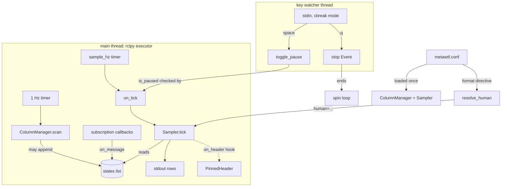
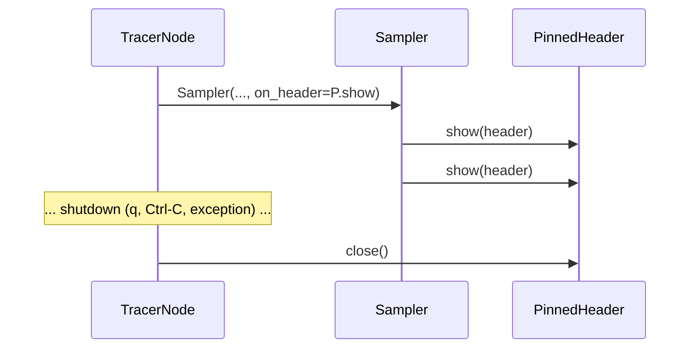

# Tracer Node: assembling the pieces and running until you quit

`metawtf/tracer_node.py` is the top of the dependency stack — the only module
that imports `rclpy` at module scope, and the only one that knows about "a
running program with a config file and a keypress to quit." Every other module
(`config`, `field_extract`, `msg_type`, `qos_select`, `topic_match`,
`echo_column`, `hz_column`, `json_column`, `rate_counter`, `proc_cpu_column`,
`sys_cpu_column`, `column_manager`, `sampler`, `terminal`) is logic that
`TracerNode` wires into something that actually subscribes to topics and
prints rows.

That placement is a deliberate architectural choice: because only this file
touches `rclpy`, everything below it can be unit-tested without a ROS context,
and the node itself stays thin — assembly and lifecycle, no policy. *Which*
topics to subscribe to and *when* lives in `ColumnManager`; *how* a row is
formatted lives in `Sampler`; *how* a header is pinned to the screen lives in
`terminal.PinnedHeader`. The node just connects them and keeps time.

## How the pieces fit together

The runtime is best understood as three concurrent sources of events funneling
into one shared data structure, the column-state list:



Three things to notice about this picture:

- **Everything ROS-related runs on one thread.** `rclpy`'s default executor is
  single-threaded, so timers and subscription callbacks never overlap. That is
  exactly why a column state's `on_message` can be a plain lock-free
  assignment, and why the sampler can iterate `states` without copying it.
- **The key watcher is the only second thread**, and it touches ROS state only
  through two narrow channels: a `threading.Event` (to stop) and a boolean
  flag on the node (to pause). Both are atomic under the GIL, so no locks.
- **The config file flows in once, at startup**, and shapes both collaborators
  plus the output-format decision. There is no live reload path.

## The node is mostly a constructor

```python
class TracerNode(Node):
    def __init__(self, config: Config):
        super().__init__("metawtf")
        self.manager = ColumnManager(self, config)
        self.states = self.manager.states
        is_human = resolve_human(config.output_format)
        # Pinning needs escape sequences on a real terminal; `format human`
        # forced into a pipe still gets the aligned text, just unpinned.
        self.pinned = (
            PinnedHeader() if is_human and sys.stdout.isatty() else None
        )
        self.sampler = Sampler(
            self.states,
            config.time,
            human=is_human,
            on_header=self.pinned.show if self.pinned is not None else None,
        )
        self.is_paused = False
        self.manager.scan()
        self.create_timer(RESCAN_PERIOD_SEC, self.manager.scan)
        self.create_timer(1.0 / config.sample_hz, self.on_tick)
```

Three collaborators, one shared list. The manager builds `self.states` (the
column state objects); the node hands that *same list object* to the sampler.
That aliasing is what makes dynamic columns work end to end: when a `match` hz
spec or a `json` echo expander appends a newly discovered column to `states`,
the sampler — holding the same reference — sees it on the next tick and
reprints its header (a documented CSV caveat; in human mode the pinned header
is redrawn in place instead). No event bus, no callback registration; just
Python's reference semantics doing the work of an observer pattern.

The new wrinkle since F07 is the output-format wiring, which is really two
decisions the constructor keeps carefully separate:

- **`human=is_human`** chooses the *render mode* — aligned padded columns
  versus pure RFC-4180 CSV. This travels into the sampler and affects every
  header and row it formats.
- **`on_header=self.pinned.show`** chooses the *delivery mechanism* for
  headers, and is only attached when the header can actually be pinned —
  which requires both human mode *and* a real terminal, because the pinning
  is ANSI escape sequences. The edge case is handled with a comment worth
  quoting: "`format human` forced into a pipe still gets the aligned text,
  just unpinned." Format and pinning are orthogonal; one is about how text
  looks, the other about where the terminal scrolls.

Two timers run at unrelated cadences for unrelated reasons. `manager.scan` at
1 Hz (`RESCAN_PERIOD_SEC`) is a discovery mechanism: it re-queries the topic
graph and subscribes to whatever has appeared since the last scan. There is no
reason to tie discovery to the output rate, so it isn't. `on_tick` runs at the
configured `sample_hz` and asks the sampler to emit one row. Note that the
initial `manager.scan()` is called synchronously in the constructor — topics
that already exist are picked up immediately, without waiting a full second
for the first timer fire.

## Choosing an output format: explicit beats implicit, but implicit tries to be right

```python
def resolve_human(output_format: str | None) -> bool:
    # The config's `format` directive wins; otherwise a tty gets the aligned
    # human format and pipes/redirects get pure csv.
    if output_format is not None:
        return output_format == "human"
    return sys.stdout.isatty()
```

This tiny function encodes a classic CLI ergonomics principle, the one
`git --color=auto` and `ls` on a tty have used for decades: **when the user
has spoken, obey; when they haven't, inspect the environment.** A `format`
directive in the config is a singleton validated by `parse_config` to be
`human` or `csv` (anything else is a `ConfigError`), so by the time it reaches
`resolve_human` the only question is whether it exists at all. `None` is the
auto-detect sentinel, and the fallback is `sys.stdout.isatty()` — the same
predicate the key watcher already uses on stdin, applied here to the output
side.

The auto-detect matters because the two consumers want opposite things. A
human staring at a terminal wants aligned columns that don't drift as values
change length (and is happy to sacrifice exact fidelity — over-wide values are
truncated with an ellipsis). A spreadsheet or a downstream script wants strict
CSV: no padding, no truncation, no decoration. Guessing wrong in either
direction is immediately visible and annoying, and asking every user to
configure it would be worse. Note that the function is module-level and pure
apart from the one `isatty` probe — deliberate, since it keeps the policy
testable without constructing a node.

## The pinned header, from the node's side

The node doesn't know anything about escape sequences; it only knows the
contract: a `PinnedHeader` (from `metawtf/terminal.py`) exposes a `show`
method taking a header string, and a `close` method to undo the effect. The
sampler emits *every* header through the single `on_header` hook, so the
first call sets the pin up and later calls — when the column set grows
mid-run — redraw it in place rather than scrolling a fresh header past. From
the node's perspective the interesting part is only the lifecycle pairing:



Why pin at all? In human mode the header is the column legend, and at 5 Hz
the data rows would scroll it off the screen within seconds, leaving the
reader to count commas to figure out which value is which. `PinnedHeader`
solves this with the DEC scroll-region escape (`DECSTBM`), a terminal feature
dating to the VT100 era: scrolling is confined to the rows *below* the header,
so data rows churn past at the bottom while the header stays put. One
consequence the terminal module documents honestly: rows scrolled off the top
of a scroll region are *not* added to scrollback by xterm-style terminals —
so human mode is for watching, and a full record still means `format csv`
redirected to a file.

## Pause stops the output, not the pipeline

```python
def on_tick(self) -> None:
    if self.is_paused:
        return
    self.sampler.tick(time.monotonic(), datetime.now())
```

The pause check sits at the *output* boundary, not the subscription boundary.
While paused, messages keep arriving and column states keep updating; only row
printing stops. That choice means the first row after resuming shows *current*
values rather than a backlog of stale ones, and hz columns keep their rate
windows warm. It also makes `toggle_pause` a trivial flag flip — safe to call
from the key-watcher thread because a boolean assignment can't tear. The
toggle itself announces the state change on `stderr` ("metawtf paused." /
"metawtf resumed."), keeping the stdout stream clean.

Two clocks feed each tick: `time.monotonic()` for the rate/ staleness math
(immune to NTP jumps, which is what you want when measuring intervals) and
`datetime.now()` for the human-readable wall-clock stamp in the time column.
Using the right clock for each job is a classic embedded-systems habit.

## Finding the config in the current directory

```python
CONFIG_FILENAME = "metawtf.conf"

def default_config_path() -> Path:
    return Path.cwd() / CONFIG_FILENAME
```

`metawtf.conf` is resolved from the current working directory, not from
anywhere near the code. An earlier design read it next to the installed
module, but once `metawtf` became a PATH command that broke the edit-and-run
loop: `Path(__file__)` at runtime points at the *install-space* copy, so a
user's edits to the source config had no effect until the next
`colcon build`. Reading from the current directory is the ordinary CLI
convention — edit `./metawtf.conf`, run `metawtf`, see the change immediately.
(The file itself is a line-based directive format, not YAML; its grammar —
including the `format` directive that feeds `resolve_human` — is the `config`
module's chapter.)

## A tiny CLI, on purpose

```python
def parse_cli(argv: list[str]) -> Path:
    # Deliberately minimal: only -h and -f, no argparse.
    config_path = default_config_path()
    args = list(argv)
    while args:
        arg = args.pop(0)
        if arg == "-h":
            print_help()
            raise SystemExit(0)
        if arg == "-f" and args:
            config_path = Path(args.pop(0))
            continue
        raise SystemExit(f"metawtf: bad argument {arg!r}\n\n{HELP_TEXT}")
    return config_path
```

Two flags: `-h` prints `HELP_TEXT` (the same text the `h` keypress shows at
runtime) and exits; `-f <path>` overrides the default `./metawtf.conf`. A
hand-rolled loop over `argv` was chosen over `argparse` deliberately — two
flags don't justify the machinery, and `SystemExit` carrying the help text
gives the same UX for an unknown argument. A nice small invariant falls out of
the branch structure: `-f` as the last word matches neither branch (there is
no value to pop) and falls through to the error, so a dangling `-f` is
rejected for free.

Notice what is *not* a flag: the output format. It lives only in the config
file, because it's a property of a tracing session (what am I watching, and
where is it going?) rather than a per-invocation toggle — and the
`isatty` auto-detect already handles the common per-invocation variation.

## Keys: quit, pause, help

`rclpy.spin` blocks until a signal, which would leave Ctrl-C as the only exit.
The key watcher adds a bare `q` to quit (no Enter needed), space to pause, and
`h` for help. The heart of it is a tiny, pure loop:

```python
def watch_keys(stream, on_quit, on_pause, on_help=print_help) -> None:
    while True:
        char = stream.read(1)
        if char == "" or char.lower() == "q":
            break
        if char == " ":
            on_pause()
        if char.lower() == "h":
            on_help()
    on_quit()
```

Everything here is dependency-injected — the stream and all three callbacks —
which is why this loop is unit-testable with a `StringIO` and a few lambdas,
no terminal required. The empty-string case is EOF (stdin closed or
redirected from a file that ran out), treated the same as `q`. Note that
`on_quit` is called on *every* exit path, after the loop — the single exit
point pattern that keeps the terminal-restore logic simple.

Reading one character at a time only works without Enter if the terminal is in
*cbreak* mode. A POSIX tty normally runs in *canonical* mode, where the line
discipline buffers input and only delivers it on newline — a holdover from
teletype days. Cbreak mode disables that buffering (keystrokes are delivered
as typed) while leaving signal generation enabled, so Ctrl-C still produces
`SIGINT`. Setting and restoring that mode is the wrapper's job:

```python
def start_key_watcher(on_quit, on_pause):
    if sys.stdin is None or not sys.stdin.isatty():
        return None
    fd = sys.stdin.fileno()
    old_settings = termios.tcgetattr(fd)
    tty.setcbreak(fd)
    thread = threading.Thread(
        target=watch_keys, args=(sys.stdin, on_quit, on_pause), daemon=True
    )
    thread.start()
    return lambda: termios.tcsetattr(fd, termios.TCSADRAIN, old_settings)
```

Three details matter. First, the `isatty` guard: when stdin is a pipe or file
there is no keypress to wait for, so the watcher is skipped entirely and
Ctrl-C remains the only exit — the returned `None` says "nothing to restore."
Second, the restore uses `TCSADRAIN`, which applies the old settings only
after pending output has drained, so restoring doesn't clobber output the main
thread is mid-way through writing. Third, the thread is a *daemon*: a
blocking `read(1)` on stdin can never be interrupted from another thread, so
daemon-ness is what guarantees a stuck read can't keep the process alive after
the main thread exits. And the "metawtf running" prompt goes to `stderr`,
never `stdout`, so it can't corrupt the output stream a spreadsheet reads.

## The spin loop and a clean shutdown

```python
def spin_until_quit(node) -> None:
    stop = threading.Event()
    restore = start_key_watcher(stop.set, node.toggle_pause)
    try:
        while rclpy.ok() and not stop.is_set():
            rclpy.spin_once(node, timeout_sec=0.1)
    finally:
        if restore is not None:
            restore()
```

The composition is worth reading twice: `stop.set` — the bound method of a
`threading.Event` — is handed directly to the watcher as its `on_quit`
callback. A `threading.Event` is the canonical cross-thread "please finish"
signal (a condition variable wrapped around a flag), and here it needs no
wrapper function at all. `spin_once(timeout_sec=0.1)` instead of a blocking
`spin` is what lets the loop notice either termination condition — `stop` set
by the watcher, or `rclpy.ok()` going false after a signal — within a tenth of
a second. This is the classic poll-with-timeout pattern: trade a little
latency for the ability to check multiple exit conditions on one thread.

The `finally` guarantees the terminal is restored whether we left via `q`,
Ctrl-C, or an exception. That guarantee matters more than it looks: a
terminal left in cbreak mode makes the user's shell behave as if it were
haunted — no echo, no line editing — until they blindly type `reset`.

```python
def main(args=None) -> None:
    config_path = parse_cli(sys.argv[1:])
    try:
        config = load_config(config_path)
    except ConfigError as error:
        raise SystemExit(f"metawtf: {error}")
    rclpy.init(args=args)
    node = TracerNode(config)
    try:
        spin_until_quit(node)
    except (KeyboardInterrupt, ExternalShutdownException):
        pass
    finally:
        # Reset the scroll region before the farewell so the prompt and the
        # message land below the pinned-header output.
        if node.pinned is not None:
            node.pinned.close()
        print("metawtf stopped.", file=sys.stderr)
        node.destroy_node()
        if rclpy.ok():
            rclpy.shutdown()
```

Note the ordering at startup: the config is loaded and validated *before*
`rclpy.init`. A missing file or a malformed directive — already translated to
`ConfigError` by `load_config` — becomes a one-line `metawtf: ...` exit
message instead of a traceback, and no ROS context is ever created for a run
that was doomed from the first line. Fail fast, and fail before acquiring
resources you would have to release.

The shutdown `finally` is now a carefully ordered teardown, and the *first*
step is the newest: `node.pinned.close()` runs **before** the "metawtf
stopped." line. The order is not cosmetic. While the pinned header is active,
the terminal's scroll region excludes the header rows, so any text printed
normally — including the farewell message and the shell prompt that follows
— would be confined to the scroll region and could land in the middle of the
screen or be overwritten by the frozen header. `close()` restores the
full-screen scroll region and drops the cursor below the output; only then is
it safe to print anything. Both `KeyboardInterrupt` and
`ExternalShutdownException` are treated as ordinary "time to stop," so neither
prints a traceback; the node is destroyed explicitly; and `rclpy.shutdown()`
is guarded by `rclpy.ok()` because calling it after the signal handler already
shut the context down would raise. The farewell goes to `stderr`, same as
every other piece of chrome, keeping `stdout` a pure data stream from first
byte to last.

The symmetry is the design principle: the program acquires two kinds of
terminal state — the tty's input mode (cbreak, restored by `spin_until_quit`'s
`finally`) and the scroll region (set by `PinnedHeader.setup`, reset by
`main`'s `finally`) — and each is unwound by the innermost scope that owns it,
inside `finally` blocks that run on every exit path.

## Observations for future improvement

- **The key bindings are fixed.** `q`/space/`h` are hard-coded; fine until
  someone wants to remap or disable them, or until `h` collides with a future
  interactive command.
- **`parse_cli` reads `sys.argv` even when `main(args=...)` receives ROS
  args.** ROS remapping arguments (`--ros-args ...`) on the command line would
  be rejected as unknown arguments; acceptable while metawtf is invoked as a
  plain command, worth a filter if launch-file use ever appears.
- **No live reconfiguration.** Editing `metawtf.conf` mid-run has no effect;
  the config is read once at startup. A SIGHUP-driven reload — or simply
  re-running `load_config` from the 1 Hz scan when the file's mtime changes —
  could be added if long traces need it. Note the format decision compounds
  this: even a reload couldn't cleanly *unpin* or *re-pin* the header mid-run
  without reconstructing the sampler, so format changes would likely need to
  stay restart-only anyway.
- **The format auto-detect probes stdout once, at construction.** Redirecting
  output mid-run (unusual but possible via shell job control) leaves the
  format stale. A defensible simplification — but worth naming.
- **`resolve_human` and the `PinnedHeader` condition both call
  `sys.stdout.isatty()` independently.** Two probes of the same predicate at
  two moments; they can't disagree today (nothing runs between them), but a
  single computed `is_tty` would make the coupling explicit.
- **Pause state is invisible in the output.** A paused run prints nothing at
  all, so a piped consumer can't distinguish "paused" from "no messages." The
  stderr announcement helps an interactive user but not a downstream process;
  a periodic stderr heartbeat would make the state observable there too.
- **`on_tick`'s two clocks can disagree under suspension.** If the machine
  sleeps mid-run, wall time jumps but monotonic time does not; hz windows stay
  correct while the time column leaps. That is arguably the right behavior,
  but a reader of the output has no way to know a gap was a suspend rather
  than silence.
