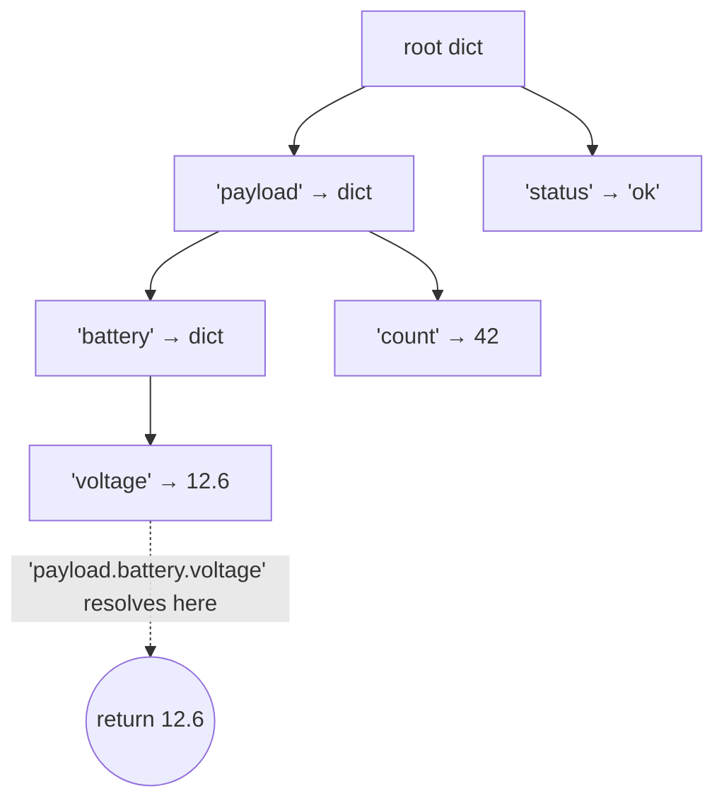
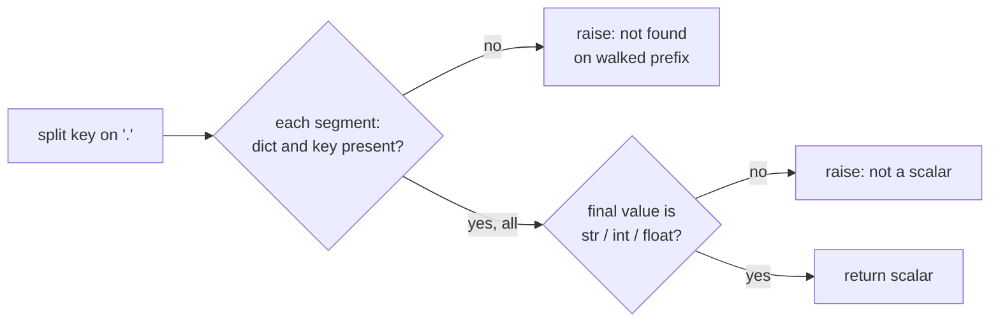

# Appendix: json_select — walking a dotted path through parsed JSON

## Why this tiny module exists

Many ROS2 topics in the wild carry their real payload as a JSON-encoded string
inside one message field — a habit inherited from bridging to web services and
log pipelines. When metawtf traces such a topic, the user does not want the
whole JSON blob in a table cell; they want one number out of it, addressed by a
dotted key like `payload.battery.voltage`. `metawtf/json_select.py` is the
25-line module that performs exactly that address resolution: it takes an
already-parsed JSON structure (a tree of Python `dict`s) and a dotted key, and
either returns the scalar living at that path or raises `JsonSelectError`.

It is deliberately separate from `field_extract.py`. That module walks *object
attributes* on live ROS messages; this one walks *dictionary keys* on data that
has already passed through `json.loads`. The two traversals look similar but
operate on different kinds of things, and keeping them apart means each stays a
single obvious loop.

The sole caller is `json_column.py`, which chains three failure-prone steps —
extract the string field, parse it as JSON, select the key — and collapses any
failure into the `INVALID` sentinel so a bad sample renders as `?` instead of
crashing the tracer:

```python
raw = extract_field(msg, self.field)
self.value = select_json_value(json.loads(raw), self.key)
```

So `select_json_value` sits at the end of a pipeline where raising is a
feature, not a hazard: its exceptions are the signal the caller uses to mark a
cell invalid.

## The data model: a tree of dicts, addressed by a path

After `json.loads`, a JSON document is a tree whose interior nodes are `dict`
(objects) or `list` (arrays) and whose leaves are scalars (`str`, `int`,
`float`, `bool`, or `None`). A dotted key is a path from the root to one leaf.
The module treats the problem as classic tree descent: split the path into
segments, then follow one edge per segment.



Two modeling decisions fall out of this framing. First, the module never looks
inside lists: a dotted key cannot index an array, so any descent that meets a
list simply fails at the `isinstance(value, dict)` guard. That is a conscious
scope cut — supporting `items.0.name`-style indexing would complicate both the
parser and the error messages for a use case the tracer has not needed.
Second, the function works on *parsed* data, not the raw string; parsing is
the caller's job, so this module has exactly one reason to fail loudly and one
job to do.

## The walk: a guarded descent loop

The heart of the module is a loop with `enumerate` over the key segments:

```python
value = data
parts = key.split(".")
for index, part in enumerate(parts):
    if not isinstance(value, dict) or part not in value:
        walked = ".".join(parts[:index]) or "<root>"
        raise JsonSelectError(f"{part!r} not found on {walked} (key {key!r})")
    value = value[part]
```

Each iteration is one hash-table lookup — Python `dict` membership and indexing
are both O(1) on average — so resolving a key of depth *d* costs O(*d*)
lookups, which is optimal for this access pattern. There is no recursion and
no copying: `value` is just a reference re-pointed at each level, so the walk
touches only the nodes on the path.

The guard condition deserves a closer look because of its short-circuit
ordering. `not isinstance(value, dict)` is checked *before* `part not in
value`, and that order is load-bearing: it lets one `if` cover two distinct
failure modes without ever calling `in` on a non-dict. The two modes are:

- **missing key** — the current node is a dict, but `part` is not one of its
  keys (a typo, or a schema where that field is sometimes absent);
- **premature leaf** — the key asks to descend further, but the current node is
  a scalar or list, i.e. the path is longer than the tree is deep at that
  branch.

Both produce the same exception type but the message disambiguates them via
the `walked` prefix.

## Error messages that locate the failure

The `walked` variable is the small detail that makes the errors useful. It
rebuilds the portion of the path that *did* resolve before the failure:

```python
walked = ".".join(parts[:index]) or "<root>"
```

For `payload.battery.voltag` (a typo at depth three), the message reads
`'voltag' not found on payload.battery` — pointing at the exact level where
resolution stopped, not just at the full key. The `or "<root>"` handles the
edge case where even the first segment is missing: `parts[:0]` is empty, the
join yields `""`, and the message would otherwise read `not found on ` with a
trailing blank. Naming the root explicitly keeps the message grammatical.

This is the fail-fast pattern applied to reporting: the exception carries the
failing segment, the resolved prefix, *and* the original full key, so whoever
logs it (today, the caller swallows it into `?`; tomorrow, perhaps a verbose
diagnostic mode) has everything needed to locate the problem without
re-walking.

## The scalar gate

Surviving the walk is not enough — the value found at the path must also be
displayable in a table cell. The final check enforces that:

```python
# bool is a subclass of int, so it is accepted here as a scalar; None,
# lists, and nested objects are not plottable and are rejected.
if isinstance(value, (str, int, float)):
    return value
raise JsonSelectError(f"key {key!r} did not resolve to a scalar: {value!r}")
```

Two subtleties live here. First, `bool` is accepted *implicitly*: in Python,
`bool` subclasses `int`, so `isinstance(True, int)` is `True` and booleans
pass the tuple check without being named. The inline comment calls this out so
nobody "fixes" it later. Whether `True`/`False` is a useful thing to trace is
debatable, but it is at least a conscious, documented consequence of the type
hierarchy rather than an oversight.

Second, the check uses nominal types rather than trying to be clever — no
attempt to stringify lists, no coercion of `None` to `0`. That keeps the
contract crisp: either the path ends at a plottable scalar or the sample is
invalid. Note also that a key pointing at a *nested object* fails here rather
than in the walk — the descent only checks the nodes it passes *through*, so
the terminal value needs its own verdict. This splits the two error cases
cleanly: "path is wrong" (walk error) versus "path is right but the leaf is
not a scalar" (gate error).

The overall control flow is therefore two sequential verdicts:



## Design notes

- **Custom exception, one type for all failures.** `JsonSelectError` is a
  bare `Exception` subclass with no extra state. Its value is purely
  taxonomic: `json_column.py` can write
  `except (FieldPathError, JsonSelectError, ValueError, TypeError)` and know
  exactly which pipeline stage each name represents. Carrying the diagnosis in
  the message string rather than in attributes is adequate *today* because the
  only consumer is a human reading logs, but see the improvements below.
- **No validation of the key itself.** An empty key (`""`) splits to `[""]`,
  fails at the root, and reports `'' not found on <root>` — a reasonable
  failure, arrived at for free by the general loop rather than by special
  casing.
- **Pure function, no state.** The module is trivially testable and safe to
  call on every arriving message; the per-message cost is one `split`, *d*
  dict lookups, and one type check — negligible next to the `json.loads` the
  caller already performs.

## Improvements and observations

- **Array indexing** is the most obvious feature gap: `items.0.name` would
  make the selector useful for JSON arrays. The walk could accept an `int`
  index segment when `value` is a `list`, with the same guarded-descent shape.
- **Structured exceptions.** If diagnostics ever matter beyond log strings,
  `JsonSelectError` could carry `part`, `walked`, and `key` as attributes so
  callers can react programmatically (e.g. suggest near-miss keys via
  `difflib.get_close_matches` on the failed level's keys).
- **A key-suggestion hint** would directly address the most common real-world
  failure — a typo in a config file — at the cost of one extra branch on the
  error path only, so no per-message overhead.
- **`bool` acceptance** is worth revisiting: tracing `True`/`False` renders as
  `True`/`False` in the cell, which is fine, but if numeric aggregation is
  ever layered on these columns, silently treating booleans as `1`/`0` could
  surprise. An explicit `isinstance(value, bool)` branch, whatever it decides,
  would make the policy visible rather than inherited.
- **Complexity note:** the walk is already optimal at O(*d*) for path length
  *d*, so there is nothing to gain performance-wise; any "optimization" urge
  here should be resisted in favor of the error-message quality work above.
